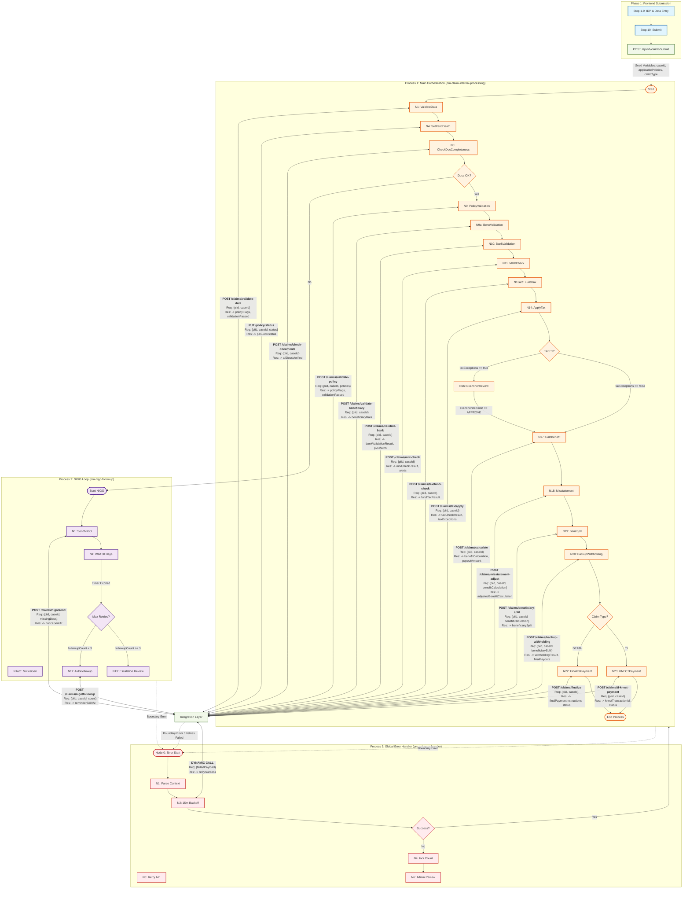
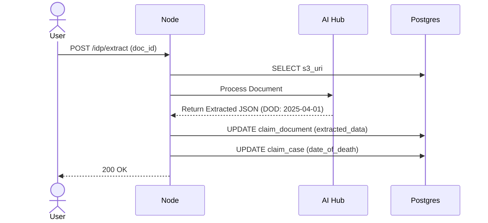
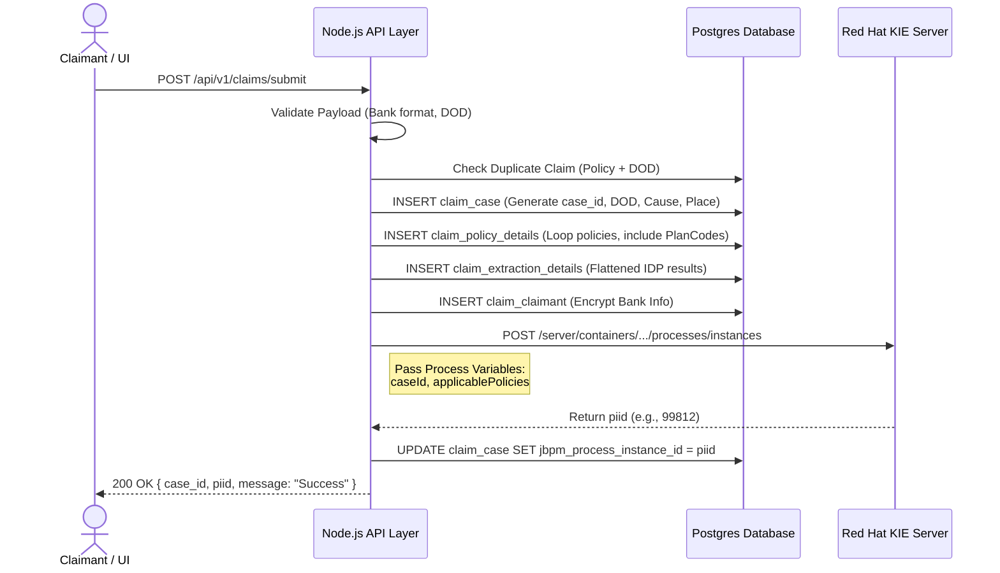
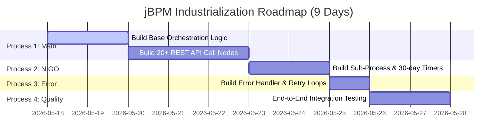
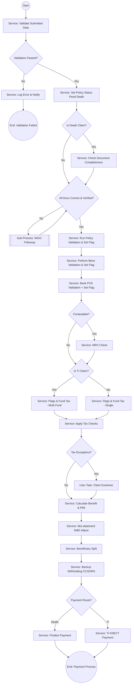
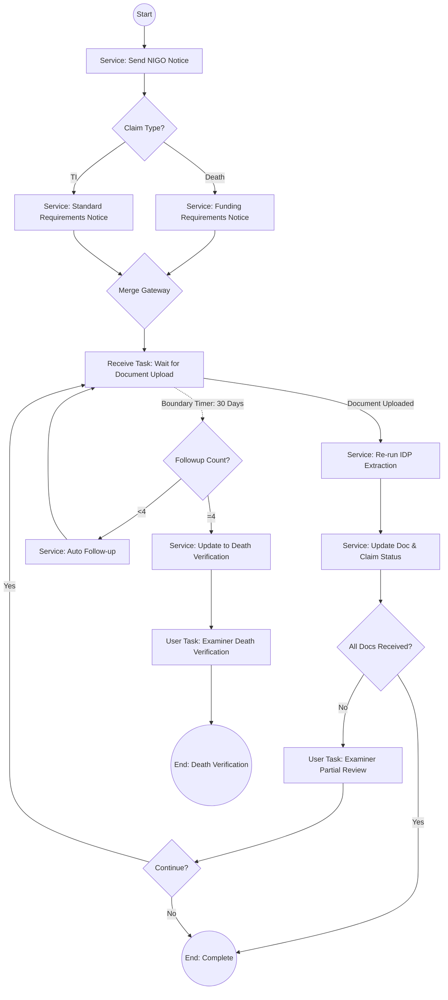
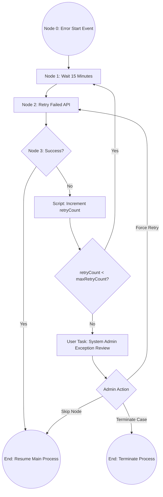

# Pru Claim Process — Complete Solution Design

## Architecture Overview

The claim process is split into two distinct layers:

| Layer | Covers | Technology |
|-------|--------|-----------|
| **Part A: Multi-Step Form APIs** | Claimant, System, IDP/AI Hub lanes (Diagram 1) | REST APIs called by frontend |
| **Part B: jBPM Process** | Claim Process lane only (Diagram 2) | jBPM workflow engine |

**Boundary:** The frontend multi-page form collects all data via REST APIs. On final **Submit**, it calls the Submit API which creates a case and triggers the jBPM process for internal adjudication.

---

# PART A: Multi-Step Form APIs (Frontend — No BPM)

> These are direct REST API calls from the Claimant Portal multi-page form. No jBPM involved.

## Form Step Map

| Step | Page Title | API Called | Diagram Source |
|------|-----------|-----------|---------------|
| 1 | Initial Information | `POST /api/v1/policy/search` | Claimant: "Initial info capture" → System: "Policy search" |
| 2 | Interaction Type | None (frontend routing) | System: "Interaction Type?" gateway |
| 2a | Quote (optional) | `POST /api/v1/claims/quote` | System: "Generate quote" |
| 3 | Claim Type Selection | `POST /api/v1/claims/ti-validate` (TI only) | Claimant: "Select Claim Type" + TI guardrail |
| 4 | Document Checklist | `GET /api/v1/claims/requirements` | System: "Requirement rules" |
| 5 | Document Upload | `POST /api/v1/documents/upload` | Claimant: "Upload documents" |
| 6 | IDP Extraction | `POST /api/v1/idp/extract-and-match` | IDP/AI Hub: classify, extract, match |
| 7 | Review Extracted Data | None (uses Step 6 response) | Claimant: "Display extracted data" |
| 8 | Eligibility Check | `POST /api/v1/claims/eligibility` | System: "Eligibility check per applicable policy" |
| 9 | Review & Bank Details | None (form page) | Claimant: "Pre-fill form" + "Bank details" |
| 10 | Final Submit | `POST /api/v1/claims/submit` | System: "Set flags" + "Create case" → Triggers jBPM |

---

## API 1: Policy Search & Draft Creation

| Property | Value |
|----------|-------|
| **Endpoint** | `POST /api/v1/policy/search` |
| **Form Step** | Step 1 — Initial Information |
| **Description** | Searches for active policies. Crucially, this API **generates the initial DRAFT case in the database** to track the claim funnel. |

### 1. Internal Logic & Validation Flow
1. **PAS Lookup:** Queries the mainframe using `policy_number` and `claimant_dob`.
2. **Consolidation Scan:** The backend automatically identifies other policies owned by the same insured (`applicable_policies`).
3. **Database Insertion:** 
   - Generates a `case_id` (UUID).
   - Inserts `claim_case` with `status = DRAFT`.
   - Inserts rows into `claim_policy_details` for every discovered policy, saving the `base_face_amount`.

### 2. Master Orchestration & Integration Logic Map (Part B jBPM)

> [!IMPORTANT]
> This diagram is the **Source of Truth** for the Part B jBPM Internal Processes. It visualizes the transition from Phase 1 (Frontend Submission) into the three core jBPM workflows, documenting every variable mapping and API contract in the flow.



### Technical Mapping Summary:
*   **Req / Res Block:** Shows the exact API endpoint and the variable mapping logic.
*   **Process Interlink:** Dashed lines indicate the **Boundary Error Catch** mechanism that triggers the Global Error Handler.
*   **Variable Seeding:** Phase 1 explicitly documents the transition from UI form state to jBPM process variables.
*   **Data Integrity:** All REST calls (solid lines) are mapped to the consolidated Integration Layer, which handles DB persistence (Part D).

### 3. Request & Response
**Request:**
```json
{
  "search_criteria": {
    "policy_number": "POL-12345",
    "insured_ssn_last_4": "6789",
    "insured_first_name": "John",
    "insured_middle_name": "Edward",
    "insured_last_name": "Doe",
    "insured_dob": "1958-05-20"
  },
  "claimant_info": {
    "first_name": "Jane",
    "last_name": "Doe",
    "relationship_to_insured": "SPOUSE"
  }
}
```
**Response:**
```json
{
  "found": true,
  "case_id": "UUID-1234-5678",
  "insured_person": {
    "first_name": "John",
    "last_name": "Doe",
    "dob": "1958-05-20",
    "state_of_issue": "NY"
  },
  "applicable_policies": ["POL-12345", "POL-98765"],
  "policy_details": [
    {
      "policy_number": "POL-12345",
      "status": "ACTIVE",
      "product_type": "WHOLE_LIFE",
      "issue_date": "2020-01-15",
      "base_face_amount": 500000,
      "beneficiaries": [
        { "name": "Jane Doe", "type": "PRIMARY", "percentage": 100 }
      ],
      "covers": [{ "cover_id": "COV-001", "type": "BASE", "amount": 500000 }]
    },
    {
      "policy_number": "POL-98765",
      "status": "ACTIVE",
      "product_type": "TERM_LIFE",
      "issue_date": "2015-06-01",
      "base_face_amount": 250000,
      "beneficiaries": [
        { "name": "Jane Doe", "type": "PRIMARY", "percentage": 100 }
      ],
      "covers": [{ "cover_id": "COV-002", "type": "BASE", "amount": 250000 }]
    }
  ]
}
```

---

## API 2: Generate Quote (Optional)

| Property | Value |
|----------|-------|
| **Endpoint** | `POST /api/v1/claims/quote` |
| **Form Step** | Step 2a — Quote |
| **Description** | Generates an estimated payout quote. **Informational only.** Does not update the database state. |

### 1. Request & Response
**Request:**
```json
{
  "case_id": "UUID-1234-5678",
  "claim_type": "DEATH",
  "date_of_death": "2025-04-01"
}
```
**Response:**
```json
{
  "quote": {
    "total_estimated_payout": 753750.00,
    "breakdown_per_policy": [
      { 
        "policy_number": "POL-12345", 
        "base_benefit": 500000,
        "estimated_interest": 2500,
        "total": 502500 
      },
      { 
        "policy_number": "POL-98765", 
        "base_benefit": 250000,
        "estimated_interest": 1250,
        "total": 251250 
      }
    ]
  },
  "downloadable_pdf_url": "/api/v1/claims/quote/UUID-1234-5678/download"
}
```

---

## API 3: TI Life Expectancy Validation

| Property | Value |
|----------|-------|
| **Endpoint** | `POST /api/v1/claims/ti-validate` |
| **Form Step** | Step 3 — Claim Type Selection |
| **Description** | Validates TI claim eligibility based on life expectancy. Terminal point if threshold exceeded. |

**Request:**
```json
{ "case_id": "UUID-1234-5678", "claim_type": "TI", "life_expectancy_months": 8 }
```
**Response:**
```json
{ "eligible": true, "message": "Proceed to next step" }
```

---

## API 4: Document Requirements

| Property | Value |
|----------|-------|
| **Endpoint** | `GET /api/v1/claims/requirements?case_id={id}&claim_type=DEATH` |
| **Form Step** | Step 4 — Requirements |
| **Description** | Returns dynamic checklist of required documents. |

---

## API 5: Document Upload

| Property | Value |
|----------|-------|
| **Endpoint** | `POST /api/v1/documents/upload` |
| **Form Step** | Step 5 — Upload |
| **Description** | Uploads the physical file to S3 and commits the record to the `claim_document` table. |

### 1. Internal Logic
1. Pipes multipart file stream directly to AWS S3 bucket.
2. **Database Insertion:** Inserts a row into `claim_document` with the returned `s3_uri` and sets `idp_status = PENDING`.

### 2. Request & Response
**Request:** `multipart/form-data` (Contains `case_id`, `doc_type`, and `file`)
**Response:**
```json
{
  "doc_id": "DOC-999",
  "s3_uri": "s3://bucket/claims/doc-999.pdf",
  "status": "UPLOAD_SUCCESS"
}
```

---

## API 6: IDP Extract & Match

| Property | Value |
|----------|-------|
| **Endpoint** | `POST /api/v1/idp/extract-and-match` |
| **Form Step** | Step 6 — Validation Hub |
| **Description** | Synchronously triggers the AI Hub IDP engine to read the Death Certificate and updates the database. |

### 1. Internal Logic & Database Updates
1. Calls external AI Hub API with the `s3_uri`.
2. Receives JSON extraction (e.g., Date of Death, Names).
3. **Database Update:** `UPDATE claim_document SET extracted_data = {...}, idp_status = 'SUCCESS'`.
4. **Database Update:** `UPDATE claim_case SET date_of_death = {extracted_dod}`.

### 2. Sequence Diagram


### 3. Request & Response
**Request:**
```json
{ "case_id": "UUID-1234-5678", "doc_id": "DOC-999" }
```
**Response:**
```json
{
  "extractedData": {
    "document_type": "DEATH_CERTIFICATE",
    "overall_confidence_score": 98.5,
    "date_of_death": "2025-04-01",
    "place_of_death": "New York, NY",
    "cause_of_death": "NATURAL",
    "deceased_name": {
      "first": "John",
      "last": "Doe"
    },
    "is_certified_copy": true,
    "county_seal_detected": true
  }
}
```

---

## API 7: Final Eligibility Check

| Property | Value |
|----------|-------|
| **Endpoint** | `POST /api/v1/claims/eligibility` |
| **Form Step** | Step 8 — Eligibility |
| **Description** | Final rules-engine check comparing extracted Data vs PAS before allowing the user to reach the final Submit screen. |

**Request:**
```json
{ "case_id": "UUID-1234-5678", "extractedData": { "date_of_death": "2025-04-01" } }
```
**Response:**
```json
{
  "eligible": true,
  "policyData": {
    "eligibility_passed": true,
    "requires_manual_review": false,
    "warnings": [],
    "verified_against_pas": true,
    "contestability_period_active": false
  },
  "message": "Passed all pre-submit checks. Proceed to final submit."
}
```

---

## API 8: Final Submit (Triggers jBPM)

| Property | Value |
|----------|-------|
| **Endpoint** | `POST /api/v1/claims/submit` |
| **Form Step** | Step 10 — Final Submit |
| **Description** | The pivotal boundary between the frontend UI and backend orchestration. Validates the payload, commits the initial data model to the DB, triggers jBPM, and binds the generated `piid` back to the case. |

### 1. Internal Logic & Validation Flow

When the Node.js backend receives this POST request, it performs the following strict sequence of operations *before* passing control to jBPM:

1. **Mandatory Field Validation:**
   - Verifies `applicable_policies` array is not empty.
   - Verifies `date_of_death` is present (if `claim_type == DEATH`).
   - Validates bank account routing format.
2. **Duplicate Check:**
   - Queries `claim_case` to ensure no existing active claim case exists for the `primary_policy_number` + `date_of_death`.
3. **Database Snapshot (Case Creation):**
   - Generates a unique UUID for the `case_id`.
   - Inserts the root record into `claim_case` with `status = SUBMITTED`.
   - Loops over the `applicable_policies` array and inserts rows into `claim_policy_details`.
   - Inserts `claim_claimant` and encrypts the bank account/routing data.
4. **Trigger jBPM Engine:**
   - Makes an HTTP POST to the jBPM KIE Server to start the process.
   - Passes `caseId`, `applicablePolicies`, `claimType`, `dateOfDeath`, `extractedData`, `uploadedDocuments`, `policyData`, and `bankAccountDetails` into the `startProcess` Variable Map to perfectly align with Part B's Process Variables.
5. **PIID Binding:**
   - jBPM returns the newly generated `piid` (Process Instance ID).
   - The backend immediately executes an `UPDATE claim_case SET jbpm_process_instance_id = {piid}`.

### 2. Sequence Diagram



### 3. Request & Response Payload

**Request:**
```json
{
  "case_id": "UUID-1234-5678",
  "claimant_name": "Jane Doe",
  "claimant_dob": "1985-03-15",
  "primary_policy_number": "POL-12345",
  "claim_type": "DEATH",
  "date_of_death": "2025-04-01",
  "relationship": "SPOUSE",
  "applicable_policies": ["POL-12345", "POL-98765"],
  "extractedData": { 
    "confidence_score": 98.5, 
    "date_of_death": "2025-04-01" 
  },
  "uploadedDocuments": [ 
    "s3://bucket/claims/doc-999.pdf" 
  ],
  "policyData": {
    "eligibility_passed": true,
    "requires_manual_review": false
  },
  "bankAccountDetails": {
    "bank_name": "First National Bank",
    "routing_number": "021000021",
    "account_number": "123456789",
    "payment_method": "ACH"
  }
}
```

**Response:**
```json
{
  "case_id": "UUID-1234-5678",
  "piid": 99812,
  "status": "SUBMITTED",
  "message": "Claim submitted successfully and jBPM workflow initiated."
}
```

---

## Multi-Step Form API Summary

| # | API | Method | Form Step | Purpose |
|---|-----|--------|-----------|---------|
| 1 | `/api/v1/policy/search` | POST | Step 1 | Search policy by number/DOB/LID |
| 2 | `/api/v1/claims/quote` | POST | Step 2a | Generate informational quote (optional) |
| 3 | `/api/v1/claims/ti-validate` | POST | Step 3 | Validate TI life expectancy threshold |
| 4 | `/api/v1/claims/requirements` | GET | Step 4 | Get required document checklist |
| 5 | `/api/v1/documents/upload` | POST | Step 5 | Upload documents to S3 |
| 6 | `/api/v1/idp/extract-and-match` | POST | Step 6 | AI Hub: classify, extract, match data |
| 7 | `/api/v1/claims/eligibility` | POST | Step 8 | Eligibility check using extracted data |
| 8 | `/api/v1/claims/submit` | POST | Step 10 | Final submit → creates case → triggers jBPM |

---


# PART B: jBPM Process (Internal Claim Processing Only)

> Only the **Claim Process** lane from Diagram 2 runs as jBPM. Triggered by API 8 (`/api/v1/claims/submit`).

## jBPM Process Inventory

| # | Process ID | Type | Triggered By |
|---|-----------|------|-------------|
| 1 | `pru-claim-internal-processing` | Main jBPM Process | API 8 Submit |
| 2 | `pru-nigo-followup` | Sub-Process | Called from Process 1 |
| 3 | `pru-api-error-handler` | Global Error Handler | Boundary Error Event |
| 4 | `E2E-Integration-Testing` | Testing Phase | Post-Development |

### Implementation Roadmap (Gantt Chart)

> [!NOTE]
> **Process 4** refers to the **End-to-End Orchestration Testing** phase. This 1.5-day cycle is critical for validating that the 28 REST APIs correctly pass data between the jBPM process variables and the Postgres database schema defined in Part D.



## Process 1: `pru-claim-internal-processing`

> ⚠️ **Superseded.** The `pru-claim-processing` BPMN has since been **rewritten** to the outcome-based flow (Claim Type gate → Set Pend Death → Check contestability → MRX → Run Per Claim Evaluation → Aggregate → Outcome {STP / Pending-Requirement 30-day loop / Refer-to-Examiner}). See [pru_claim_evaluation_solution.md](pru_claim_evaluation_solution.md) §2. The **original** full submission→payment pipeline documented below is preserved verbatim in `pru-claim-submission.bpmn`.

### Process Variables

| Variable | Type | Description |
|----------|------|-------------|
| `caseId` | String | Case ID from submit API |
| `policyNumber` | String | Primary policy number |
| `claimType` | String | DEATH or TI |
| `applicablePolicies` | List | All eligible policies |
| `policyData` | Object | Full policy record |
| `extractedData` | Object | IDP extraction results |
| `uploadedDocuments` | List | Document S3 references |
| `bankAccountDetails` | Object | Bank name, routing, account, owner |
| `flagSuicide` | Boolean | Suicide indicator |
| `flagContestable` | Boolean | Within 2-year contestability |
| `flagForeignDeath` | Boolean | Foreign death indicator |
| `flagAIDS` | Boolean | AIDS indicator |
| `dateOfDeath` | Date | Extracted DOD |
| `eligibilityResult` | Object | Per-policy eligibility |
| `validationPassed` | Boolean | Server-side re-validation result |
| `validationErrors` | List | List of validation failures |
| `allDocsVerified` | Boolean | All documents correct and verified |
| `reclassificationType` | String | Acres PRA/VUL reclassification |
| `bankValidationResult` | Object | Bank PVS + owner match |
| `mrxCheckResult` | Object | MRX check response |
| `allFlagsAndFunds` | Object | Combined flags and fund tax data |
| `taxCheckResult` | Object | Tax check results |
| `taxExceptions` | Boolean | True if manual tax exception review is needed |
| `interestMethodConfirmed` | Boolean | Status of DCF / PMI calculation |
| `examinerDecision` | String | Decision made by Examiner during user task |
| `benefitCalculation` | Object | Benefit amount, interest, PMI |
| `adjustedBenefitCalculation` | Object | After M&E adjustment |
| `beneficiarySplit` | List | Per-beneficiary payout split |
| `withholdingResult` | Object | CCIS/IRS backup withholding |
| `payoutAmount` | Decimal | Calculated payout amount |
| `pasLockStatus` | String | Status from Node 4 Mainframe update |
| `knectTransactionId` | String | Transaction ID for TI payments |
| `finalPaymentInstructions` | Object | Final payment details for death claims |
| `reqPayload` | String | Transient: Holds current API request JSON |
| `resPayload` | String | Transient: Holds current API response JSON |

### Flow Diagram



### Node Specifications

#### Node 0: `Script_Bootstrap` — Script Task
| Property | Value |
|----------|-------|
| **Type** | Script Task |
| **Name** | Initialize Environment |

**Script (Java):**
```java
// Initialize Base URL from System Property (e.g., -DINTEGRATION_LAYER_URL=...)
String url = System.getProperty("INTEGRATION_LAYER_URL");
if (url == null || url.isEmpty()) {
    url = "http://localhost:3000"; // Default for dev
}
kcontext.setVariable("baseUrl", url);
System.out.println("Claim Journey Started. Environment Base URL: " + url);
```

---

#### Node 1: `ScriptTask_ValidateSubmittedData` — Script Task
| Property | Value |
|----------|-------|
| **Type** | Script Task (Java) |
| **Name** | Validate Submitted Data |
| **Input Variables** | `applicablePolicies`, `uploadedDocuments`, `extractedData`, `bankAccountDetails`, `claimType`, `dateOfDeath` |
| **Output Variables**| `validationPassed`, `validationErrors`, `flagSuicide`, `flagContestable`, `flagForeignDeath`, `flagAIDS` |
| **Description** | Server-side re-validation of ALL data collected via frontend APIs. Guards against tampered or stale data. Executes native Java script. |

**Validations Performed:**
| # | Check | Logic | On Fail |
|---|-------|-------|---------|
| 1 | Policy still active | Re-query policy status — must not have changed since frontend search | `POLICY_STATUS_CHANGED` |
| 2 | Documents exist in S3 | Verify all `s3_key` references are accessible | `DOCUMENT_NOT_FOUND` |
| 3 | Extraction data integrity | Re-verify extraction confidence ≥ 0.80 | `LOW_CONFIDENCE` |
| 4 | Eligibility still valid | Re-check eligibility with current policy state | `ELIGIBILITY_EXPIRED` |
| 5 | Bank account format | Validate routing number format (9 digits), account number present | `INVALID_BANK_DATA` |
| 6 | Duplicate claim check | Check no existing open case for same policy + DOD | `DUPLICATE_CLAIM` |
| 7 | Mandatory docs present | All mandatory docs from requirement rules are uploaded | `MISSING_MANDATORY_DOCS` |
| 8 | Flag consistency | Re-calculate flags and verify match with submitted flags | `FLAG_MISMATCH` |

**Code:**
```java
List<String> errors = new ArrayList<>();

// 1. Policy status re-check
PolicyData currentPolicy = policyService.getByNumber(policyNumber);
if (!"ACTIVE".equals(currentPolicy.getStatus()) && !"GRACE".equals(currentPolicy.getStatus())) {
    errors.add("POLICY_STATUS_CHANGED: Policy is now " + currentPolicy.getStatus());
}

// 2. S3 document existence
for (Document doc : uploadedDocuments) {
    if (!s3Service.exists(doc.getS3Key())) {
        errors.add("DOCUMENT_NOT_FOUND: " + doc.getDocId());
    }
}

// 3. Confidence threshold
if (extractedData.getOverallConfidence() < 0.80) {
    errors.add("LOW_CONFIDENCE: " + extractedData.getOverallConfidence());
}

// 4. Duplicate check
if (caseService.existsOpenCase(policyNumber, dateOfDeath)) {
    errors.add("DUPLICATE_CLAIM: Open case already exists");
}

// 5. Bank format
if (bankAccountDetails.getRoutingNumber().length() != 9) {
    errors.add("INVALID_BANK_DATA: Routing number must be 9 digits");
}

// 6. Re-calculate flags for consistency
ClaimFlags recalculated = flagService.calculateFlags(currentPolicy, extractedData, dateOfDeath, claimType);
if (!recalculated.equals(submittedFlags)) {
    errors.add("FLAG_MISMATCH: Flags recalculated differ from submitted");
    // Use recalculated flags going forward
    kcontext.setVariable("flagSuicide", recalculated.isSuicide());
    kcontext.setVariable("flagContestable", recalculated.isContestable());
    kcontext.setVariable("flagForeignDeath", recalculated.isForeignDeath());
    kcontext.setVariable("flagAIDS", recalculated.isAids());
}

kcontext.setVariable("validationErrors", errors);
kcontext.setVariable("validationPassed", errors.isEmpty());
```

**Output:** `validationPassed`, `validationErrors`

---

#### Node 2: `ExclusiveGateway_ValidationPassed` — Exclusive Gateway
| Property | Value |
|----------|-------|
| **Type** | Exclusive Gateway (XOR) |
| **Name** | Validation Passed? |

| Flow | Condition | Target |
|------|-----------|--------|
| `flow_fail` | `validationPassed == false` | `ServiceTask_LogError` |
| `flow_pass` | `validationPassed == true` | `ServiceTask_SetPendDeath` |

---

#### Node 3: `ServiceTask_LogError` — Service Task
| Property | Value |
|----------|-------|
| **Type** | Service Task |
| **Name** | Log Validation Error & Notify |

**API:** `POST /api/v1/audit/log-failure`

**Request Payload:**
```json
{
  "piid": "String",
  "caseId": "String",
  "errors": ["List of Errors"]
}
```

**Response Payload:**
```json
{
  "auditLogId": "String",
  "notificationSent": true
}
```

<details>
<summary><b>🛠 jBPM Implementation Details (RestWorkItemHandler)</b></summary>

**1. On-Entry Action (Script)**
```java
com.fasterxml.jackson.databind.node.ObjectNode json = new com.fasterxml.jackson.databind.ObjectMapper().createObjectNode();
json.put("piid", String.valueOf(kcontext.getProcessInstance().getId()));
json.putPOJO("caseId", kcontext.getVariable("caseId"));
json.putPOJO("errors", kcontext.getVariable("validationErrors"));
kcontext.setVariable("reqPayload", json.toString());
```

**2. Data Input Assignments**
*   `Url` = `System.getProperty("INTEGRATION_LAYER_URL") + "/api/v1/audit/log-failure"`
*   `Method` = `"POST"`
*   `ContentData` = `reqPayload`
*   `ContentType` = `"application/json"`
*   `HandleResponseErrors` = `true`

**3. Data Output Assignments**
*   `Result` &rarr; `resPayload`

**4. On-Exit Action (Script)**
```java
String response = (String) kcontext.getVariable("resPayload");
if (response != null) {
    com.fasterxml.jackson.databind.JsonNode root = new com.fasterxml.jackson.databind.ObjectMapper().readTree(response);
    kcontext.setVariable("auditLogId", root.get("auditLogId").asText());
}
```

</details>

---

#### Node 4: `ServiceTask_SetPendDeath` — Service Task
| Property | Value |
|----------|-------|
| **Type** | Service Task |
| **Name** | Set Policy Status to Pend Death |

**API:** `PUT /api/v1/policy/status`

**Request Payload:**
```json
{
  "piid": "String",
  "caseId": "String",
  "applicablePolicies": ["List"]
}
```

**Response Payload:**
```json
{
  "success": true,
  "updatedPolicies": ["List of Policies Updated"]
}
```

<details>
<summary><b>🛠 jBPM Implementation Details (RestWorkItemHandler)</b></summary>

**1. On-Entry Action (Script)**
```java
com.fasterxml.jackson.databind.node.ObjectNode json = new com.fasterxml.jackson.databind.ObjectMapper().createObjectNode();
json.put("piid", String.valueOf(kcontext.getProcessInstance().getId()));
json.putPOJO("caseId", kcontext.getVariable("caseId"));
json.putPOJO("applicablePolicies", kcontext.getVariable("applicablePolicies"));
kcontext.setVariable("reqPayload", json.toString());
```

**2. Data Input Assignments**
*   `Url` = `System.getProperty("INTEGRATION_LAYER_URL") + "/api/v1/policy/status"`
*   `Method` = `"PUT"`
*   `ContentData` = `reqPayload`
*   `ContentType` = `"application/json"`
*   `Retries` = `3`
*   `HandleResponseErrors` = `true` (Throws BPMNError to Error Sub-Process if retries fail)

**3. Data Output Assignments**
*   `Result` &rarr; `resPayload`

**4. On-Exit Action (Script)**
```java
String response = (String) kcontext.getVariable("resPayload");
if (response != null) {
    com.fasterxml.jackson.databind.JsonNode root = new com.fasterxml.jackson.databind.ObjectMapper().readTree(response);
    kcontext.setVariable("updatedPolicies", root.get("updatedPolicies"));
}
```

</details>

**Input:** `{ "applicable_policies": applicablePolicies, "status": "PEND_DEATH" }`
**Functionality:** Backend loops over the `applicablePolicies` array and makes PAS calls to lock every associated policy to "Pend Death" simultaneously. Returns consolidated success.

---

#### Node 5: `ExclusiveGateway_DeathOnly` — Exclusive Gateway
| Property | Value |
|----------|-------|
| **Name** | Is Death Claim? (Check Docs Gate) |

| Flow | Condition | Target |
|------|-----------|--------|
| `flow_death` | `claimType == "DEATH"` | `ServiceTask_CheckDocCompleteness` |
| `flow_skip` | `claimType != "DEATH"` | `ExclusiveGateway_DocsVerified` |

---

#### Node 6: `ServiceTask_CheckDocCompleteness` — Service Task
| Property | Value |
|----------|-------|
| **Type** | Service Task |
| **Name** | Check Document Completeness |

**API:** `POST /api/v1/claims/check-documents`

**Request Payload:**
```json
{
  "piid": "String",
  "caseId": "String",
  "applicablePolicies": ["List of Policy Numbers"]
}
```

**Response Payload:**
```json
{
  "allDocsVerified": true,
  "missingDocs": ["List of Missing Document Types"]
}
```

<details>
<summary><b>🛠 jBPM Implementation Details (RestWorkItemHandler)</b></summary>

**1. On-Entry Action (Script)**
```java
com.fasterxml.jackson.databind.node.ObjectNode json = new com.fasterxml.jackson.databind.ObjectMapper().createObjectNode();
json.put("piid", String.valueOf(kcontext.getProcessInstance().getId()));
json.putPOJO("caseId", kcontext.getVariable("caseId"));
json.putPOJO("applicablePolicies", kcontext.getVariable("applicablePolicies"));
kcontext.setVariable("reqPayload", json.toString());
```

**2. Data Input Assignments**
*   `Url` = `System.getProperty("INTEGRATION_LAYER_URL") + "/api/v1/claims/check-documents"`
*   `Method` = `"POST"`
*   `ContentData` = `reqPayload`
*   `ContentType` = `"application/json"`
*   `Retries` = `3`
*   `HandleResponseErrors` = `true`

**3. Data Output Assignments**
*   `Result` &rarr; `resPayload`

**4. On-Exit Action (Script)**
```java
String response = (String) kcontext.getVariable("resPayload");
if (response != null) {
    com.fasterxml.jackson.databind.JsonNode root = new com.fasterxml.jackson.databind.ObjectMapper().readTree(response);
    kcontext.setVariable("allDocsVerified", root.get("allDocsVerified").asBoolean());
    kcontext.setVariable("missingDocs", root.get("missingDocs"));
}
```

</details>
```java
String response = (String) kcontext.getVariable("resPayload");
if (response != null) {
    com.fasterxml.jackson.databind.JsonNode root = new com.fasterxml.jackson.databind.ObjectMapper().readTree(response);
    kcontext.setVariable("reclassificationType", root.get("reclassificationType"));
    kcontext.setVariable("contactVerified", root.get("contactVerified"));
}
```

</details>
| **Condition** | Death claims only |

**Functionality:** Match type verification, contact/payment info validation. Reclassifies account type (Acres - PRA/VUL).

---

#### Node 7: `ExclusiveGateway_DocsVerified` — Exclusive Gateway
| Property | Value |
|----------|-------|
| **Name** | All Documents Correct and Verified? |

| Flow | Condition | Target |
|------|-----------|--------|
| `flow_nigo` | `allDocsVerified == false` | `SubProcess_NIGO` |
| `flow_ok` | `allDocsVerified == true` | `ServiceTask_PolicyValidation` |

---

#### Node 8: `SubProcess_NIGO` — Reusable Sub-Process
| Property | Value |
|----------|-------|
| **Called Process** | `pru-nigo-followup` |
| **On complete** | Loop back to `ExclusiveGateway_DocsVerified` |

---

#### Node 9: `ServiceTask_PolicyValidation` — Service Task
| Property | Value |
|----------|-------|
| **Type** | Service Task |
| **Name** | Run Policy Validation Check and Set Flag |

**API:** `POST /api/v1/claims/validate-policy`

**Request Payload:**
```json
{
  "piid": "String",
  "caseId": "String",
  "applicablePolicies": ["List"]
}
```

**Response Payload:**
```json
{
  "policyFlags": {
    "isContestable": false,
    "isSuicide": false,
    "isReinstate": false
  },
  "validationPassed": true
}
```

<details>
<summary><b>🛠 jBPM Implementation Details (RestWorkItemHandler)</b></summary>

**1. On-Entry Action (Script)**
```java
com.fasterxml.jackson.databind.node.ObjectNode json = new com.fasterxml.jackson.databind.ObjectMapper().createObjectNode();
json.put("piid", String.valueOf(kcontext.getProcessInstance().getId()));
json.putPOJO("caseId", kcontext.getVariable("caseId"));
json.putPOJO("applicablePolicies", kcontext.getVariable("applicablePolicies"));
kcontext.setVariable("reqPayload", json.toString());
```

**2. Data Input Assignments**
*   `Url` = `System.getProperty("INTEGRATION_LAYER_URL") + "/api/v1/claims/validate-policy"`
*   `Method` = `"POST"`
*   `ContentData` = `reqPayload`
*   `ContentType` = `"application/json"`
*   `Retries` = `3`
*   `HandleResponseErrors` = `true` (Throws BPMNError to Error Sub-Process if retries fail)

**3. Data Output Assignments**
*   `Result` &rarr; `resPayload`

**4. On-Exit Action (Script)**
```java
String response = (String) kcontext.getVariable("resPayload");
if (response != null) {
    com.fasterxml.jackson.databind.JsonNode root = new com.fasterxml.jackson.databind.ObjectMapper().readTree(response);
    kcontext.setVariable("policyFlags", root.get("policyFlags"));
    kcontext.setVariable("validationPassed", root.get("validationPassed"));
}
```

</details>

**Functionality:** Backend iterates through the `applicablePolicies` array to check constraints (e.g., CSLN alerts, reinstatements) against the mainframe. Returns an aggregated map of policyFlags.

---

#### Node 9a: `ServiceTask_BeneValidation` — Service Task
| Property | Value |
|----------|-------|
| **Type** | Service Task |
| **Name** | Perform Bene Validation and Set Flag |

**API:** `POST /api/v1/claims/validate-beneficiary`

**Request Payload:**
```json
{
  "piid": "String",
  "caseId": "String",
  "applicablePolicies": ["List"]
}
```

**Response Payload:**
```json
{
  "beneficiaryFlags": {
    "minorDetected": false,
    "nameMismatch": false
  },
  "minorDetected": false
}
```

<details>
<summary><b>🛠 jBPM Implementation Details (RestWorkItemHandler)</b></summary>

**1. On-Entry Action (Script)**
```java
com.fasterxml.jackson.databind.node.ObjectNode json = new com.fasterxml.jackson.databind.ObjectMapper().createObjectNode();
json.put("piid", String.valueOf(kcontext.getProcessInstance().getId()));
json.putPOJO("caseId", kcontext.getVariable("caseId"));
json.putPOJO("applicablePolicies", kcontext.getVariable("applicablePolicies"));
kcontext.setVariable("reqPayload", json.toString());
```

**2. Data Input Assignments**
*   `Url` = `System.getProperty("INTEGRATION_LAYER_URL") + "/api/v1/claims/validate-beneficiary"`
*   `Method` = `"POST"`
*   `ContentData` = `reqPayload`
*   `ContentType` = `"application/json"`
*   `Retries` = `3`
*   `HandleResponseErrors` = `true` (Throws BPMNError to Error Sub-Process if retries fail)

**3. Data Output Assignments**
*   `Result` &rarr; `resPayload`

**4. On-Exit Action (Script)**
```java
String response = (String) kcontext.getVariable("resPayload");
if (response != null) {
    com.fasterxml.jackson.databind.JsonNode root = new com.fasterxml.jackson.databind.ObjectMapper().readTree(response);
    kcontext.setVariable("beneficiaryFlags", root.get("beneficiaryFlags"));
    kcontext.setVariable("minorDetected", root.get("minorDetected"));
}
```

</details>

**Functionality:** Backend loops through `applicablePolicies` to cross-reference extracted beneficiaries with the PAS mainframe. Flags minors requiring guardianship docs or name/relationship mismatches across all policies.

---

#### Node 9b: `ServiceTask_BankValidation` — Service Task
| Property | Value |
|----------|-------|
| **Type** | Service Task |
| **Name** | Bank PVS Validation + Set Flag |

**API:** `POST /api/v1/claims/validate-bank`

**Request Payload:**
```json
{
  "piid": "String",
  "caseId": "String",
  "applicablePolicies": ["List"]
}
```

**Response Payload:**
```json
{
  "bankValidationResult": {
    "pvsMatch": true,
    "ownershipVerified": true
  },
  "pvsMatch": true
}
```

<details>
<summary><b>🛠 jBPM Implementation Details (RestWorkItemHandler)</b></summary>

**1. On-Entry Action (Script)**
```java
com.fasterxml.jackson.databind.node.ObjectNode json = new com.fasterxml.jackson.databind.ObjectMapper().createObjectNode();
json.put("piid", String.valueOf(kcontext.getProcessInstance().getId()));
json.putPOJO("caseId", kcontext.getVariable("caseId"));
json.putPOJO("applicablePolicies", kcontext.getVariable("applicablePolicies"));
kcontext.setVariable("reqPayload", json.toString());
```

**2. Data Input Assignments**
*   `Url` = `System.getProperty("INTEGRATION_LAYER_URL") + "/api/v1/claims/validate-bank"`
*   `Method` = `"POST"`
*   `ContentData` = `reqPayload`
*   `ContentType` = `"application/json"`
*   `Retries` = `3`
*   `HandleResponseErrors` = `true` (Throws BPMNError to Error Sub-Process if retries fail)

**3. Data Output Assignments**
*   `Result` &rarr; `resPayload`

**4. On-Exit Action (Script)**
```java
String response = (String) kcontext.getVariable("resPayload");
if (response != null) {
    com.fasterxml.jackson.databind.JsonNode root = new com.fasterxml.jackson.databind.ObjectMapper().readTree(response);
    kcontext.setVariable("bankValidationResult", root.get("bankValidationResult"));
    kcontext.setVariable("pvsMatch", root.get("pvsMatch"));
}
```

</details>

**Functionality:** Validates bank via PVS. Matches owner against claimant/beneficiary. Verifies contact/payment info for death.

---

#### Node 10: `ExclusiveGateway_Contestable` — Exclusive Gateway
| Property | Value |
|----------|-------|
| **Type** | Exclusive Gateway |
| **Name** | Is Claim Contestable? |

**Logic:**
| Flow | Condition | Target |
|------|-----------|--------|
| `true` | `flagContestable == true` | `ServiceTask_MRXCheck` |
| `false`| `flagContestable == false`| `ExclusiveGateway_TIClaim` |

---

#### Node 11: `ServiceTask_MRXCheck` — Service Task
| Property | Value |
|----------|-------|
| **Type** | Service Task |
| **Name** | MRX Check + Validation Flag |

**API:** `POST /api/v1/claims/mrx-check`

**Request Payload:**
```json
{
  "piid": "String",
  "caseId": "String",
  "applicablePolicies": ["List"]
}
```

**Response Payload:**
```json
{
  "mrxCheckResult": {
    "hasHistory": false,
    "discrepancy": false
  },
  "alerts": ["List of Alerts"]
}
```

<details>
<summary><b>🛠 jBPM Implementation Details (RestWorkItemHandler)</b></summary>

**1. On-Entry Action (Script)**
```java
// Construct JSON Payload
com.fasterxml.jackson.databind.node.ObjectNode json = new com.fasterxml.jackson.databind.ObjectMapper().createObjectNode();
json.put("piid", String.valueOf(kcontext.getProcessInstance().getId()));
json.putPOJO("caseId", kcontext.getVariable("caseId"));
json.putPOJO("applicablePolicies", kcontext.getVariable("applicablePolicies"));
kcontext.setVariable("reqPayload", json.toString());
```

**2. Data Input Assignments**
*   `Url` = `System.getProperty("INTEGRATION_LAYER_URL") + "/api/v1/claims/mrx-check"`
*   `Method` = `"POST"`
*   `ContentData` = `reqPayload`
*   `ContentType` = `"application/json"`
*   `Retries` = `3`
*   `HandleResponseErrors` = `true` (Throws BPMNError to Error Sub-Process if retries fail)

**3. Data Output Assignments**
*   `Result` &rarr; `resPayload`

**4. On-Exit Action (Script)**
```java
String response = (String) kcontext.getVariable("resPayload");
if (response != null) {
    com.fasterxml.jackson.databind.JsonNode root = new com.fasterxml.jackson.databind.ObjectMapper().readTree(response);
    kcontext.setVariable("mrxCheckResult", root.get("mrxCheckResult"));
    kcontext.setVariable("alerts", root.get("alerts"));
}
```

</details>

**Functionality:** Medical Records Exchange lookup. Validates medical history vs application disclosures. Frequency TBD.

---

#### Node 12: `ExclusiveGateway_TIClaim` — Exclusive Gateway
| Property | Value |
|----------|-------|
| **Type** | Exclusive Gateway |
| **Name** | Determine Tax Path (TI vs Death) |

**Logic:**
| Flow | Condition | Target |
|------|-----------|--------|
| `flow_ti` | `claimType == "TI"` | `ServiceTask_FundTax` (Multi) |
| `flow_death`| `claimType != "TI"` | `ServiceTask_FundTax` (Single) |

---

#### Node 13: `ServiceTask_FundTax` — Service Task(s)

**Multi Fund**
| Property | Value |
|----------|-------|
| **Type** | Service Task |
| **Name** | Flags & Fund Tax - Multi Fund |

**API:** `POST /api/v1/claims/tax/multi-fund` (TI)
**Request Payload:**
```json
{
  "piid": "String",
  "caseId": "String",
  "applicablePolicies": ["List"]
}
```
**Response Payload:**
```json
{
  "fundTaxResult": {
    "taxableAmount": 0.0,
    "withholdingReq": false
  }
}
```

<details>
<summary><b>🛠 jBPM Implementation Details (RestWorkItemHandler)</b></summary>

**1. On-Entry Action (Script)**
```java
com.fasterxml.jackson.databind.node.ObjectNode json = new com.fasterxml.jackson.databind.ObjectMapper().createObjectNode();
json.put("piid", String.valueOf(kcontext.getProcessInstance().getId()));
json.putPOJO("caseId", kcontext.getVariable("caseId"));
json.putPOJO("applicablePolicies", kcontext.getVariable("applicablePolicies"));
kcontext.setVariable("reqPayload", json.toString());
```

**2. Data Input Assignments**
*   `Url` = `System.getProperty("INTEGRATION_LAYER_URL") + ""`
*   `Method` = `"POST"`
*   `ContentData` = `reqPayload`
*   `ContentType` = `"application/json"`
*   `Retries` = `3`
*   `HandleResponseErrors` = `true` (Throws BPMNError to Error Sub-Process if retries fail)

**3. Data Output Assignments**
*   `Result` &rarr; `resPayload`

**4. On-Exit Action (Script)**
```java
String response = (String) kcontext.getVariable("resPayload");
if (response != null) {
    com.fasterxml.jackson.databind.JsonNode root = new com.fasterxml.jackson.databind.ObjectMapper().readTree(response);
    kcontext.setVariable("fundTaxResult", root.get("fundTaxResult"));
}
```

</details>

**Single Fund**
| Property | Value |
|----------|-------|
| **Type** | Service Task |
| **Name** | Flags & Fund Tax - Single |

**API:** `POST /api/v1/claims/tax/single-fund` (Death)
**Request Payload:**
```json
{
  "piid": "String",
  "caseId": "String",
  "applicablePolicies": ["List"],
}
```
**Response Payload:**
```json
{
  "fundTaxResult": {
    "taxableAmount": 0.0,
    "withholdingReq": false
  }
}
```

<details>
<summary><b>🛠 jBPM Implementation Details (RestWorkItemHandler)</b></summary>

**1. On-Entry Action (Script)**
```java
com.fasterxml.jackson.databind.node.ObjectNode json = new com.fasterxml.jackson.databind.ObjectMapper().createObjectNode();
json.put("piid", String.valueOf(kcontext.getProcessInstance().getId()));
json.putPOJO("caseId", kcontext.getVariable("caseId"));
json.putPOJO("applicablePolicies", kcontext.getVariable("applicablePolicies"));
kcontext.setVariable("reqPayload", json.toString());
```

**2. Data Input Assignments**
*   `Url` = `System.getProperty("INTEGRATION_LAYER_URL") + ""`
*   `Method` = `"POST"`
*   `ContentData` = `reqPayload`
*   `ContentType` = `"application/json"`
*   `Retries` = `3`
*   `HandleResponseErrors` = `true` (Throws BPMNError to Error Sub-Process if retries fail)

**3. Data Output Assignments**
*   `Result` &rarr; `resPayload`

**4. On-Exit Action (Script)**
```java
String response = (String) kcontext.getVariable("resPayload");
if (response != null) {
    com.fasterxml.jackson.databind.JsonNode root = new com.fasterxml.jackson.databind.ObjectMapper().readTree(response);
    kcontext.setVariable("fundTaxResult", root.get("fundTaxResult"));
}
```

</details>

---

#### Node 14: `ServiceTask_ApplyTax` — Service Task
| Property | Value |
|----------|-------|
| **Type** | Service Task |
| **Name** | Apply Tax Checks |

**API:** `POST /api/v1/claims/tax/apply`

**Request Payload:**
```json
{
  "piid": "String",
  "caseId": "String",
  "applicablePolicies": ["List"]
}
```

**Response Payload:**
```json
{
  "taxCheckResult": {
    "federalTax": 0.0,
    "stateTax": 0.0,
    "levyDetected": false
  },
  "taxExceptions": false
}
```

<details>
<summary><b>🛠 jBPM Implementation Details (RestWorkItemHandler)</b></summary>

**1. On-Entry Action (Script)**
```java
com.fasterxml.jackson.databind.node.ObjectNode json = new com.fasterxml.jackson.databind.ObjectMapper().createObjectNode();
json.put("piid", String.valueOf(kcontext.getProcessInstance().getId()));
json.putPOJO("caseId", kcontext.getVariable("caseId"));
json.putPOJO("applicablePolicies", kcontext.getVariable("applicablePolicies"));
kcontext.setVariable("reqPayload", json.toString());
```

**2. Data Input Assignments**
*   `Url` = `System.getProperty("INTEGRATION_LAYER_URL") + "/api/v1/claims/tax/apply"`
*   `Method` = `"POST"`
*   `ContentData` = `reqPayload`
*   `ContentType` = `"application/json"`
*   `Retries` = `3`
*   `HandleResponseErrors` = `true` (Throws BPMNError to Error Sub-Process if retries fail)

**3. Data Output Assignments**
*   `Result` &rarr; `resPayload`

**4. On-Exit Action (Script)**
```java
String response = (String) kcontext.getVariable("resPayload");
if (response != null) {
    com.fasterxml.jackson.databind.JsonNode root = new com.fasterxml.jackson.databind.ObjectMapper().readTree(response);
    kcontext.setVariable("taxCheckResult", root.get("taxCheckResult"));
    kcontext.setVariable("taxExceptions", root.get("taxExceptions"));
}
```

</details>
| **Functionality** | State/Federal Withholding, TIN Check, Backup Withholding, CSR/IRS Levy |
| **Output** | `taxCheckResult`, `taxExceptions` |

---

#### Node 15: `ExclusiveGateway_TaxExceptions` — Exclusive Gateway
| Property | Value |
|----------|-------|
| **Type** | Exclusive Gateway |
| **Name** | Manual Tax Review Required? |

**Logic:**
| Flow | Condition | Target |
|------|-----------|--------|
| `true` | `taxExceptions == true` | `UserTask_ClaimExaminer` |
| `false`| `taxExceptions == false`| `ServiceTask_CalcBenefit` |

---

#### Node 16: `UserTask_ClaimExaminer` — User Task
| Property | Value |
|----------|-------|
| **Type** | User Task |
| **Actor** | `ClaimExaminer` (internal staff role) |
| **Form** | `examiner-review-form` |
| **Input** | `taxCheckResult`, `mrxCheckResult`, `allFlagsAndFunds`, `extractedData` |
| **Output** | `examinerDecision` (`APPROVE` / `REJECT` / `MODIFY`) |
| **Description** | Only true human task in the BPM — internal examiner reviews exceptions |

---

#### Node 17: `ServiceTask_CalcBenefit` — Service Task
| Property | Value |
|----------|-------|
| **Type** | Service Task |
| **Name** | Calculate Benefit & PMI |

**API:** `POST /api/v1/claims/calculate`

**Request Payload:**
```json
{
  "piid": "String",
  "caseId": "String",
  "applicablePolicies": ["List"]
}
```

**Response Payload:**
```json
{
  "benefitCalculation": {
    "baseAmount": 0.0,
    "interest": 0.0,
    "totalPayout": 0.0
  },
  "payoutAmount": 0.0
}
```

<details>
<summary><b>🛠 jBPM Implementation Details (RestWorkItemHandler)</b></summary>

**1. On-Entry Action (Script)**
```java
com.fasterxml.jackson.databind.node.ObjectNode json = new com.fasterxml.jackson.databind.ObjectMapper().createObjectNode();
json.put("piid", String.valueOf(kcontext.getProcessInstance().getId()));
json.putPOJO("caseId", kcontext.getVariable("caseId"));
json.putPOJO("applicablePolicies", kcontext.getVariable("applicablePolicies"));
kcontext.setVariable("reqPayload", json.toString());
```

**2. Data Input Assignments**
*   `Url` = `System.getProperty("INTEGRATION_LAYER_URL") + "/api/v1/claims/calculate"`
*   `Method` = `"POST"`
*   `ContentData` = `reqPayload`
*   `ContentType` = `"application/json"`
*   `Retries` = `3`
*   `HandleResponseErrors` = `true` (Throws BPMNError to Error Sub-Process if retries fail)

**3. Data Output Assignments**
*   `Result` &rarr; `resPayload`

**4. On-Exit Action (Script)**
```java
String response = (String) kcontext.getVariable("resPayload");
if (response != null) {
    com.fasterxml.jackson.databind.JsonNode root = new com.fasterxml.jackson.databind.ObjectMapper().readTree(response);
    kcontext.setVariable("benefitCalculation", root.get("benefitCalculation"));
    kcontext.setVariable("payoutAmount", root.get("payoutAmount"));
}
```

</details>
| **Functionality** | Backend iterates through `applicablePolicies`, calculates face amount + interest from DOD (DCF) for each policy individually, and aggregates them into a single consolidated benefit calculation object. |
| **On-Entry** | If `!interestMethodConfirmed` → use `DCF_PROVISIONAL` |

---

#### Node 18: `ServiceTask_MisstatementAdjust` — Service Task
| Property | Value |
|----------|-------|
| **Type** | Service Task |
| **Name** | Run Mis-statement M&E Adjustment |

**API:** `POST /api/v1/claims/misstatement-adjust`

**Request Payload:**
```json
{
  "piid": "String",
  "caseId": "String",
  "applicablePolicies": ["List"]
}
```

**Response Payload:**
```json
{
  "adjustedBenefitCalculation": {
    "original": {},
    "adjustment": 0.0,
    "final": 0.0
  }
}
```

<details>
<summary><b>🛠 jBPM Implementation Details (RestWorkItemHandler)</b></summary>

**1. On-Entry Action (Script)**
```java
com.fasterxml.jackson.databind.node.ObjectNode json = new com.fasterxml.jackson.databind.ObjectMapper().createObjectNode();
json.put("piid", String.valueOf(kcontext.getProcessInstance().getId()));
json.putPOJO("caseId", kcontext.getVariable("caseId"));
json.putPOJO("benefitCalculation", kcontext.getVariable("benefitCalculation"));
kcontext.setVariable("reqPayload", json.toString());
```

**2. Data Input Assignments**
*   `Url` = `System.getProperty("INTEGRATION_LAYER_URL") + "/api/v1/claims/misstatement-adjust"`
*   `Method` = `"POST"`
*   `ContentData` = `reqPayload`
*   `ContentType` = `"application/json"`
*   `Retries` = `3`
*   `HandleResponseErrors` = `true` (Throws BPMNError to Error Sub-Process if retries fail)

**3. Data Output Assignments**
*   `Result` &rarr; `resPayload`

**4. On-Exit Action (Script)**
```java
String response = (String) kcontext.getVariable("resPayload");
if (response != null) {
    com.fasterxml.jackson.databind.JsonNode root = new com.fasterxml.jackson.databind.ObjectMapper().readTree(response);
    kcontext.setVariable("adjustedBenefitCalculation", root.get("adjustedBenefitCalculation"));
}
```

</details>
| **Functionality** | Per diagram: "Mis-statement(s) payment M&E adjust". Age correction if misstated. |

---

#### Node 19: `ServiceTask_BeneficiarySplit` — Service Task
| Property | Value |
|----------|-------|
| **Type** | Service Task |
| **Name** | Beneficiary Split Calculation |

**API:** `POST /api/v1/claims/beneficiary-split`

**Request Payload:**
```json
{
  "piid": "String",
  "caseId": "String",
  "benefitCalculation": "Object"
}
```

**Response Payload:**
```json
{
  "beneficiarySplit": [
    {
      "beneId": "String",
      "payoutAmount": 0.0,
      "percentage": 50.0
    }
  ]
}
```

<details>
<summary><b>🛠 jBPM Implementation Details (RestWorkItemHandler)</b></summary>

**1. On-Entry Action (Script)**
```java
com.fasterxml.jackson.databind.node.ObjectNode json = new com.fasterxml.jackson.databind.ObjectMapper().createObjectNode();
json.put("piid", String.valueOf(kcontext.getProcessInstance().getId()));
json.putPOJO("caseId", kcontext.getVariable("caseId"));
json.putPOJO("benefitCalculation", kcontext.getVariable("adjustedBenefitCalculation"));
kcontext.setVariable("reqPayload", json.toString());
```

**2. Data Input Assignments**
*   `Url` = `System.getProperty("INTEGRATION_LAYER_URL") + "/api/v1/claims/beneficiary-split"`
*   `Method` = `"POST"`
*   `ContentData` = `reqPayload`

**3. Data Output Assignments**
*   `Result` &rarr; `resPayload`

**4. On-Exit Action (Script)**
```java
String response = (String) kcontext.getVariable("resPayload");
if (response != null) {
    com.fasterxml.jackson.databind.JsonNode root = new com.fasterxml.jackson.databind.ObjectMapper().readTree(response);
    kcontext.setVariable("beneficiarySplit", root.get("beneficiarySplit"));
}
```

</details>

**Functionality:** Divides the total benefit amount among verified beneficiaries based on their recorded shares.

---

#### Node 20: `ServiceTask_BackupWithholding` — Service Task
| Property | Value |
|----------|-------|
| **Type** | Service Task |
| **Name** | Backup Withholding CCIS/IRS |

**API:** `POST /api/v1/claims/backup-withholding`

**Request Payload:**
```json
{
  "piid": "String",
  "caseId": "String",
  "beneficiarySplit": "List"
}
```

**Response Payload:**
```json
{
  "withholdingResult": "Object",
  "finalPayouts": "List"
}
```

<details>
<summary><b>🛠 jBPM Implementation Details (RestWorkItemHandler)</b></summary>

**1. On-Entry Action (Script)**
```java
com.fasterxml.jackson.databind.node.ObjectNode json = new com.fasterxml.jackson.databind.ObjectMapper().createObjectNode();
json.put("piid", String.valueOf(kcontext.getProcessInstance().getId()));
json.putPOJO("caseId", kcontext.getVariable("caseId"));
json.putPOJO("beneficiarySplit", kcontext.getVariable("beneficiarySplit"));
kcontext.setVariable("reqPayload", json.toString());
```

**2. Data Input Assignments**
*   `Url` = `System.getProperty("INTEGRATION_LAYER_URL") + "/api/v1/claims/backup-withholding"`
*   `Method` = `"POST"`
*   `ContentData` = `reqPayload`

**3. Data Output Assignments**
*   `Result` &rarr; `resPayload`

**4. On-Exit Action (Script)**
```java
String response = (String) kcontext.getVariable("resPayload");
if (response != null) {
    com.fasterxml.jackson.databind.JsonNode root = new com.fasterxml.jackson.databind.ObjectMapper().readTree(response);
    kcontext.setVariable("withholdingResult", root.get("withholdingResult"));
    kcontext.setVariable("finalPayouts", root.get("finalPayouts"));
}
```

</details>

**Functionality:** Performs IRS TIN matching and applies backup withholding deductions where applicable. Generates the final net payout list.

**API:** `POST /api/v1/claims/beneficiary-split`

**Request Payload:**
```json
{
  "piid": "String",
  "caseId": "String",
  "applicablePolicies": ["List"]
}
```

**Response Payload:**
```json
{
  "beneficiarySplit": [
    {
      "beneId": "String",
      "percentage": 0.0,
      "amount": 0.0
    }
  ]
}
```

<details>
<summary><b>🛠 jBPM Implementation Details (RestWorkItemHandler)</b></summary>

**1. On-Entry Action (Script)**
```java
com.fasterxml.jackson.databind.node.ObjectNode json = new com.fasterxml.jackson.databind.ObjectMapper().createObjectNode();
json.put("piid", String.valueOf(kcontext.getProcessInstance().getId()));
json.putPOJO("caseId", kcontext.getVariable("caseId"));
json.putPOJO("applicablePolicies", kcontext.getVariable("applicablePolicies"));
kcontext.setVariable("reqPayload", json.toString());
```

**2. Data Input Assignments**
*   `Url` = `System.getProperty("INTEGRATION_LAYER_URL") + "/api/v1/claims/beneficiary-split"`
*   `Method` = `"POST"`
*   `ContentData` = `reqPayload`
*   `ContentType` = `"application/json"`
*   `Retries` = `3`
*   `HandleResponseErrors` = `true` (Throws BPMNError to Error Sub-Process if retries fail)

**3. Data Output Assignments**
*   `Result` &rarr; `resPayload`

**4. On-Exit Action (Script)**
```java
String response = (String) kcontext.getVariable("resPayload");
if (response != null) {
    com.fasterxml.jackson.databind.JsonNode root = new com.fasterxml.jackson.databind.ObjectMapper().readTree(response);
    kcontext.setVariable("beneficiarySplit", root.get("beneficiarySplit"));
}
```

</details>
| **Functionality** | Backend resolves the beneficiary structure across all `applicablePolicies`, processes Primary/Contingent logic or Dead-Primary reallocations, and calculates exact split payouts for each claimant under the consolidated case. |

---

#### Node 20: `ServiceTask_BackupWithholding` — Service Task
| Property | Value |
|----------|-------|
| **Type** | Service Task |
| **Name** | Backup Withholding CCIS/IRS |

**API:** `POST /api/v1/claims/backup-withholding`

**Request Payload:**
```json
{
  "piid": "String",
  "caseId": "String",
  "applicablePolicies": ["List"]
}
```

**Response Payload:**
```json
{
  "withholdingResult": {
    "backupWithholding": 0.0,
    "irsLevy": 0.0
  },
  "finalPayouts": [
    {
      "payeeId": "String",
      "amount": 0.0,
      "method": "ACH"
    }
  ]
}
```

<details>
<summary><b>🛠 jBPM Implementation Details (RestWorkItemHandler)</b></summary>

**1. On-Entry Action (Script)**
```java
com.fasterxml.jackson.databind.node.ObjectNode json = new com.fasterxml.jackson.databind.ObjectMapper().createObjectNode();
json.put("piid", String.valueOf(kcontext.getProcessInstance().getId()));
json.putPOJO("caseId", kcontext.getVariable("caseId"));
json.putPOJO("applicablePolicies", kcontext.getVariable("applicablePolicies"));
kcontext.setVariable("reqPayload", json.toString());
```

**2. Data Input Assignments**
*   `Url` = `System.getProperty("INTEGRATION_LAYER_URL") + "/api/v1/claims/backup-withholding"`
*   `Method` = `"POST"`
*   `ContentData` = `reqPayload`
*   `ContentType` = `"application/json"`
*   `Retries` = `3`
*   `HandleResponseErrors` = `true` (Throws BPMNError to Error Sub-Process if retries fail)

**3. Data Output Assignments**
*   `Result` &rarr; `resPayload`

**4. On-Exit Action (Script)**
```java
String response = (String) kcontext.getVariable("resPayload");
if (response != null) {
    com.fasterxml.jackson.databind.JsonNode root = new com.fasterxml.jackson.databind.ObjectMapper().readTree(response);
    kcontext.setVariable("withholdingResult", root.get("withholdingResult"));
    kcontext.setVariable("finalPayouts", root.get("finalPayouts"));
}
```

</details>
| **Functionality** | Per diagram: "Backup withholding CCIS/IRS". Deducts if TIN missing/invalid. |

---

#### Node 21: `ExclusiveGateway_PaymentRoute` — Exclusive Gateway
| Property | Value |
|----------|-------|
| **Type** | Exclusive Gateway |
| **Name** | Route Final Payment |

**Logic:**
| Flow | Condition | Target |
|------|-----------|--------|
| `death_flow`| `claimType == "DEATH"` | `ServiceTask_FinalizePayment` |
| `ti_flow` | `claimType == "TI"` | `ServiceTask_KNECTPayment` |

---

#### Node 22: `ServiceTask_FinalizePayment` — Service Task
| Property | Value |
|----------|-------|
| **Type** | Service Task |
| **Name** | Finalize Payment |

**API:** `POST /api/v1/claims/finalize`

**Request Payload:**
```json
{
  "piid": "String",
  "caseId": "String",
  "applicablePolicies": ["List"],
}
```

**Response Payload:**
```json
{
  "finalPaymentInstructions": {
    "payeeId": "String",
    "method": "String",
    "amount": 0.0
  },
  "status": "PAYMENT_INITIATED"
}
```

<details>
<summary><b>🛠 jBPM Implementation Details (RestWorkItemHandler)</b></summary>

**1. On-Entry Action (Script)**
```java
// Construct JSON Payload
com.fasterxml.jackson.databind.node.ObjectNode json = new com.fasterxml.jackson.databind.ObjectMapper().createObjectNode();
json.put("piid", String.valueOf(kcontext.getProcessInstance().getId()));
json.putPOJO("caseId", kcontext.getVariable("caseId"));
json.putPOJO("applicablePolicies", kcontext.getVariable("applicablePolicies"));
kcontext.setVariable("reqPayload", json.toString());
```

**2. Data Input Assignments**
*   `Url` = `System.getProperty("INTEGRATION_LAYER_URL") + "/api/v1/claims/finalize"`
*   `Method` = `"POST"`
*   `ContentData` = `reqPayload`
*   `ContentType` = `"application/json"`
*   `Retries` = `3`
*   `HandleResponseErrors` = `true` (Throws BPMNError to Error Sub-Process if retries fail)

**3. Data Output Assignments**
*   `Result` &rarr; `resPayload`

**4. On-Exit Action (Script)**
```java
String response = (String) kcontext.getVariable("resPayload");
if (response != null) {
    com.fasterxml.jackson.databind.JsonNode root = new com.fasterxml.jackson.databind.ObjectMapper().readTree(response);
    kcontext.setVariable("finalPaymentInstructions", root.get("finalPaymentInstructions"));
}
```

</details>
| **Functionality** | Death claim: Create payment instructions per beneficiary. Trigger payment process. |

---

#### Node 23: `ServiceTask_KNECTPayment` — Service Task
| Property | Value |
|----------|-------|
| **Type** | Service Task |
| **Name** | TI KNECT Payment |

**API:** `POST /api/v1/claims/ti-knect-payment`

**Request Payload:**
```json
{
  "piid": "String",
  "caseId": "String",
  "applicablePolicies": ["List"],
}
```

**Response Payload:**
```json
{
  "knectTransactionId": "String",
  "status": "KNECT_PAYMENT_INITIATED"
}
```

<details>
<summary><b>🛠 jBPM Implementation Details (RestWorkItemHandler)</b></summary>

**1. On-Entry Action (Script)**
```java
// Construct JSON Payload
com.fasterxml.jackson.databind.node.ObjectNode json = new com.fasterxml.jackson.databind.ObjectMapper().createObjectNode();
json.put("piid", String.valueOf(kcontext.getProcessInstance().getId()));
json.putPOJO("caseId", kcontext.getVariable("caseId"));
json.putPOJO("applicablePolicies", kcontext.getVariable("applicablePolicies"));
kcontext.setVariable("reqPayload", json.toString());
```

**2. Data Input Assignments**
*   `Url` = `System.getProperty("INTEGRATION_LAYER_URL") + "/api/v1/claims/ti-knect-payment"`
*   `Method` = `"POST"`
*   `ContentData` = `reqPayload`
*   `ContentType` = `"application/json"`
*   `Retries` = `3`
*   `HandleResponseErrors` = `true` (Throws BPMNError to Error Sub-Process if retries fail)

**3. Data Output Assignments**
*   `Result` &rarr; `resPayload`

**4. On-Exit Action (Script)**
```java
String response = (String) kcontext.getVariable("resPayload");
if (response != null) {
    com.fasterxml.jackson.databind.JsonNode root = new com.fasterxml.jackson.databind.ObjectMapper().readTree(response);
    kcontext.setVariable("knectTransactionId", root.get("knectTransactionId"));
}
```

</details>
| **Functionality** | Per diagram: "TI-Do — KNECT details payment process". TI-specific accelerated benefit payout. |

---

## Process 2: `pru-nigo-followup` (NIGO Document Chase Sub-Process)

### Process Variables

| Variable | Type | Description |
|----------|------|-------------|
| `followupCount` | Integer | Number of reminders sent |
| `allDocsReceived` | Boolean | True if all required docs are submitted |
| `docUploaded` | Boolean | True if a new doc was uploaded during the wait |
| `continueReview` | Boolean | Examiner decision to extend the timer |
| `maxAttempts` | Integer | Maximum followups allowed (Set to 4) |
| `lastReminderDate` | Date | Timestamp of the last notice |
| `noticeSentAt` | String | Exact timestamp of letter dispatch |
| `noticeS3Key` | String | S3 reference to generated notice PDF |
| `reqPayload` | String | Transient: Holds current API request JSON |
| `resPayload` | String | Transient: Holds current API response JSON |

### Flow Diagram

### Flow Diagram



### Sub-Process Nodes & jBPM Execution Semantics

> **BPMN Gateway Rules & Waiting States:** 
> In strict BPMN, it is best practice to separate converging and diverging flows. Therefore, the flow from the two Notice tasks merges into an **Exclusive Gateway (Converging)** before proceeding.
> 
> To implement the waiting state, jBPM uses a **Receive Task**. A Receive Task suspends the process engine indefinitely until it receives an API call. We attach a **Boundary Timer Event** directly to the border of the Receive Task. If 30 days pass before the API completes the task, the timer triggers and routes the flow to the timeout logic.

#### Node 0: `Script_Bootstrap` — Script Task
| Property | Value |
|----------|-------|
| **Type** | Script Task |
| **Name** | Initialize NIGO Environment |

**Script (Java):**
```java
String url = System.getProperty("INTEGRATION_LAYER_URL");
if (url == null || url.isEmpty()) { url = "http://localhost:3000"; }
kcontext.setVariable("baseUrl", url);
```

---

#### Node 1a: `ServiceTask_FundingNotice` — Service Task
| Property | Value |
|----------|-------|
| **Type** | Service Task |
| **Name** | Generate Death Funding Requirements Notice |

**API:** `POST /api/v1/claims/nigo/funding-notice`

**Request Payload:**
```json
{
  "piid": "String",
  "caseId": "String",
  "noticeType": "DEATH_FUNDING"
}
```

**Response Payload:**
```json
{
  "success": true,
  "documentS3Key": "String"
}
```

<details>
<summary><b>🛠 jBPM Implementation Details (RestWorkItemHandler)</b></summary>

**1. On-Entry Action (Script)**
```java
com.fasterxml.jackson.databind.node.ObjectNode json = new com.fasterxml.jackson.databind.ObjectMapper().createObjectNode();
json.put("piid", String.valueOf(kcontext.getProcessInstance().getId()));
json.put("caseId", (String)kcontext.getVariable("caseId"));
json.put("noticeType", "DEATH_FUNDING");
kcontext.setVariable("reqPayload", json.toString());
```

**2. Data Input Assignments**
*   `Url` = `System.getProperty("INTEGRATION_LAYER_URL") + "/api/v1/claims/nigo/funding-notice"`
*   `Method` = `"POST"`
*   `ContentData` = `reqPayload`
*   `ContentType` = `"application/json"`

**3. Data Output Assignments**
*   `Result` &rarr; `resPayload`

**4. On-Exit Action (Script)**
```java
String response = (String) kcontext.getVariable("resPayload");
if (response != null) {
    com.fasterxml.jackson.databind.JsonNode root = new com.fasterxml.jackson.databind.ObjectMapper().readTree(response);
    kcontext.setVariable("noticeS3Key", root.get("documentS3Key").asText());
}
```

</details>

---

#### Node 1b: `ServiceTask_StandardNotice` — Service Task
| Property | Value |
|----------|-------|
| **Type** | Service Task |
| **Name** | Generate TI Standard Notice |

**API:** `POST /api/v1/claims/nigo/standard-notice`

**Request Payload:**
```json
{
  "piid": "String",
  "caseId": "String",
  "noticeType": "TI_STANDARD"
}
```

**Response Payload:**
```json
{
  "success": true,
  "documentS3Key": "String"
}
```

<details>
<summary><b>🛠 jBPM Implementation Details (RestWorkItemHandler)</b></summary>

**1. On-Entry Action (Script)**
```java
com.fasterxml.jackson.databind.node.ObjectNode json = new com.fasterxml.jackson.databind.ObjectMapper().createObjectNode();
json.put("piid", String.valueOf(kcontext.getProcessInstance().getId()));
json.put("caseId", (String)kcontext.getVariable("caseId"));
json.put("noticeType", "TI_STANDARD");
kcontext.setVariable("reqPayload", json.toString());
```

**2. Data Input Assignments**
*   `Url` = `System.getProperty("INTEGRATION_LAYER_URL") + "/api/v1/claims/nigo/standard-notice"`
*   `Method` = `"POST"`
*   `ContentData` = `reqPayload`

**3. Data Output Assignments**
*   `Result` &rarr; `resPayload`

**4. On-Exit Action (Script)**
```java
String response = (String) kcontext.getVariable("resPayload");
if (response != null) {
    com.fasterxml.jackson.databind.JsonNode root = new com.fasterxml.jackson.databind.ObjectMapper().readTree(response);
    kcontext.setVariable("noticeS3Key", root.get("documentS3Key").asText());
}
```

</details>

---

#### Node 1: `ServiceTask_SendNIGO` — Service Task
| Property | Value |
|----------|-------|
| **Type** | Service Task |
| **Name** | Send NIGO Notice |

**API:** `POST /api/v1/claims/nigo/send`

**Request Payload:**
```json
{
  "piid": "String",
  "caseId": "String",
  "applicablePolicies": ["List"],
  "missingDocuments": ["List"]
}
```

**Response Payload:**
```json
{
  "success": true,
  "noticeSentAt": "ISO-TIMESTAMP"
}
```

<details>
<summary><b>🛠 jBPM Implementation Details (RestWorkItemHandler)</b></summary>

**1. On-Entry Action (Script)**
```java
// Construct JSON Payload
com.fasterxml.jackson.databind.node.ObjectNode json = new com.fasterxml.jackson.databind.ObjectMapper().createObjectNode();
json.put("piid", String.valueOf(kcontext.getProcessInstance().getId()));
json.putPOJO("caseId", kcontext.getVariable("caseId"));
json.putPOJO("applicablePolicies", kcontext.getVariable("applicablePolicies"));
json.putPOJO("missingDocuments", kcontext.getVariable("missingDocuments"));
kcontext.setVariable("reqPayload", json.toString());
```

**2. Data Input Assignments**
*   `Url` = `System.getProperty("INTEGRATION_LAYER_URL") + "/api/v1/claims/nigo/send"`
*   `Method` = `"POST"`
*   `ContentData` = `reqPayload`
*   `ContentType` = `"application/json"`
*   `Retries` = `3`
*   `HandleResponseErrors` = `true` (Throws BPMNError to Error Sub-Process if retries fail)

**3. Data Output Assignments**
*   `Result` &rarr; `resPayload`

**4. On-Exit Action (Script)**
```java
String response = (String) kcontext.getVariable("resPayload");
if (response != null) {
    com.fasterxml.jackson.databind.JsonNode root = new com.fasterxml.jackson.databind.ObjectMapper().readTree(response);
    kcontext.setVariable("noticeSentAt", root.get("noticeSentAt"));
}
```

</details>
| **Functionality** | Sends initial NIGO letter outlining missing requirements. |

#### Node 2a: `ServiceTask_FundingNotice` — Service Task
| Property | Value |
|----------|-------|
| **Type** | Service Task |
| **Name** | Funding Requirements Notice |

**API:** `POST /api/v1/claims/nigo/funding-notice`

**Request Payload:**
```json
{
  "piid": "String",
  "caseId": "String",
  "noticeType": "DEATH_FUNDING"
}
```

**Response Payload:**
```json
{
  "success": true,
  "documentS3Key": "String"
}
```

<details>
<summary><b>🛠 jBPM Implementation Details (RestWorkItemHandler)</b></summary>

**1. On-Entry Action (Script)**
```java
com.fasterxml.jackson.databind.node.ObjectNode json = new com.fasterxml.jackson.databind.ObjectMapper().createObjectNode();
json.put("piid", String.valueOf(kcontext.getProcessInstance().getId()));
json.put("caseId", (String)kcontext.getVariable("caseId"));
json.put("noticeType", "DEATH_FUNDING");
kcontext.setVariable("reqPayload", json.toString());
```

**2. Data Input Assignments**
*   `Url` = `System.getProperty("INTEGRATION_LAYER_URL") + "/api/v1/claims/nigo/funding-notice"`
*   `Method` = `"POST"`
*   `ContentData` = `reqPayload`
*   `ContentType` = `"application/json"`

**3. Data Output Assignments**
*   `Result` &rarr; `resPayload`

**4. On-Exit Action (Script)**
```java
String response = (String) kcontext.getVariable("resPayload");
if (response != null) {
    com.fasterxml.jackson.databind.JsonNode root = new com.fasterxml.jackson.databind.ObjectMapper().readTree(response);
    kcontext.setVariable("noticeS3Key", root.get("documentS3Key").asText());
}
```

</details>

#### Node 2b: `ServiceTask_StandardNotice` — Service Task
| Property | Value |
|----------|-------|
| **Type** | Service Task |
| **Name** | Standard Requirements Notice |

**API:** `POST /api/v1/claims/nigo/standard-notice`

**Request Payload:**
```json
{
  "piid": "String",
  "caseId": "String",
  "noticeType": "TI_STANDARD"
}
```

**Response Payload:**
```json
{
  "success": true,
  "documentS3Key": "String"
}
```

<details>
<summary><b>🛠 jBPM Implementation Details (RestWorkItemHandler)</b></summary>

**1. On-Entry Action (Script)**
```java
com.fasterxml.jackson.databind.node.ObjectNode json = new com.fasterxml.jackson.databind.ObjectMapper().createObjectNode();
json.put("piid", String.valueOf(kcontext.getProcessInstance().getId()));
json.put("caseId", (String)kcontext.getVariable("caseId"));
json.put("noticeType", "TI_STANDARD");
kcontext.setVariable("reqPayload", json.toString());
```

**2. Data Input Assignments**
*   `Url` = `System.getProperty("INTEGRATION_LAYER_URL") + "/api/v1/claims/nigo/standard-notice"`
*   `Method` = `"POST"`
*   `ContentData` = `reqPayload`

**3. Data Output Assignments**
*   `Result` &rarr; `resPayload`

**4. On-Exit Action (Script)**
```java
String response = (String) kcontext.getVariable("resPayload");
if (response != null) {
    com.fasterxml.jackson.databind.JsonNode root = new com.fasterxml.jackson.databind.ObjectMapper().readTree(response);
    kcontext.setVariable("noticeS3Key", root.get("documentS3Key").asText());
}
```

</details>

#### Node 2: `ExclusiveGateway_ClaimTypeGate` (Diverging)
| Property | Value |
|----------|-------|
| **Condition** | Death → Funding Notice; TI → Standard Notice |

#### Node 3: `ExclusiveGateway_Merge` (Converging)
| Property | Value |
|----------|-------|
| **Functionality** | Safely converges the two Notice branches into a single flow line (Multiple Input -> One Output). |

#### Node 4: `ReceiveTask_WaitForDocument`
| Property | Value |
|----------|-------|
| **Type** | Receive Task |
| **API Trigger** | `POST /server/.../instances/{caseId}/signal/DocumentUploaded` |
| **Functionality** | Halts execution. Waits specifically for the integration layer to complete it via API. On completion, routes to IDP Extraction. |

#### Node 5: `BoundaryTimer_30Days`
| Property | Value |
|----------|-------|
| **Type** | Boundary Timer Event (Attached to Receive Task) |
| **Condition** | `PT720H` (30 days duration) |
| **Functionality** | If the Receive Task is not completed within 30 days, this boundary event fires, aborts the Receive Task, and routes to Followup Count. |

#### Node 6: `ServiceTask_ReRunIDPExtraction` — Service Task
| Property | Value |
|----------|-------|
| **Type** | Service Task |
| **Name** | Re-Run IDP Extraction |

**API:** `POST /api/v1/idp/extract-and-match`

**Request Payload:**
```json
{
  "piid": "String",
  "caseId": "String",
  "applicablePolicies": ["List"],
  "uploadedDocuments": ["List of S3 Keys"]
}
```

**Response Payload:**
```json
{
  "extractedData": {
    "dod": "YYYY-MM-DD",
    "cause": "String"
  },
  "confidenceScores": {
    "overall": 0.0
  }
}
```

<details>
<summary><b>🛠 jBPM Implementation Details (RestWorkItemHandler)</b></summary>

**1. On-Entry Action (Script)**
```java
// Construct JSON Payload
com.fasterxml.jackson.databind.node.ObjectNode json = new com.fasterxml.jackson.databind.ObjectMapper().createObjectNode();
json.put("piid", String.valueOf(kcontext.getProcessInstance().getId()));
json.putPOJO("caseId", kcontext.getVariable("caseId"));
json.putPOJO("applicablePolicies", kcontext.getVariable("applicablePolicies"));
json.putPOJO("uploadedDocuments", kcontext.getVariable("uploadedDocuments"));
kcontext.setVariable("reqPayload", json.toString());
```

**2. Data Input Assignments**
*   `Url` = `System.getProperty("INTEGRATION_LAYER_URL") + "/api/v1/idp/extract-and-match"`
*   `Method` = `"POST"`
*   `ContentData` = `reqPayload`
*   `ContentType` = `"application/json"`
*   `Retries` = `3`
*   `HandleResponseErrors` = `true` (Throws BPMNError to Error Sub-Process if retries fail)

**3. Data Output Assignments**
*   `Result` &rarr; `resPayload`

**4. On-Exit Action (Script)**
```java
String response = (String) kcontext.getVariable("resPayload");
if (response != null) {
    com.fasterxml.jackson.databind.JsonNode root = new com.fasterxml.jackson.databind.ObjectMapper().readTree(response);
    kcontext.setVariable("extractedData", root.get("extractedData"));
    kcontext.setVariable("confidenceScores", root.get("confidenceScores"));
}
```

</details>
| **Functionality** | Triggered if a document is uploaded. Extracts data from the new files. |

#### Node 7: `ServiceTask_UpdateStatus` — Service Task
| Property | Value |
|----------|-------|
| **Type** | Service Task |
| **Name** | Update Claim Status |

**API:** `PUT /api/v1/claims/documents/status`

**Request Payload:**
```json
{
  "piid": "String",
  "caseId": "String",
  "applicablePolicies": ["List"]
}
```

**Response Payload:**
```json
{
  "allDocsReceived": true,
  "pendingDocs": ["List of Pending Types"]
}
```

<details>
<summary><b>🛠 jBPM Implementation Details (RestWorkItemHandler)</b></summary>

**1. On-Entry Action (Script)**
```java
com.fasterxml.jackson.databind.node.ObjectNode json = new com.fasterxml.jackson.databind.ObjectMapper().createObjectNode();
json.put("piid", String.valueOf(kcontext.getProcessInstance().getId()));
json.putPOJO("caseId", kcontext.getVariable("caseId"));
json.putPOJO("applicablePolicies", kcontext.getVariable("applicablePolicies"));
kcontext.setVariable("reqPayload", json.toString());
```

**2. Data Input Assignments**
*   `Url` = `System.getProperty("INTEGRATION_LAYER_URL") + "/api/v1/claims/documents/status"`
*   `Method` = `"PUT"`
*   `ContentData` = `reqPayload`
*   `ContentType` = `"application/json"`
*   `Retries` = `3`
*   `HandleResponseErrors` = `true` (Throws BPMNError to Error Sub-Process if retries fail)

**3. Data Output Assignments**
*   `Result` &rarr; `resPayload`

**4. On-Exit Action (Script)**
```java
String response = (String) kcontext.getVariable("resPayload");
if (response != null) {
    com.fasterxml.jackson.databind.JsonNode root = new com.fasterxml.jackson.databind.ObjectMapper().readTree(response);
    kcontext.setVariable("allDocsReceived", root.get("allDocsReceived"));
    kcontext.setVariable("pendingDocs", root.get("pendingDocs"));
}
```

</details>
| **Functionality** | Updates claim status to received and evaluates if requirements are met. |

#### Node 8: `ExclusiveGateway_AllDocsReceived` — Exclusive Gateway
| Property | Value |
|----------|-------|
| **Type** | Exclusive Gateway |
| **Name** | All Documents Received? |

**Logic:**
| Flow | Condition | Target |
|------|-----------|--------|
| `yes` | `allDocsReceived == true` | `EndEvent_NIGOSuccess` |
| `no`  | `allDocsReceived == false`| `UserTask_ExaminerPartialReview` |

#### Node 9: `UserTask_ExaminerPartialReview`
* **Database Alignment:** When the Examiner clicks "Continue Chasing" or "Close Claim", the backend updates `claim_case.examiner_resolution` and `claim_case.examiner_comments`.
| Property | Value |
|----------|-------|
| **Actor** | Claim Examiner |
| **Functionality** | Examiner reviews the partial documents and decides whether to continue chasing or close. |

#### Node 10: `ExclusiveGateway_FollowupCount` — Exclusive Gateway
| Property | Value |
|----------|-------|
| **Type** | Exclusive Gateway |
| **Name** | Max Follow-ups Reached? |

**Logic:**
| Flow | Condition | Target |
|------|-----------|--------|
| `loop` | `followupCount < 3` | `Timer_30DayWait` |
| `halt` | `followupCount >= 3` | `UserTask_FinalNIGOReview` |

#### Node 11: `ServiceTask_AutoFollowup` — Service Task
| Property | Value |
|----------|-------|
| **Type** | Service Task |
| **Name** | Auto Follow-up |

**API:** `POST /api/v1/claims/nigo/followup`

**Request Payload:**
```json
{
  "piid": "String",
  "caseId": "String",
  "applicablePolicies": ["List"],
  "followupCount": 0
}
```

**Response Payload:**
```json
{
  "success": true,
  "reminderSentAt": "ISO-TIMESTAMP"
}
```

<details>
<summary><b>🛠 jBPM Implementation Details (RestWorkItemHandler)</b></summary>

**1. On-Entry Action (Script)**
```java
// Construct JSON Payload
com.fasterxml.jackson.databind.node.ObjectNode json = new com.fasterxml.jackson.databind.ObjectMapper().createObjectNode();
json.put("piid", String.valueOf(kcontext.getProcessInstance().getId()));
json.putPOJO("caseId", kcontext.getVariable("caseId"));
json.putPOJO("applicablePolicies", kcontext.getVariable("applicablePolicies"));
json.putPOJO("followupCount", kcontext.getVariable("followupCount"));
kcontext.setVariable("reqPayload", json.toString());
```

**2. Data Input Assignments**
*   `Url` = `System.getProperty("INTEGRATION_LAYER_URL") + "/api/v1/claims/nigo/followup"`
*   `Method` = `"POST"`
*   `ContentData` = `reqPayload`
*   `ContentType` = `"application/json"`
*   `Retries` = `3`
*   `HandleResponseErrors` = `true` (Throws BPMNError to Error Sub-Process if retries fail)

**3. Data Output Assignments**
*   `Result` &rarr; `resPayload`

**4. On-Exit Action (Script)**
```java
String response = (String) kcontext.getVariable("resPayload");
if (response != null) {
    com.fasterxml.jackson.databind.JsonNode root = new com.fasterxml.jackson.databind.ObjectMapper().readTree(response);
    kcontext.setVariable("reminderSentAt", root.get("reminderSentAt"));
}
```

</details>
| **Functionality** | Sends a reminder and loops the process back to the Receive Task for another 30 days. |

#### Node 12: `ServiceTask_UpdateDeathVerif` — Service Task
| Property | Value |
|----------|-------|
| **Type** | Service Task |
| **Name** | Update to Death Verification |

**API:** `PUT /api/v1/claims/status`

**Request Payload:**
```json
{
  "piid": "String",
  "caseId": "String",
  "status": "DEATH_VERIFICATION"
}
```

<details>
<summary><b>🛠 jBPM Implementation Details (RestWorkItemHandler)</b></summary>

**1. On-Entry Action (Script)**
```java
com.fasterxml.jackson.databind.node.ObjectNode json = new com.fasterxml.jackson.databind.ObjectMapper().createObjectNode();
json.put("piid", String.valueOf(kcontext.getProcessInstance().getId()));
json.putPOJO("caseId", kcontext.getVariable("caseId"));
json.put("status", "DEATH_VERIFICATION");
kcontext.setVariable("reqPayload", json.toString());
```

**2. Data Input Assignments**
*   `Url` = `System.getProperty("INTEGRATION_LAYER_URL") + "/api/v1/claims/status"`
*   `Method` = `"PUT"`
*   `ContentData` = `reqPayload`
*   `ContentType` = `"application/json"`
*   `Retries` = `3`
*   `HandleResponseErrors` = `true`

**3. Data Output Assignments**
*   `Result` &rarr; `resPayload`

</details>

**Functionality:** If the NIGO loop fails to collect documents after 3 reminders, the case is automatically pended for a deep "Death Verification" by a senior investigator.

---

#### Node 13: `UserTask_ExaminerDeathVerif` — User Task
| Property | Value |
|----------|-------|
---

## Appendix: How to Import into jBPM Business Central

The orchestration project has been industrialized and saved into the `docs/prudential-claims-bpm` folder as a standard Maven KJAR. 

> [!IMPORTANT]
> **Why did you get the import error?**
> Business Central's "Import Project" clones a Git repository and expects a `pom.xml` to be at the **root** of that repository. Because your main repository (`pru-neu-integration-layer`) is a Node.js/Java integration layer and does not have a `pom.xml` at its root, importing the root repository directly fails with the error *"There are no projects available to import"*.
> 
> To resolve this, **I have initialized a standalone Git repository directly inside the `/docs/prudential-claims-bpm` folder** and committed the process definitions. You can now import it using one of the two methods below depending on your setup.

### 1. Import the Project

Choose the method that matches your jBPM setup:

#### Method A: If jBPM is running locally on your Mac host
You can import the project directly from the local file system.
1. Open **jBPM Business Central** (KIE Workbench).
2. Go to **Design** &rarr; **Projects**.
3. Click **Add Asset** &rarr; **Import Project**.
4. Set the **Repository URL** to:
   `file:///Users/avinashgupta/Documents/Prudentials/pru-neu-integration-layer/docs/prudential-claims-bpm`
5. Leave the credentials blank and select the `master` branch.
6. Business Central will detect the Maven project and successfully import the three processes:
   - `pru-claim-internal-processing` (Main)
   - `pru-nigo-followup` (NIGO)
   - `pru-api-error-handler` (Global Error)

#### Method B: If jBPM is running inside a Docker container or remote VM
Since Docker containers and remote servers cannot access `/Users/avinashgupta/...` on your host Mac, you should push the BPM project to a remote Git hosting service (e.g., GitHub, GitLab, or an internal enterprise Git):
1. Create an empty repository on your Git server (e.g., `prudential-claims-bpm`).
2. Run these commands on your Mac terminal to push the local BPM project to your server:
   ```bash
   cd /Users/avinashgupta/Documents/Prudentials/pru-neu-integration-layer/docs/prudential-claims-bpm
   git remote add origin <your-git-server-repo-url>
   git push -u origin master
   ```
3. Open **jBPM Business Central**, click **Import Project**, and use the remote repository URL (e.g. `https://github.com/your-username/prudential-claims-bpm.git`) along with your git credentials.


### 2. Configure Service Tasks
The processes use the **RestWorkItemHandler**. Ensure your environment has the following configured:
- **Deployment Descriptor:** Add `new org.jbpm.process.workitem.rest.RestWorkItemHandler()` to the Work Item Handlers list.
- **Environment Variable:** Set `INTEGRATION_LAYER_URL` to your Node.js backend address (e.g., `http://pru-integration-svc:3000`).

### 3. Build & Deploy
1. Click **Build** to verify the BPMN semantic integrity.
2. Click **Deploy** to push the KJAR to the Execution Server (KIE Server).
3. The APIs in `Phase 1 (Frontend)` are now ready to trigger the `pru-claim-internal-processing` workflow using the `caseId` as the correlation key.

> [!TIP]
> Use the **Process Instance Viewer** to visualize the real-time movement of a claim through the 28 API integration nodes. If a node fails, verify the `failedContext` variable in Process 3 to debug the exact REST request.

---

## Complete API Registry (All Endpoints)

### 1. Frontend Form APIs (8 Endpoints)

| # | Endpoint | Method | Purpose |
|---|----------|--------|---------|
| 1 | `/api/v1/policy/search` | POST | Search policy by number/DOB/LID |
| 2 | `/api/v1/claims/quote` | POST | Generate informational quote (optional) |
| 3 | `/api/v1/claims/ti-validate` | POST | Validate TI life expectancy threshold |
| 4 | `/api/v1/claims/requirements` | GET | Get required document checklist |
| 5 | `/api/v1/documents/upload` | POST | Upload documents to S3 |
| 6 | `/api/v1/idp/extract-and-match` | POST | AI Hub: classify, extract, match data |
| 7 | `/api/v1/claims/eligibility` | POST | Eligibility check using extracted data |
| 8 | `/api/v1/claims/submit` | POST | Final submit → triggers jBPM |

<details>
<summary><b>View Frontend API Payloads</b></summary>

#### 1. POST `/api/v1/policy/search`
*   **Request:** `{ "policyNumber": "String", "dob": "String" }`
*   **Response:** `{ "policies": [ { "policyNumber": "String", "status": "ACTIVE", "planCode": "String" } ] }`

#### 2. POST `/api/v1/claims/quote`
*   **Request:** `{ "policyNumber": "String", "claimType": "DEATH" }`
*   **Response:** `{ "estimatedValue": 50000.0, "quoteId": "Q-123" }`

#### 3. POST `/api/v1/claims/ti-validate`
*   **Request:** `{ "policyNumber": "String", "lifeExpectancyMonths": 12 }`
*   **Response:** `{ "isEligible": true, "threshold": 12 }`

#### 4. GET `/api/v1/claims/requirements`
*   **Request:** `?claimType=DEATH`
*   **Response:** `{ "requiredDocs": ["DEATH_CERTIFICATE", "BENEFICIARY_SSN"] }`

#### 5. POST `/api/v1/documents/upload`
*   **Request:** `Multipart/Form-Data (File)`
*   **Response:** `{ "s3_uri": "s3://...", "doc_id": "UUID" }`

#### 6. POST `/api/v1/idp/extract-and-match`
*   **Request:** `{ "s3_uri": "s3://..." }`
*   **Response:** `{ "extractedData": { "dod": "2025-01-01", "name": "..." }, "confidence": 0.98 }`

#### 7. POST `/api/v1/claims/eligibility`
*   **Request:** `{ "caseId": "UUID", "extractedData": {} }`
*   **Response:** `{ "eligible": true, "reason": "Match Found" }`

#### 8. POST `/api/v1/claims/submit`
*   **Request:** See Part A, Section 3 for full payload.
*   **Response:** `{ "case_id": "UUID", "piid": 12345, "status": "SUBMITTED" }`

</details>

### 2. jBPM Internal Service Task APIs (20 Endpoints)

> [!IMPORTANT]
> All APIs in this section MUST accept the `piid`, `caseId`, and `applicablePolicies` as the base request payload.

| # | Endpoint | Method | BPM Node |
|---|----------|--------|----------|
| 9 | `/api/v1/policy/status` | PUT | SetPendDeath |
| 10 | `/api/v1/claims/check-documents` | POST | CheckDocCompleteness |
| 11 | `/api/v1/claims/validate-policy` | POST | PolicyValidation |
| 12 | `/api/v1/claims/validate-beneficiary` | POST | BeneValidation |
| 13 | `/api/v1/claims/validate-bank` | POST | BankValidation |
| 14 | `/api/v1/claims/mrx-check` | POST | MRXCheck |
| 15 | `/api/v1/claims/tax/multi-fund` | POST | MultiFundTax |
| 16 | `/api/v1/claims/tax/single-fund` | POST | SingleFundTax |
| 17 | `/api/v1/claims/tax/apply` | POST | ApplyTax |
| 18 | `/api/v1/claims/calculate` | POST | CalcBenefit |
| 19 | `/api/v1/claims/misstatement-adjust` | POST | MisstatementAdjust |
| 20 | `/api/v1/claims/beneficiary-split` | POST | BeneSplit |
| 21 | `/api/v1/claims/backup-withholding` | POST | BackupWithholding |
| 22 | `/api/v1/claims/finalize` | POST | FinalizePayment |
| 23 | `/api/v1/claims/ti-knect-payment` | POST | KNECTPayment |
| 24 | `/api/v1/claims/nigo/send` | POST | SendNIGO |
| 25 | `/api/v1/claims/nigo/followup` | POST | AutoFollowup |
| 26 | `/api/v1/audit/log-failure` | POST | LogError |
| 27 | `/api/v1/claims/nigo/funding-notice` | POST | FundingNotice |
| 28 | `/api/v1/claims/nigo/standard-notice` | POST | StandardNotice |

<details>
<summary><b>View jBPM API Payloads</b></summary>

#### 9. PUT `/api/v1/policy/status`
*   **Request:** `{ "piid": "S", "caseId": "S", "applicablePolicies": ["L"], "status": "PEND_DEATH" }`
*   **Response:** `{ "success": true, "lockedPolicies": ["L"] }`

#### 10. POST `/api/v1/claims/check-documents`
*   **Request:** `{ "piid": "S", "caseId": "S", "applicablePolicies": ["L"] }`
*   **Response:** `{ "allDocsVerified": true, "missingDocs": [] }`

#### 11. POST `/api/v1/claims/validate-policy`
*   **Request:** `{ "piid": "S", "caseId": "S", "applicablePolicies": ["L"] }`
*   **Response:** `{ "policyFlags": { "isContestable": false }, "validationPassed": true }`

#### 12. POST `/api/v1/claims/validate-beneficiary`
*   **Request:** `{ "piid": "S", "caseId": "S", "applicablePolicies": ["L"] }`
*   **Response:** `{ "beneficiaryData": [], "validationPassed": true }`

#### 13. POST `/api/v1/claims/validate-bank`
*   **Request:** `{ "piid": "S", "caseId": "S", "applicablePolicies": ["L"] }`
*   **Response:** `{ "bankValidationResult": { "pvsMatch": true } }`

#### 14. POST `/api/v1/claims/mrx-check`
*   **Request:** `{ "piid": "S", "caseId": "S", "applicablePolicies": ["L"] }`
*   **Response:** `{ "mrxCheckResult": { "hasHistory": false } }`

#### 15. POST `/api/v1/claims/tax/multi-fund`
*   **Request:** `{ "piid": "S", "caseId": "S", "applicablePolicies": ["L"] }`
*   **Response:** `{ "fundTaxResult": { "taxableAmount": 0.0 } }`

#### 16. POST `/api/v1/claims/tax/single-fund`
*   **Request:** `{ "piid": "S", "caseId": "S", "applicablePolicies": ["L"] }`
*   **Response:** `{ "fundTaxResult": { "taxableAmount": 0.0 } }`

#### 17. POST `/api/v1/claims/tax/apply`
*   **Request:** `{ "piid": "S", "caseId": "S", "applicablePolicies": ["L"] }`
*   **Response:** `{ "taxCheckResult": { "totalWithheld": 0.0 }, "taxExceptions": false }`

#### 18. POST `/api/v1/claims/calculate`
*   **Request:** `{ "piid": "S", "caseId": "S", "applicablePolicies": ["L"] }`
*   **Response:** `{ "benefitCalculation": { "base": 0.0, "interest": 0.0 }, "payoutAmount": 0.0 }`

#### 19. POST `/api/v1/claims/misstatement-adjust`
*   **Request:** `{ "piid": "S", "caseId": "S", "applicablePolicies": ["L"] }`
*   **Response:** `{ "adjustedBenefitCalculation": { "adjustment": 0.0 } }`

#### 20. POST `/api/v1/claims/beneficiary-split`
*   **Request:** `{ "piid": "S", "caseId": "S", "applicablePolicies": ["L"] }`
*   **Response:** `{ "beneficiarySplit": [ { "beneId": "S", "amount": 0.0 } ] }`

#### 21. POST `/api/v1/claims/backup-withholding`
*   **Request:** `{ "piid": "S", "caseId": "S", "applicablePolicies": ["L"] }`
*   **Response:** `{ "withholdingResult": { "backup": 0.0 }, "finalPayouts": [] }`

#### 22. POST `/api/v1/claims/finalize`
*   **Request:** `{ "piid": "S", "caseId": "S", "applicablePolicies": ["L"] }`
*   **Response:** `{ "finalPaymentInstructions": {}, "status": "PAYMENT_INITIATED" }`

#### 23. POST `/api/v1/claims/ti-knect-payment`
*   **Request:** `{ "piid": "S", "caseId": "S", "applicablePolicies": ["L"] }`
*   **Response:** `{ "knectTransactionId": "S", "status": "KNECT_PAYMENT_INITIATED" }`

#### 24. POST `/api/v1/claims/nigo/send`
*   **Request:** `{ "piid": "S", "caseId": "S", "applicablePolicies": ["L"] }`
*   **Response:** `{ "noticeSent": true, "followupId": "S" }`

#### 25. POST `/api/v1/claims/nigo/followup`
*   **Request:** `{ "piid": "S", "caseId": "S", "applicablePolicies": ["L"] }`
*   **Response:** `{ "reminderSentAt": "TIMESTAMP" }`

#### 26. POST `/api/v1/audit/log-failure`
*   **Request:** `{ "piid": "S", "caseId": "S", "failedEndpoint": "S", "errorMessage": "S" }`
*   **Response:** `{ "logged": true }`

#### 27. POST `/api/v1/claims/nigo/funding-notice`
*   **Request:** `{ "piid": "S", "caseId": "S", "applicablePolicies": ["L"] }`
*   **Response:** `{ "success": true }`

#### 28. POST `/api/v1/claims/nigo/standard-notice`
*   **Request:** `{ "piid": "S", "caseId": "S", "applicablePolicies": ["L"] }`
*   **Response:** `{ "success": true }`

</details>

**Total: 28 APIs (8 frontend + 20 jBPM internal)**

---

## Data Model & Schema Design

To securely and efficiently support the "1 Case, Multiple Policies" architecture, the database is highly normalized. The root entity is the `claim_case`, acting as the parent for all policy details, beneficiaries, and documents.

### 1. `claim_case` (The Root Umbrella)
| Column Name | Type | Description |
|-------------|------|-------------|
| `case_id` | UUID (PK) | Unique identifier for the consolidated claim |
| `primary_policy_number` | VARCHAR | The policy used to initiate the search |
| `claim_type` | VARCHAR | `DEATH` or `TI` |
| `date_of_death` | DATE | Extracted Date of Death (Null for TI) |
| `cause_of_death` | VARCHAR | Natural, Accidental, etc. (for Contestability) |
| `place_of_death` | VARCHAR | City/State/Hospital |
| `status` | VARCHAR | State: `DRAFT`, `SUBMITTED`, `PEND_DEATH`, `NIGO_WAIT`, `EXAMINER_REVIEW`, `PAYMENT_INITIATED` |
| `examiner_resolution` | VARCHAR | Tracks Node 16 decision (`APPROVE`, `REJECT`, `MODIFY`) |
| `examiner_comments` | TEXT | Manual justification/remarks provided by the examiner |
| `interest_method_confirmed`| BOOLEAN | True if examiner manually validated DCF interest method |
| `total_calculated_payout` | DECIMAL | Consolidated payout across all policies |
| `jbpm_process_instance_id`| BIGINT | The `piid` tying this case to the active jBPM workflow |
| `created_at` / `updated_at`| TIMESTAMP | Standard audit timestamps |

### 2. `claim_policy_details` (1-to-Many Policies)
*Because jBPM loops over multiple policies, this table stores the specific math, flags, and system state for each individual policy under the case umbrella.*
| Column Name | Type | Description |
|-------------|------|-------------|
| `id` | UUID (PK) | Unique link ID |
| `case_id` | UUID (FK) | Links back to `claim_case` |
| `policy_number` | VARCHAR | The specific policy number (e.g., POL-A, POL-B) |
| `plan_code` | VARCHAR | PAS Plan Code (e.g., TERM-80, VUL-1) |
| `admin_system` | VARCHAR | `ACRES`, `PRA`, `VUL`, etc. |
| `pas_lock_status` | VARCHAR | `PENDING`, `LOCKED`, `FAILED` (Populated at Node 4) |
| `base_face_amount` | DECIMAL | The original coverage amount pulled from PAS |
| `face_amount_confirmed` | BOOLEAN | True once Backend validates amount against Mainframe |
| `calculated_interest`| DECIMAL | Interest from DOD (DCF) (Populated at Node 17) |
| `misstatement_adjust`| DECIMAL | +/- Adjustments for age misstatements (Node 18) |
| `total_benefit_amount`| DECIMAL | Base + Interest +/- Adjustments (Populated at Node 17/18) |
| `last_system_sync` | TIMESTAMP | Last time PAS data was refreshed |

### 3. `claim_claimant` (The user filing the form)
| Column Name | Type | Description |
|-------------|------|-------------|
| `claimant_id` | UUID (PK) | Unique ID |
| `case_id` | UUID (FK) | Links to `claim_case` |
| `first_name` / `last_name` | VARCHAR | Name of person reporting the claim |
| `relationship` | VARCHAR | Relationship to insured |
| `payment_method` | VARCHAR | `ACH`, `CHECK`, `KNECT` |
| `bank_routing` / `account`| VARCHAR | Payment instructions (Encrypted/Tokenized) |

### 4. `claim_beneficiary` (Payout Splitting)
| Column Name | Type | Description |
|-------------|------|-------------|
| `bene_id` | UUID (PK) | Unique ID |
| `case_id` | UUID (FK) | Links to `claim_case` |
| `policy_number` | VARCHAR | Policy this beneficiary is attached to |
| `bene_type` | VARCHAR | `PRIMARY` or `CONTINGENT` |
| `is_minor` | BOOLEAN | Age check from PAS (Populated at Node 9a) |
| `split_percentage` | DECIMAL | e.g., 50.00% |
| `calculated_payout` | DECIMAL | Final dollar amount after Node 19 |
| `payment_method` | VARCHAR | `ACH`, `CHECK`, `KNECT` |
| `payment_status` | VARCHAR | `PENDING`, `SENT`, `FAILED` |
| `payment_ref_id` | VARCHAR | Transaction ID from KNECT or Treasury |

### 5. `claim_document` (S3 & IDP Extraction)
| Column Name | Type | Description |
|-------------|------|-------------|
| `doc_id` | UUID (PK) | Unique ID |
| `case_id` | UUID (FK) | Links to `claim_case` |
| `bene_id` | UUID (FK) | (Optional) Links document to a specific beneficiary (e.g., W-9, Guardianship) |
| `doc_type` | VARCHAR | `DEATH_CERTIFICATE`, `ATTENDING_PHYSICIAN_STATEMENT` (TI), `CLAIM_FORM` |
| `s3_uri` | VARCHAR | Path to physical file in AWS S3 |
| `extracted_data` | JSONB | Raw JSON output from the IDP engine |
| `is_user_verified`| BOOLEAN | True once the Claimant confirms the AI extraction |

### 6. `claim_extraction_details` (Structured IDP Data)
*Handles both Death and Terminal Illness (TI) extractions.*
| Column Name | Type | Description |
|-------------|------|-------------|
| `id` | UUID (PK) | Unique ID |
| `case_id` | UUID (FK) | Links to `claim_case` |
| `first_name` | VARCHAR | First Name of Insured (from DC or APS) |
| `last_name` | VARCHAR | Last Name of Insured |
| `ssn_last4` | VARCHAR | For mainframe matching |
| `dod` | DATE | Date of Death (Null for TI) |
| `cause_of_death` | VARCHAR | Direct cause (from DC) |
| `place_of_death` | VARCHAR | Hospital/Address |
| `funeral_home` | VARCHAR | Name of Funeral Home |
| `is_foreign_death` | BOOLEAN | True if death occurred outside USA |
| `ti_life_expectancy`| INT | Months (extracted from APS) |
| `ti_diagnosis` | TEXT | Diagnosis details for TI |
| `physician_name` | VARCHAR | Name of attending physician (TI) |
| `medical_facility` | VARCHAR | Clinic/Hospital (TI) |

### 6. `claim_tax_withholding` (Financial Output)
*Taxes are calculated per payee, not globally. This table tracks deductions per beneficiary.*
| Column Name | Type | Description |
|-------------|------|-------------|
| `tax_id` | UUID (PK) | Unique ID |
| `bene_id` | UUID (FK) | Links to `claim_beneficiary` |
| `tax_type` | VARCHAR | `FEDERAL`, `STATE`, `BACKUP`, `CSR_LEVY` |
| `amount_withheld` | DECIMAL | Exact dollar amount to deduct (Node 14) |
| `exception_flag` | BOOLEAN | True if manual review is required |

### 7. `claim_nigo_log` (NIGO Chase Tracker)
| Column Name | Type | Description |
|-------------|------|-------------|
| `log_id` | UUID (PK) | Unique ID |
| `case_id` | UUID (FK) | Links to `claim_case` |
| `followup_count` | INT | `1`, `2`, `3` (Tracks NIGO loop progress) |
| `notice_type` | VARCHAR | `FUNDING_REQ`, `STANDARD_REQ` |
| `sent_at` | TIMESTAMP | Timestamp of when jBPM triggered the email |


### 8. `claim_case_flag` (Case-Level Rules)
| Column Name | Type | Description |
|-------------|------|-------------|
| `id` | UUID (PK) | Unique ID |
| `case_id` | UUID (FK) | Links to `claim_case` |
| `flag_code` | VARCHAR | `CONTESTABLE`, `MRX_FAILED`, `FOREIGN_DEATH` |
| `created_at` | TIMESTAMP | When the flag was triggered |

### 9. `claim_policy_flag` (Policy-Level Rules)
| Column Name | Type | Description |
|-------------|------|-------------|
| `id` | UUID (PK) | Unique ID |
| `policy_detail_id`| UUID (FK) | Links to `claim_policy_details` |
| `flag_code` | VARCHAR | `CSLN_ALERT`, `IRS_ALERT`, `REINSTATEMENT` |
| `created_at` | TIMESTAMP | When the flag was triggered |

### 10. `claim_beneficiary_flag` (Beneficiary-Level Rules)
| Column Name | Type | Description |
|-------------|------|-------------|
| `id` | UUID (PK) | Unique ID |
| `bene_id` | UUID (FK) | Links to `claim_beneficiary` |
| `flag_code` | VARCHAR | `NAME_MISMATCH`, `MISSING_PAYMENT_INFO` |
| `created_at` | TIMESTAMP | When the flag was triggered |

### 11. `claim_audit_log` (Compliance & Tracking)
| Column Name | Type | Description |
|-------------|------|-------------|
| `audit_id` | UUID (PK) | Unique ID |
| `case_id` | UUID (FK) | Links to `claim_case` |
| `actor` | VARCHAR | `SYSTEM`, `CLAIMANT_JDOE`, `EXAMINER_JSMITH` (Tracks WHO made the change) |
| `event_type` | VARCHAR | `STATUS_CHANGE`, `API_FAILURE`, `EXAMINER_APPROVAL` |
| `details` | JSONB | Snapshot of payload or error stack trace |

---

### Data Lifecycle & Architecture Considerations

#### Design Considerations Taken:
1. **PII/Financial Security:** `claim_claimant.bank_account` is assumed to be tokenized/encrypted at rest. No raw SSNs are stored in this schema; we rely on PAS/Mainframe for PII validation, storing only reference keys (`case_id`, `policy_number`).
2. **Asynchronous Tax/Math:** The schema splits `base_face_amount` from `total_benefit_amount` and `misstatement_adjust` to maintain a strict, auditable paper trail of exactly how the final payment was calculated.
3. **Per-Beneficiary Taxes (Node 14):** Taxes are not deducted globally. They are deducted from the specific payee based on their individual SSN. Therefore, `claim_tax_withholding` links directly to `bene_id`, not the case.
4. **Per-Beneficiary Payouts (Node 22):** The claimant does not receive all the money. Insurance pays each beneficiary separately. `payment_method`, `status`, and `transaction_ref` are tracked explicitly per row in the `claim_beneficiary` table.
5. **AI Human-in-the-Loop (API 8):** `claim_document` stores `is_user_verified` to prove that the raw JSON extracted by the IDP engine was manually confirmed by the claimant before triggering the jBPM process.
6. **Examiner Review Tracking (Node 16):** Both the `examiner_resolution` (Approve/Reject) and the `examiner_comments` (free-text remarks) are stored directly on the `claim_case` to ensure all manual human interventions are permanently audited.
7. **Terminal Illness (TI) Support:** The schema natively supports both `DEATH` and `TI` flows:
   - For `TI`, `claim_case.date_of_death` is strictly `NULL`.
   - `claim_document` accepts `ATTENDING_PHYSICIAN_STATEMENT` instead of a Death Certificate.
   - For `TI`, the `claim_beneficiary` table simply stores the living Insured as the sole payee, allowing Node 23 (`KNECTPayment`) to process their Accelerated Benefit payout.

#### Execution Step-by-Step (When & What gets updated)

**Stage 1: The Frontend Journey (Draft State)**
*   **Search/Quote:** Backend creates `claim_case` (`status = DRAFT`) and inserts rows into `claim_policy_details` populating the `policy_number`, `admin_system`, `plan_code`, and `base_face_amount`.
*   **Upload/IDP:** Death Certificate uploaded. Backend inserts `claim_document` with `s3_uri`. IDP runs, populates `claim_extraction_details` (DOD, Cause, Place), and updates `claim_case.date_of_death`.
*   **Submit API:** User submits. Backend inserts `claim_claimant` with payment details, updates `claim_case.status = SUBMITTED`, and triggers jBPM.

**Stage 2: Main jBPM Adjudication (Active State)**
*   **Init:** jBPM generates a `piid`. Backend immediately updates `claim_case.jbpm_process_instance_id = piid`.
*   **Node 4 (SetPendDeath):** Backend iterates `claim_policy_details`, locks policies in PAS, updates `claim_policy_details.pas_lock_status = 'LOCKED'`, and updates `claim_case.status = PEND_DEATH`.
*   **Node 16 (Examiner Task):** If tax or validation flags trigger an exception, the jBPM process halts at the User Task. When the admin completes the form, the backend updates `claim_case.examiner_resolution`.
*   **Node 9 & 9a (Validation):** Backend validates against PAS. Inserts records into `claim_case_flag`, `claim_policy_flag`, and `claim_beneficiary_flag`. Populates the `claim_beneficiary` table with names and `split_percentage` directly from the mainframe.
*   **Node 14 (Tax):** Backend calculates withholding. Inserts rows into `claim_tax_withholding`. If exceptions occur, `claim_case.status = EXAMINER_REVIEW`.

**Stage 3: NIGO Sub-Process (Exception Routing)**
*   If docs are missing, jBPM enters the NIGO Sub-Process.
*   **Node 1 (Notice) & Node 11 (AutoFollowup):** Backend inserts/updates `claim_nigo_log` (`followup_count`, `sent_at`). Updates `claim_case.status = NIGO_WAIT`.
*   **Resume:** User uploads missing doc via frontend. Backend updates `claim_document`, fires the REST signal using the `piid` from `claim_case`, and jBPM wakes up.

**Stage 4: Finalization & Math (Payment State)**
*   **Node 17 & 18 (Calc Benefit):** Backend iterates `claim_policy_details`. Calculates and updates `calculated_interest`, `misstatement_adjust`, and `total_benefit_amount` for *each* policy.
*   **Node 19 (Split):** Backend queries `claim_beneficiary` and `claim_policy_details`. It applies the `split_percentage` to the `total_benefit_amount` minus `claim_tax_withholding` amounts. Finally, it updates `claim_beneficiary.calculated_payout`.
*   **Node 22 (Finalize):** Backend reads `calculated_payout`, grabs the `payment_method` from `claim_claimant`, constructs the final payment instruction payload, sends it to the payment gateway, and updates `claim_case.status = PAYMENT_INITIATED`.

## Key Design Decisions from Transcript

1. **Eligibility AFTER extraction**: Hari confirmed — uses extracted dates, NOT user-entered (claimants may enter wrong DOD)
2. **Multi-beneficiary**: Key requirement — split handles Primary/Contingent/Dead-Primary reallocation
3. **Data model**: 60% ready, CJ + Sarath from Monday
4. **Consolidated Case ID**: 1 Case ID per consolidated claim covering all eligible policies

## Pending Confirmations

| # | Item | Status |
|---|------|--------|
| 1 | Interest calculation method (DCF) | ⏳ Pending |
| 2 | Input on methodology | ⏳ To be confirmed |
| 3 | Frequency TBD for MRX re-checks | ⏳ TBD |
| 4 | Subtrace calculation method | ⏳ To be determined |
| 5 | KNECT payment details for TI | ⏳ TI-Do pending |
| 6 | Quote path vs New Claim — what triggers? | ⏳ Not discussed in transcript |


## Process 3: `pru-api-error-handler` (Global API Error Handling Sub-Process)

> Triggered automatically via a **Boundary Error Event** attached to any `RestWorkItemHandler` that exhausts its local `Retries` (or encounters a fatal HTTP 5xx error). 

### Process Variables
| Variable | Type | Description |
|----------|------|-------------|
| `failedEndpoint` | String | The URL of the API that failed |
| `failedPayload` | String | The JSON payload that was attempted |
| `httpErrorCode` | String | The HTTP status code returned |
| `errorMessage` | String | Exception stack trace or error body |
| `retryCount` | Integer | Tracks manual/delayed retries inside the sub-process |
| `maxRetryCount`| Integer | Max threshold (e.g., 3) before admin escalation |

### Flow Diagram


### Node Specifications

#### Node 0: `StartEvent_ErrorCatch` — Error Start Event
| Property | Value |
|----------|-------|
| **Type** | Error Start Event |
| **Error Code** | `REST_API_FAILURE` |
| **Variable Mapping** | `Error_Message` &rarr; `errorMessage`, `Error_Payload` &rarr; `failedPayload` |

**Functionality:** This is the process entry point. It is not "called" manually; instead, it is triggered by the jBPM engine whenever an error with the code `REST_API_FAILURE` is thrown by any other process in the project.

---

#### Node 1: `Timer_BackoffDelay` — Intermediate Catch Event
| Property | Value |
|----------|-------|
| **Type** | Intermediate Catch Event (Timer) |
| **Duration** | `PT15M` (15 minutes) |
| **Name** | Wait 15 Minutes |

**Functionality:** Provides a cooling-off period for network/system outages before attempting a manual retry.

#### Node 2: `ServiceTask_RetryAPI` — Service Task
| Property | Value |
|----------|-------|
| **Type** | Service Task |
| **Name** | Retry Failed API |

**API:** `DYNAMIC` (Uses `failedEndpoint` variable)

**Request Payload:**
```json
{
  "DYNAMIC": "Uses failedPayload variable"
}
```

**Response Payload:**
```json
{
  "retrySuccess": true
}
```

<details>
<summary><b>🛠 jBPM Implementation Details (RestWorkItemHandler)</b></summary>

**1. On-Entry Action (Script)**
```java
// No script needed as inputs are mapped directly from variables
```

**2. Data Input Assignments**
*   `Url` = `failedEndpoint`
*   `Method` = `"POST"`
*   `ContentData` = `failedPayload`
*   `ContentType` = `"application/json"`
*   `HandleResponseErrors` = `false` (Avoid infinite error loops)

**3. Data Output Assignments**
*   `Result` &rarr; `resPayload`

**4. On-Exit Action (Script)**
```java
String response = (String) kcontext.getVariable("resPayload");
kcontext.setVariable("retrySuccess", (response != null));
```

</details>

#### Node 3: `ExclusiveGateway_RetrySuccess` — Exclusive Gateway
| Flow | Condition | Target |
|------|-----------|--------|
| `success` | `retrySuccess == true` | `EndEvent_Resume` |
| `fail` | `retrySuccess == false` | `ScriptTask_IncrementRetry` |

#### Node 4: `ScriptTask_IncrementRetry` — Script Task
| Property | Value |
|----------|-------|
| **Type** | Script Task |
| **Name** | Increment Retry Count |

**Script (Java):**
```java
int count = (int) kcontext.getVariable("retryCount");
kcontext.setVariable("retryCount", count + 1);
System.out.println("API Retry failed. Attempt: " + (count + 1));
```

#### Node 5: `ExclusiveGateway_RetryLimit` — Exclusive Gateway
| Flow | Condition | Target |
|------|-----------|--------|
| `loop` | `retryCount < maxRetryCount` | `Timer_BackoffDelay` |
| `halt` | `retryCount >= maxRetryCount` | `UserTask_SystemAdminReview` |

#### Node 6: `UserTask_SystemAdminReview` — User Task
| Property | Value |
|----------|-------|
| **Type** | User Task |
| **Name** | System Admin Review |
| **Actor** | `SystemAdmin` |

**Functionality:** If the API fails 3 more times after 15-minute delays, it halts. An IT Administrator must manually review the payload, fix the downstream system, and decide to force-retry or skip the node.

### How to Configure Global Error Routing in jBPM Business Central

To physically connect your main process REST APIs to this `pru-api-error-handler` sub-process, the jBPM developer must follow these exact configuration steps in the Business Central IDE:

#### Step 1: Enable Exception Throwing on the REST Node
By default, if a REST API returns a 500 or times out, jBPM will simply rollback the database transaction. We want to catch the error instead.
1. Click on the REST Service Task.
2. In the **Data Assignments**, ensure `HandleResponseErrors` is mapped to `"true"`.
3. This forces the engine to wrap the HTTP error in a `WorkItemHandlerRuntimeException` instead of rolling back.

#### Step 2: Attach the Boundary Error Event
1. From the tool palette, drag an **Intermediate Error Catch Event** (a circle with a lightning bolt) and drop it directly onto the border of the REST Service Task.
2. Open its properties and set the **ErrorRef** to match the exception thrown (e.g., `java.lang.RuntimeException` or a custom `HTTP_ERROR`).

#### Step 3: Route to the Error Sub-Process
1. Drag a **Reusable Sub-Process (Call Activity)** node onto the canvas and name it "Handle API Error".
2. Set its **Called Element** property to `pru-api-error-handler`.
3. Draw a sequence flow arrow from the Boundary Error Event to this Call Activity node.

#### Step 4: Map the Failed Context (On-Entry Script)
To ensure the Error Sub-Process knows *what* failed so it can retry it, attach the following **On-Entry Action** to the Call Activity node:

```java
// Extract the context of the failed REST node
org.kie.api.runtime.process.WorkItem failedWorkItem = (org.kie.api.runtime.process.WorkItem) kcontext.getNodeInstance().getVariable("WorkItem");

if (failedWorkItem != null) {
    kcontext.setVariable("failedEndpoint", failedWorkItem.getParameter("Url"));
    kcontext.setVariable("failedPayload", failedWorkItem.getParameter("ContentData"));
    kcontext.setVariable("retryCount", 0);
    kcontext.setVariable("maxRetryCount", 3);
}
```
*(This maps the lost URL and Payload into the process variables, which are then passed into the Data Inputs of the `pru-api-error-handler`).*

#### Step 5: Resume the Flow
1. Draw a sequence flow arrow exiting the Error Sub-Process node back to the *original* REST node (if you want the main process to attempt the retry) OR to the *next* node in the flow (if the Error process handled the retry successfully internally). 
*(Because our `pru-api-error-handler` executes the API call internally during its wait loops, we draw the exit arrow to the **next** node in the main flow).*
