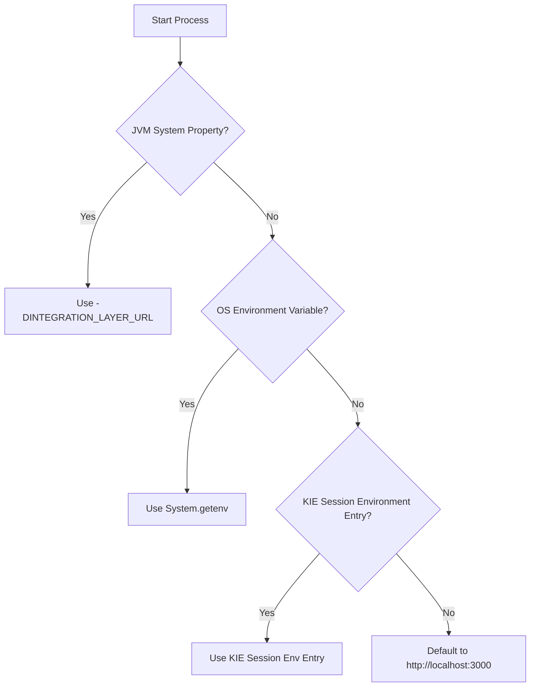

# jBPM Claims Orchestration: Environment Setup & Configuration Guide

This guide explains how to configure environment variables and custom project-level values for the **Prudential Claims jBPM Processes**.

Specifically, all processes rely on a unified backend URL parameter: **`INTEGRATION_LAYER_URL`** (used to point the RestWorkItemHandlers to your Node.js/Integration Layer service).

---

## 1. ⚙️ Dynamic URL Resolution Hierarchy

To make deployment as seamless as possible across development, staging, and production environments, the workflows resolve the `INTEGRATION_LAYER_URL` dynamically using a **hierarchical fallback mechanism** inside their Bootstrap script tasks:



1.  **JVM System Property:** Looks up `-DINTEGRATION_LAYER_URL=...` (Highest priority).
2.  **OS Environment Variable:** Looks up the system-wide environment variable `INTEGRATION_LAYER_URL`.
3.  **KIE Session Environment Entry:** Looks up the local project-level deployment descriptor environment entry configured in KIE Workbench.
4.  **Local Fallback Default:** If none of the above are set, the engine automatically falls back to `http://localhost:3000` to prevent any runtime exceptions.

---

## 2. 🎛 How to Configure Value Per-Project Wise (KIE Workbench UI)

If you do not want to configure global JVM variables on your application server startup script, you can easily configure this **per-project/per-deployment** inside the **KIE Workbench (Business Central) User Interface**:

### Step-by-Step Guide:
1.  Log into your **Business Central** console.
2.  Navigate to **Menu** &rarr; **Design** &rarr; **Projects** and select the **`prudential-claims-bpm`** project.
3.  Click on the **Settings** tab at the top of the project page.
4.  In the left sidebar, click on **Deployments** &rarr; **Environment Entries**.
5.  You will see a table displaying the default environment entry we configured:
    *   **Name:** `INTEGRATION_LAYER_URL`
    *   **Value:** `"http://localhost:3000"` (or another default)
6.  Click **Edit** or click on the value field, and enter your target integration layer address (e.g. `"http://pru-integration-svc:3000"`).
7.  Click **Save** in the top right.
8.  **Re-deploy the project:** When you click **Deploy**, the KIE server compiles the KJAR and launches it using this environment value. The processes will automatically start routing their API calls to this specific URL!

> [!TIP]
> Always wrap the environment entry string value in double quotes (e.g. `"http://localhost:3000"`) in the KIE Workbench UI field because the value resolver is evaluated using the MVEL expression language.

---

## 3. 🖥 How to Configure via JVM Command Line (WildFly / JBoss)

If starting JBoss EAP or WildFly standalone, append the property argument to the startup command:

```bash
./standalone.sh -c standalone-full.xml -DINTEGRATION_LAYER_URL="http://your-integration-service-url:3000"
```

For domain mode, add the system property to your `host.xml` or `domain.xml` configuration file:

```xml
<system-properties>
    <property name="INTEGRATION_LAYER_URL" value="http://your-integration-service-url:3000"/>
</system-properties>
```

---

## 4. 🐳 How to Configure via Docker / Kubernetes (Container Env)

If running the containerized KIE Server (e.g. `jboss/kie-server-showcase`), set the environment variable in your launch parameters:

```bash
docker run -d -p 8080:8080 \
  -e INTEGRATION_LAYER_URL="http://pru-integration-svc:3000" \
  --name kie-server jboss/kie-server-showcase:latest
```

---
