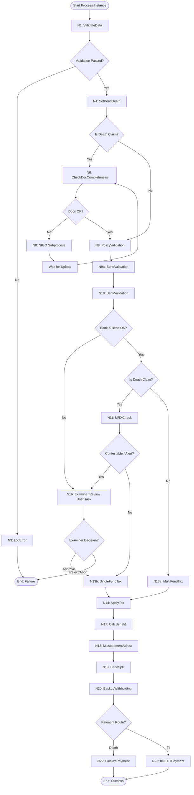

# 📘 Prudential Claims BPM: Mock Testing Blueprint

This testing blueprint serves as the **Mock Solution Document** for testing your industrialized jBPM claims process end-to-end. It details the different business scenarios, the exact **Startup JSON Payloads** to send to KIE Server, how the BPMN execution branches, and how the Mock API server responds to trigger each specific scenario.

---

## 🗺️ Process Scenarios & Execution Matrix



---

## 📁 Scenarios by Category

### 📂 Category 1: Happy Path & Automation
These scenarios test standard, fully automated claims processing where no human intervention is needed.

#### 🧪 Scenario 1: Happy Path Death Claim (Fully Automated Route)
This tests the standard automatic processing of a death claim with complete documentation, valid bank details, and no contestability issues.

##### 📥 Startup Payload (`POST /server/containers/{containerId}/processes/{processId}/instances`)
```json
{
  "caseId": "CASE-DEATH-HAPPY-001",
  "policyNumber": "POL-12345",
  "claimType": "DEATH",
  "dateOfDeath": "2025-04-01",
  "applicablePolicies": ["POL-12345"],
  "uploadedDocuments": [
    "s3://prudential-claims/claims_form_signed.pdf",
    "s3://prudential-claims/certified_death_certificate.pdf"
  ],
  "policyData": {
    "eligibility_passed": true,
    "requires_manual_review": false
  },
  "bankAccountDetails": {
    "bank_name": "Chase Bank",
    "routing_number": "021000021",
    "account_number": "987654321",
    "payment_method": "ACH"
  }
}
```

##### ⚙️ Mock API Interactions & Steps
1. **`POST /api/v1/claims/validate-data`**
   * *BPM sends:* Ingestion payload.
   * *Mock responds:* `{ "success": true, "validationPassed": true }`
2. **`POST /api/v1/claims/status`**
   * *BPM sends:* `{ "caseId": "CASE-DEATH-HAPPY-001" }`
   * *Mock responds:* `{ "success": true, "status": "ACTIVE" }`
3. **`PUT /api/v1/policy/status`**
   * *Mock responds:* `{ "success": true, "updatedPolicies": [...] }`
4. **`POST /api/v1/claims/check-documents`**
   * *Mock responds:* `{ "success": true, "allDocsVerified": true, "missingDocs": [] }`
   * *BPM branches directly to Policy Validation (bypassing NIGO loop).*
5. **`POST /api/v1/claims/validate-policy`** $\rightarrow$ Responds `{ "validationPassed": true }`
6. **`POST /api/v1/claims/validate-beneficiary`** $\rightarrow$ Responds `{ "minorDetected": false }`
7. **`POST /api/v1/claims/validate-bank`** $\rightarrow$ Responds `{ "pvsMatch": true }`
8. **`POST /api/v1/claims/mrx-check`** $\rightarrow$ Responds `{ "alerts": [] }` *(no contestability)*
9. **`POST /api/v1/claims/tax/single-fund`** $\rightarrow$ Returns single-fund tax rates.
10. **`POST /api/v1/claims/tax/apply`** $\rightarrow$ Responds `{ "taxExceptions": false }`
11. **`POST /api/v1/claims/calculate`** $\rightarrow$ Returns face value & interest calculation.
12. **`POST /api/v1/claims/misstatement-adjust`** $\rightarrow$ Returns no adjustments.
13. **`POST /api/v1/claims/beneficiary-split`** $\rightarrow$ Returns payout split.
14. **`POST /api/v1/claims/backup-withholding`** $\rightarrow$ Returns net payout amounts without deductions.
15. **`POST /api/v1/claims/finalize`**
    * *Mock responds:* `{ "success": true, "finalPaymentInstructions": { "status": "DISPATCHED" } }`

🏁 **Expected Outcome:** Process executes under 1 second and reaches **End (Success)**.

---

#### 🧪 Scenario 2: Happy Path Terminal Illness (TI) Claim
This tests the accelerated Terminal Illness route using the **TI KNECT Payment Pipeline**.

##### 📥 Startup Payload
```json
{
  "caseId": "CASE-TI-HAPPY-002",
  "policyNumber": "POL-98765",
  "claimType": "TI",
  "applicablePolicies": ["POL-98765"],
  "uploadedDocuments": [
    "s3://prudential-claims/claims_form_signed.pdf",
    "s3://prudential-claims/physician_statement_ti.pdf"
  ],
  "policyData": {
    "eligibility_passed": true,
    "requires_manual_review": false
  },
  "bankAccountDetails": {
    "bank_name": "First National Bank",
    "routing_number": "121000248",
    "account_number": "554433221",
    "payment_method": "ACH"
  }
}
```

##### ⚙️ Mock API Interactions & Steps
1. **`POST /api/v1/claims/validate-data`** $\rightarrow$ Responds `{ "success": true, "validationPassed": true }`
2. **`POST /api/v1/claims/status`**
   * *BPM sends:* `{ "caseId": "CASE-TI-HAPPY-002" }`
   * *Mock responds:* `{ "success": true, "status": "ACTIVE" }`
3. **BPM routes at `Is Death Claim?` gateway:** Takes the **No** path (direct to `PolicyValidation`).
4. **`POST /api/v1/claims/validate-policy`** $\rightarrow$ Responds `{ "validationPassed": true }`
5. **`POST /api/v1/claims/validate-bank`** $\rightarrow$ Responds `{ "pvsMatch": true }`
6. **BPM routes at second `Is Death Claim?` gateway:** Takes the **No** path (direct to `MultiFundTax`).
7. **`POST /api/v1/claims/tax/multi-fund`** $\rightarrow$ Returns multi-fund tax rates.
8. **BPM routes at `Payment Route?` gateway:** Takes the **TI** path to `N23: KNECTPayment`.
9. **`POST /api/v1/claims/ti-knect-payment`**
   * *Mock responds:* `{ "success": true, "knectTransactionId": "TXN-KNECT-99218A" }`

🏁 **Expected Outcome:** Process reaches **End (Success)** and logs the KNECT Transaction ID.

---

### 📂 Category 2: Document Completeness & NIGO Resolution
These scenarios verify the NIGO (Not In Good Order) subprocess loops, assessing how the system reacts when documents are initially missing, handles updates, and resolves statuses.

#### 🧪 Scenario 3: Death Claim with Missing Documents - NIGO Loop Success
This tests integration, suspension, and subsequent successful resolution when documents are missing. The claim status updates dynamically from `PENDING_REQUIREMENTS` to `ACTIVE` upon document upload.

##### 📥 Startup Payload
```json
{
  "caseId": "CASE-DEATH-NIGO-003",
  "policyNumber": "POL-12345",
  "claimType": "DEATH",
  "dateOfDeath": "2025-04-01",
  "applicablePolicies": ["POL-12345"],
  "uploadedDocuments": [] 
}
```

##### ⚙️ Mock API Interactions & Steps

###### **Phase 1: Initial Suspension**
1. **`POST /api/v1/claims/validate-data`** $\rightarrow$ Responds `{ "validationPassed": true }`
2. **`POST /api/v1/claims/status`**
   * *BPM sends:* `{ "caseId": "CASE-DEATH-NIGO-003" }`
   * *Mock responds:* `{ "success": true, "status": "PENDING_REQUIREMENTS" }` *(Initial state because caseId contains 'NIGO')*
3. **`POST /api/v1/claims/check-documents`**
   * *Mock responds:* `{ "success": true, "allDocsVerified": false, "missingDocs": ["CERTIFIED_DEATH_CERTIFICATE"] }`
   * *BPM branches to NIGO Subprocess (`pru-nigo-followup`).*
4. **`POST /api/v1/claims/nigo/send`** $\rightarrow$ Responds `{ "success": true }`
5. **`POST /api/v1/claims/nigo/funding-notice`** $\rightarrow$ Responds `{ "success": true }`
6. **BPM enters Wait State:** Suspends execution on a Catch Signal/Message event named **`DocumentUploaded`**.

###### **Phase 2: Resume & Resolution**
7. **Trigger Document Upload Event:**
   Send the signal using KIE Server REST:
   `POST /server/containers/{containerId}/processes/instances/{processInstanceId}/signal/DocumentUploaded`
   *Payload:* `["s3://prudential-claims/certified_death_certificate.pdf"]`
8. **`POST /api/v1/claims/nigo/rerun-idp`** $\rightarrow$ Responds `{ "success": true, "extractionResult": { "verified": true } }`
9. **`POST /api/v1/claims/nigo/update-status`**
   * *BPM sends:* `{ "caseId": "CASE-DEATH-NIGO-003" }`
   * *Mock updates internal state mapping:* `CASE-DEATH-NIGO-003` $\rightarrow$ `ACTIVE`
   * *Mock responds:* `{ "success": true, "allDocsReceived": true }`
10. **`POST /api/v1/claims/nigo/death-verification`** $\rightarrow$ Responds `{ "success": true, "verificationStatus": "VERIFIED_PUBLIC_RECORDS" }`
11. **`POST /api/v1/claims/status`**
    * *BPM updates system status check.*
    * *Mock responds:* `{ "success": true, "status": "ACTIVE" }` *(Updated dynamically based on update-status transition!)*
12. Subprocess exits; main process resumes from `N9: PolicyValidation` and continues to completion.

---

#### 🧪 Scenario 4: NIGO Loop Followup Outstanding (PARTIAL / NIGOFAIL)
This tests the loop execution when a document check is updated but still has unresolved outstanding requirements, retaining the `PENDING_REQUIREMENTS` status.

##### 📥 Startup Payload
```json
{
  "caseId": "CASE-DEATH-PARTIAL-013",
  "policyNumber": "POL-12345",
  "claimType": "DEATH"
}
```

##### ⚙️ Mock API Interactions & Steps

###### **Phase 1: Initial Suspension**
1. **`POST /api/v1/claims/check-documents`**
   * *Mock responds:* `{ "success": true, "allDocsVerified": false, "missingDocs": ["CERTIFIED_DEATH_CERTIFICATE"] }`
   * *BPM branches to NIGO Subprocess (`pru-nigo-followup`).*
2. **`POST /api/v1/claims/status`**
   * *Mock responds:* `{ "success": true, "status": "PENDING_REQUIREMENTS" }`
3. **`POST /api/v1/claims/nigo/send`** $\rightarrow$ Responds `{ "success": true }`
4. **BPM enters Wait State:** Suspends execution waiting for the **`DocumentUploaded`** signal.

###### **Phase 2: Resume with Partial/Missing Documents**
5. **Trigger Document Upload Event:**
   Send `DocumentUploaded` signal to the process instance.
6. **`POST /api/v1/claims/nigo/update-status`**
   * *BPM sends:* `{ "caseId": "CASE-DEATH-PARTIAL-013" }`
   * *Mock retains internal state mapping:* `CASE-DEATH-PARTIAL-013` $\rightarrow$ `PENDING_REQUIREMENTS`
   * *Mock responds:* `{ "success": true, "allDocsReceived": false }` *(Since caseId contains 'PARTIAL')*
7. **`POST /api/v1/claims/status`**
   * *Mock responds:* `{ "success": true, "status": "PENDING_REQUIREMENTS" }`
8. **BPM Action:** Because status is still pending requirements, the flow loops and escalates to `N9: ExaminerPartialReview` (Human Task) due to outstanding requirements.

---

### 📂 Category 3: Manual Underwriting & Escalations
These scenarios test routes that bypass automated calculations and escalate claims to human underwriters/examiners due to discrepancies, warnings, or anomalies.

#### 🧪 Scenario 5: Bank Validation Ownership Failure (Manual Underwriting Review)
This tests the automatic escalation to a **Human Task** if Bank Details ownership verification fails.

##### 📥 Startup Payload
```json
{
  "caseId": "CASE-DEATH-BANKFAIL-004",
  "policyNumber": "POL-12345",
  "claimType": "DEATH",
  "applicablePolicies": ["POL-12345"],
  "uploadedDocuments": ["s3://claims/death_cert.pdf", "s3://claims/form.pdf"],
  "bankAccountDetails": {
    "bank_name": "Fraud Bank",
    "routing_number": "999999999",
    "account_number": "111111111",
    "payment_method": "ACH"
  }
}
```

##### ⚙️ Mock API Interactions & Steps
1. **`POST /api/v1/claims/validate-bank`**
   * *Mock responds:* `{ "success": true, "pvsMatch": false, "bankValidationResult": { "error": "OWNER_MISMATCH" } }` *(Triggered by 'BANKFAIL' substring)*
2. **BPM Escalates to Human Task:** Suspends execution on node `N16: ExaminerReview` in Business Central (group: `ClaimExaminer`).
3. **Resolve/Complete:**
   * *Option A (Approve / Force Override):* Underwriter overrides the mismatch. The flow resumes to `N13b: SingleFundTax` and completes payment.
   * *Option B (Reject / Abort):* Underwriter rejects the claim. The flow routes to `N3: LogError` and ends in Failure.

---

#### 🧪 Scenario 6: Contestability Check Failure (Suicide/Contestable Flags)
This tests escalation to manual underwriting if a claim flags contestability rules (e.g. death within contestability window).

##### 📥 Startup Payload
```json
{
  "caseId": "CASE-DEATH-CONTEST-005",
  "policyNumber": "POL-12345",
  "claimType": "DEATH",
  "dateOfDeath": "2025-04-01"
}
```

##### ⚙️ Mock API Interactions & Steps
1. **`POST /api/v1/claims/mrx-check`**
   * *Mock responds:* `{ "success": true, "alerts": ["SUICIDE_CONTESTABLE_WINDOW"], "mrxCheckResult": { "isSuicide": true, "isContestable": true } }` *(Triggered by 'CONTEST' substring)*
2. **BPM Escalates to Human Task:** Bypasses single tax / payment gates and routes directly to node `N16: ExaminerReview` (Manual Underwriting).

---

#### 🧪 Scenario 7: Tax Rules Exception (TAXEXCEPT)
This tests branching where a tax exception is flagged at node `N14: ApplyTax` and escalated to manual review.

##### 📥 Startup Payload
```json
{
  "caseId": "CASE-DEATH-TAXEXCEPT-007",
  "policyNumber": "POL-12345",
  "claimType": "DEATH",
  "applicablePolicies": ["POL-12345"]
}
```

##### ⚙️ Mock API Interactions & Steps
1. **`POST /api/v1/claims/tax/apply`**
   * *Mock responds:*
     ```json
     {
       "success": true,
       "taxExceptions": true,
       "taxCheckResult": {
         "withholdingApplied": true,
         "irsReportingGenerated": true
       }
     }
     ```
2. **BPM Escalates to Human Task:** Branches to `N16: ExaminerReview` due to `taxExceptions == true` and suspends waiting for approval.

---

#### 🧪 Scenario 8: Beneficiary Verification Mismatches & Sanctions (MINOR / SANCTION)
This tests human verification flows when a beneficiary is identified as a minor or hits a sanctions registry warning.

##### 📥 Startup Payload
```json
{
  "caseId": "CASE-DEATH-MINOR-009",
  "policyNumber": "POL-12345",
  "claimType": "DEATH"
}
```

##### ⚙️ Mock API Interactions & Steps
1. **`POST /api/v1/claims/validate-beneficiary`**
   * *Mock responds:*
     ```json
     {
       "success": true,
       "minorDetected": true,
       "beneficiaryFlags": {
         "identitiesVerified": true,
         "sanctionsChecked": true
       }
     }
     ```
2. **BPM Action:** Routes to `N16: ExaminerReview` task because `minorDetected` is true.

---

### 📂 Category 4: Data Validation & Mainframe Gate Errors
These scenarios test integration failures, data structure mismatch, and mainframe verification failures.

#### 🧪 Scenario 9: Ingestion Data Invalidation (VALFAIL)
This tests the bootstrap validation failure where the claim is rejected immediately at step `N1: ValidateData` and logged.

##### 📥 Startup Payload
```json
{
  "caseId": "CASE-DEATH-VALFAIL-006",
  "policyNumber": "POL-12345",
  "claimType": "DEATH",
  "applicablePolicies": ["POL-12345"]
}
```

##### ⚙️ Mock API Interactions & Steps
1. **`POST /api/v1/claims/validate-data`**
   * *Mock responds:*
     ```json
     {
       "success": true,
       "validationPassed": false,
       "validationErrors": [
         { "field": "claimType", "error": "Claim type selection is missing or invalid" }
       ]
     }
     ```
2. **BPM branches to Failure path:** Routes directly to node `N3: LogError`.
3. **`POST /api/v1/audit/log-failure`** $\rightarrow$ Responds `{ "success": true, "auditLogId": "AUD-129481" }`
4. Process terminates at **End: Failure**.

---

#### 🧪 Scenario 10: Policy Lapsed or Inactive (LAPSE / POLICYFAIL)
Tests policy validation failing on the mainframe, flagging the policy as inactive.

##### 📥 Startup Payload
```json
{
  "caseId": "CASE-DEATH-LAPSE-008",
  "policyNumber": "POL-12345",
  "claimType": "DEATH"
}
```

##### ⚙️ Mock API Interactions & Steps
1. **`POST /api/v1/claims/validate-policy`**
   * *Mock responds:*
     ```json
     {
       "success": true,
       "validationPassed": false,
       "policyFlags": {
         "isActive": false,
         "premiumsPaid": false,
         "hasLapseAlert": true
       }
     }
     ```
2. **BPM Action:** Bypasses standard flow and routes to failure logging or examiner escalations.

---

#### 🧪 Scenario 11: Payment Finalization Gate Failure (PAYFAIL)
Tests behavior when the final payment dispatch gateway rejects or fails the EFT transaction.

##### 📥 Startup Payload
```json
{
  "caseId": "CASE-DEATH-PAYFAIL-012",
  "policyNumber": "POL-12345",
  "claimType": "DEATH"
}
```

##### ⚙️ Mock API Interactions & Steps
1. **`POST /api/v1/claims/finalize`**
   * *Mock responds:* `{ "success": false, "finalPaymentInstructions": { "paymentGateway": "EFT", "payoutStatus": "FAILED", "bankRefNum": null } }`
2. **BPM Action:** Executes API error handoff or triggers administrative retries.

---

### 📂 Category 5: Dynamic Adjustments
These scenarios test calculated modifications of the final payouts (e.g. loans, misstated attributes, tax withholdings).

#### 🧪 Scenario 12: Misstatement Adjustment Flow (MISSTATE)
Tests dynamic payout recalculation when a misstatement of age or gender is detected during calculations.

##### 📥 Startup Payload
```json
{
  "caseId": "CASE-DEATH-MISSTATE-010",
  "policyNumber": "POL-12345",
  "claimType": "DEATH"
}
```

##### ⚙️ Mock API Interactions & Steps
1. **`POST /api/v1/claims/calculate`**
   * *Mock responds:* Sets `outstandingLoans` to `30000.00` and returns `netPayout: 221250.00`.
2. **`POST /api/v1/claims/misstatement-adjust`**
   * *Mock responds:* Applies adjustment reduction of `20000.00` returning `adjustedPayout: 201250.00`.
3. **`POST /api/v1/claims/beneficiary-split`**
   * *Mock responds:* Dynamically returns a single split of `201250.00`.

---

#### 🧪 Scenario 13: Backup Withholding Deduction (WITHHOLD)
Tests IRS backup withholding checks where 24% is withheld from the final payout amount.

##### 📥 Startup Payload
```json
{
  "caseId": "CASE-DEATH-WITHHOLD-011",
  "policyNumber": "POL-12345",
  "claimType": "DEATH"
}
```

##### ⚙️ Mock API Interactions & Steps
1. **`POST /api/v1/claims/backup-withholding`**
   * *Mock responds:*
     ```json
     {
       "success": true,
       "withholdingResult": {
         "withholdingDeducted": 60300.00,
         "finalPayout": 190950.00
       },
       "finalPayouts": [
         { "beneficiary": "John Doe", "amount": 190950.00 }
       ]
     }
     ```

---

### 📂 Category 6: Fast-Track Rules
These scenarios test the fast-track rule endpoints that verify eligibility based on business rules.

#### 🧪 Scenario 14: Fast-Track Rule Check (FASTTRACKFAIL)
This tests the branching and response behavior of the fast-track rule check endpoint.

##### 📥 Startup Payload
```json
{
  "caseId": "CASE-FASTTRACKFAIL-014",
  "policyNumber": "POL-12345",
  "claimType": "DEATH",
  "applicablePolicies": ["POL-12345"]
}
```

##### ⚙️ Mock API Interactions & Steps
1. **`POST /api/v1/claims/check-fast-track-rule`**
   * *Mock responds:*
     ```json
     {
       "success": true,
       "fundTaxResult": {
         "taxWithholdingRate": 0.1,
         "stateTaxRate": 0.03,
         "fundType": "MULTI"
       },
       "isFastTrackRuleClear": false
     }
     ```
   * *BPM Action:* Routes to manual underwriting review since `isFastTrackRuleClear` is false.

---

## 🛠️ Route Overrides & Failure Injection

You can dynamically force any mock endpoint to fail a specific number of times (to test automated retry logic) or persistently (to test manual admin exception handling).

### 📥 1. Configure Auto-Retry Test (Temporary Failures)
* **HTTP Method:** `POST`
* **URL:** `/api/mock/override`
* **Sample Payload (Fail 2 times with 503, then succeed):**
  ```json
  {
    "path": "/api/v1/claims/validate-policy",
    "status": 503,
    "failCount": 2,
    "response": {
      "success": false,
      "error": "Temporary connection timeout to policy mainframe"
    }
  }
  ```

### 📥 2. Configure Persistent Failure
* **HTTP Method:** `POST`
* **URL:** `/api/mock/override`
* **Sample Payload:**
  ```json
  {
    "path": "/api/v1/claims/validate-policy",
    "status": 500,
    "success": false,
    "response": {
      "success": false,
      "error": "Persistent authorization exception"
    }
  }
  ```

### 📥 3. View All Configured Overrides
* **HTTP Method:** `GET`
* **URL:** `/api/mock/overrides`

### 📥 4. Clear/Reset Overrides
* **HTTP Method:** `DELETE`
* **URL:** `/api/mock/override`
* **Sample Payload:**
  ```json
  {
    "path": "/api/v1/claims/validate-policy"
  }
  ```
  *(Omit `path` or send `{}` to clear all overrides).*

---

## ⚡ KIE Server & jBPM REST APIs Integration

These APIs allow execution of the entire claims lifecycle interactively inside the **Swagger UI (`http://localhost:3010/api-docs`)**.

> [!TIP]
> **Swagger Authentication:** Click **"Authorize"** at the top-right of Swagger UI. Enter username `krisv` and password `krisv`. All request headers will automatically authenticate.

### 📥 1. Start Process Instance
* **HTTP Method:** `POST`
* **URL:** `/kie-server/services/rest/server/containers/prudential-claims-bpm_1.0.0-SNAPSHOT/processes/prudential-claims-submission.pru-claim-internal-processing/instances`
* **Payload:**
  ```json
  {
    "caseId": "CASE-DEATH-BANKFAIL-104",
    "policyNumber": "POL-12345",
    "claimType": "DEATH",
    "applicablePolicies": ["POL-12345"]
  }
  ```
* **Response (201):** Returns Process Instance ID (e.g. `1059`).

### 📥 2. Query Human Task List
* **HTTP Method:** `GET`
* **URL:** `/kie-server/services/rest/server/queries/tasks/instances/pot-owners?status=Ready,Reserved,InProgress`

### 📥 3. Claim Human Task
* **HTTP Method:** `PUT`
* **URL:** `/kie-server/services/rest/server/containers/prudential-claims-bpm_1.0.0-SNAPSHOT/tasks/{taskId}/states/claimed`

### 📥 4. Start Human Task
* **HTTP Method:** `PUT`
* **URL:** `/kie-server/services/rest/server/containers/prudential-claims-bpm_1.0.0-SNAPSHOT/tasks/{taskId}/states/started`

### 📥 5. Complete Human Task
* **HTTP Method:** `PUT`
* **URL:** `/kie-server/services/rest/server/containers/prudential-claims-bpm_1.0.0-SNAPSHOT/tasks/{taskId}/states/completed`
* **Payload:**
  ```json
  {
    "isApproved": true,
    "examinerOverrideRemarks": "Banking mismatch overridden; claimant details validated"
  }
  ```

### 📥 6. Signal NIGO Document Upload
* **HTTP Method:** `POST`
* **URL:** `/kie-server/services/rest/server/containers/prudential-claims-bpm_1.0.0-SNAPSHOT/processes/instances/{piid}/signal/DocumentUploaded`
* **Payload:**
  ```json
  [
    "s3://claims/certified_death_certificate.pdf"
  ]
  ```

---

## 👤 User Accounts, Roles & Task Visibility

The process engine delegates human tasks to specific roles (groups) instead of hardcoding user assignments.

### 🔑 Configured Testing Users
*   **`krisv`** (Password: `krisv`)
    *   *Roles/Groups:* `ClaimExaminer`, `SystemAdmin`
    *   *Testing Use:* Can access all examiner review tasks and IT admin exception reviews.
*   **`john`** (Password: `john`)
    *   *Roles/Groups:* `ClaimExaminer`
    *   *Testing Use:* Can access examiner review tasks (`ExaminerReview` and `ExaminerPartialReview`).
*   **Mary** (Password: `mary`)
    *   *Roles/Groups:* `SeniorInvestigator`
    *   *Testing Use:* Can access death verification tasks (`ExaminerDeathVerif`).
