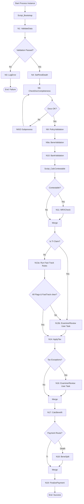

# 📘 Prudential Claims BPM: Mock Testing Blueprint

This testing blueprint serves as the **Mock Solution Document** for testing your industrialized jBPM claims process end-to-end. It details the different business scenarios, the exact **Startup JSON Payloads** to send to KIE Server, how the BPMN execution branches, and how the Mock API server responds to trigger each specific scenario.

---

## 🗺️ Process Scenarios & Execution Matrix



---

## 🧪 Scenario 1: Happy Path Death Claim (Fully Automated Route)
This tests the standard automatic processing of a death claim with complete documentation, valid bank details, and no contestability issues.

### 📥 Startup Payload (`POST /server/containers/{containerId}/processes/{processId}/instances`)
```json
{
  "caseId": "CASE-DEATH-HAPPY-001",
  "policyNumber": "POL-12345",
  "claimType": "DEATH",
  "dateOfDeath": "2025-04-01",
  "applicablePolicies": ["POL-12345"],
  "uploadedDocuments": [
    "s3://prudential-claims/claims_form_signed.pdf",
    "s3://prudential-claims/certified_death_certificate.pdf"
  ],
  "policyData": {
    "eligibility_passed": true,
    "requires_manual_review": false
  },
  "bankAccountDetails": {
    "bank_name": "Chase Bank",
    "routing_number": "021000021",
    "account_number": "987654321",
    "payment_method": "ACH"
  }
}
```

### ⚙️ Mock API Interactions & Behaviors
1. **`POST /api/v1/claims/validate-data`**
   * **BPM sends:** `{ "piid": "...", "caseId": "CASE-DEATH-HAPPY-001", ... }`
   * **Mock responds:** `{ "success": true, "validationPassed": true }`
2. **`PUT /api/v1/policy/status`**
   * **BPM sends:** Sets status to `PENDING_DEATH_CLAIM`.
   * **Mock responds:** `{ "success": true, "updatedPolicies": [...] }`
3. **`POST /api/v1/claims/check-documents`**
   * **Mock responds:** `{ "success": true, "allDocsVerified": true, "missingDocs": [] }`
   * *BPM branches to **PolicyValidation** (bypassing NIGO loop).*
4. **`POST /api/v1/claims/validate-policy`** $\rightarrow$ Responds `{ "validationPassed": true }`
5. **`POST /api/v1/claims/validate-beneficiary`** $\rightarrow$ Responds `{ "minorDetected": false }`
6. **`POST /api/v1/claims/validate-bank`** $\rightarrow$ Responds `{ "pvsMatch": true }`
   * *BPM calculates `flagContestable = false` and bypasses MRXCheck.*
7. **`POST /api/v1/claims/check-fast-track-rule`**
   * **Mock responds:** `{ "success": true, "fundTaxResult": { ... }, "isFastTrackRuleClear": true }`
   * *BPM bypasses Examiner Review task `N13b` since fast-track rules are clear.*
8. **`POST /api/v1/claims/tax/apply`** $\rightarrow$ Responds `{ "taxExceptions": false }`
   * *BPM bypasses Examiner Review task `N16` since there are no tax exceptions.*
9. **`POST /api/v1/claims/calculate`** $\rightarrow$ Returns benefit calculation payout.
10. **`POST /api/v1/claims/beneficiary-split`** $\rightarrow$ Returns payout split.
11. **`POST /api/v1/claims/finalize`**
    * **Mock responds:** `{ "success": true, "finalPaymentInstructions": { "payoutStatus": "SUCCESS" } }`

🏁 **Expected Outcome:** Process executes automatically in the background and reaches **End (Success)**.

---

## 🧪 Scenario 2: Happy Path Terminal Illness (TI) Claim
This tests the Terminal Illness route. It bypasses MRXCheck and the fast-track rules checks, but routes to a manual Underwriting review task `N13b: ExaminerReview` due to the TI claim type, and bypasses beneficiary split.

### 📥 Startup Payload
```json
{
  "caseId": "CASE-TI-HAPPY-002",
  "policyNumber": "POL-98765",
  "claimType": "TI",
  "applicablePolicies": ["POL-98765"],
  "uploadedDocuments": [
    "s3://prudential-claims/claims_form_signed.pdf",
    "s3://prudential-claims/physician_statement_ti.pdf"
  ],
  "policyData": {
    "eligibility_passed": true,
    "requires_manual_review": false
  },
  "bankAccountDetails": {
    "bank_name": "First National Bank",
    "routing_number": "121000248",
    "account_number": "554433221",
    "payment_method": "ACH"
  }
}
```

### ⚙️ Mock API Interactions & Behaviors
1. **`POST /api/v1/claims/validate-data`** $\rightarrow$ Responds validationPassed: true.
2. **`PUT /api/v1/policy/status`** $\rightarrow$ Sets status to pending.
3. **`POST /api/v1/claims/check-documents`** $\rightarrow$ Responds allDocsVerified: true.
4. **`POST /api/v1/claims/validate-policy`** $\rightarrow$ Responds validationPassed: true.
5. **`POST /api/v1/claims/validate-beneficiary`** $\rightarrow$ Responds minorDetected: false.
6. **`POST /api/v1/claims/validate-bank`** $\rightarrow$ Responds pvsMatch: true.
   * *BPM routes through Contestable? -> No (bypassing MRXCheck).*
   * *BPM routes through Is TI Claim? -> Yes, routing directly to task `N13b: ExaminerReview`.*
7. **BPM Escales to Human Task:** Suspends execution on user task `N13b: ExaminerReview`.
   * *Underwriter claims and completes task with `isApproved: true`.*
8. **`POST /api/v1/claims/tax/apply`** $\rightarrow$ Responds taxExceptions: false.
9. **`POST /api/v1/claims/calculate`** $\rightarrow$ Returns calculations.
   * *BPM routes through Payment Route? -> TI, bypassing `N18: BeneSplit`.*
10. **`POST /api/v1/claims/finalize`**
    * **Mock responds:** `{ "success": true, "finalPaymentInstructions": { "payoutStatus": "SUCCESS" } }`

🏁 **Expected Outcome:** Process reaches task `N13b: ExaminerReview`. Upon manual task completion, it finishes automated payment and reaches **End (Success)**.

---

## 🧪 Scenario 3: Death Claim with Missing Documents (NIGO Loop)
This tests the integration and suspension of the process when documents are missing, triggering the **NIGO Subprocess** and waiting for manual document upload.

### 📥 Startup Payload
```json
{
  "caseId": "CASE-DEATH-NIGO-003",
  "policyNumber": "POL-12345",
  "claimType": "DEATH",
  "dateOfDeath": "2025-04-01",
  "applicablePolicies": ["POL-12345"],
  "uploadedDocuments": [] 
}
```

### ⚙️ Mock API Interactions & Behaviors
1. **`POST /api/v1/claims/check-documents`**
   * **Mock responds:** `{ "success": true, "allDocsVerified": false, "missingDocs": ["CERTIFIED_DEATH_CERTIFICATE"] }`
   * *BPM branches to NIGO Subprocess (`pru-nigo-followup`).*
2. **`POST /api/v1/claims/nigo/send`** $\rightarrow$ Responds `{ "success": true }`
3. **`POST /api/v1/claims/status`** $\rightarrow$ Responds `{ "success": true, "status": "PENDING_REQUIREMENTS" }`
4. **BPM enters Wait State:** Suspends execution on human task `Wait for Document Upload` inside the NIGO subprocess.

### 🔄 How to Resume & Complete Scenario 3:
1. Complete/resume the human task `Wait for Document Upload` in Business Central (or trigger the mock signal/event if configured).
2. **`POST /api/v1/claims/nigo/rerun-idp`** $\rightarrow$ Responds `{ "success": true }`
3. **`POST /api/v1/claims/nigo/update-status`**
   * **Mock responds:** `{ "success": true, "allDocsReceived": true }`
   * *BPM exits NIGO subprocess loop and re-enters the main flow.*
4. **`POST /api/v1/claims/validate-policy`** $\rightarrow$ Responds validationPassed: true, and process resumes standard execution until completion!

> [!NOTE]
> **Loop Timeout Escalations:**
> If documents are not uploaded and reminders continue:
> * **DEATH claims:** After 4 follow-up reminders (limit of 4), the subprocess times out and routes to **Death Verification** (`_P2_N12` UpdateDeathVerification status / `_P2_N13` ExaminerDeathVerif user task).
> * **TI claims:** After 1 follow-up reminder (limit of 1), the subprocess times out and routes directly to the **Examiner Partial Review** user task (`_P2_N9`).

---

## 🧪 Scenario 4: Bank Validation Ownership Failure (Manual Underwriting Review)
This tests the automatic escalation to a **Human Task** if Bank Details ownership verification fails.

### 📥 Startup Payload
```json
{
  "caseId": "CASE-DEATH-BANKFAIL-004",
  "policyNumber": "POL-12345",
  "claimType": "DEATH",
  "applicablePolicies": ["POL-12345"],
  "uploadedDocuments": ["s3://claims/death_cert.pdf", "s3://claims/form.pdf"],
  "bankAccountDetails": {
    "bank_name": "Fraud Bank",
    "routing_number": "999999999",
    "account_number": "111111111",
    "payment_method": "ACH"
  }
}
```

### ⚙️ Mock API Interactions & Behaviors
1. **`POST /api/v1/claims/validate-bank`**
   * **Mock responds:** `{ "success": true, "pvsMatch": false, "bankValidationResult": { "error": "OWNER_MISMATCH" } }`
   * *BPM calculates `flagContestable = true` (routing to N11: MRXCheck).*
2. **`POST /api/v1/claims/check-fast-track-rule`**
   * **Mock responds:** `{ "success": true, "isFastTrackRuleClear": false }` (since caseId contains `BANKFAIL`).
3. **BPM Escales to Human Task:** Suspends execution on task `N13b: ExaminerReview` in Business Central.
4. **Task Owner:** Mapped to group `ClaimExaminer`.

### 🔄 How to Resume & Complete Scenario 4:
An Underwriter claims the task and makes a decision:
* **Option A (Approve / Force Override):** The underwriter overrides the banking flag. The flow resumes to `N14: ApplyTax` and successfully finishes automated payment.
* **Option B (Reject / Abort):** The underwriter aborts the claim. The flow goes to `N3: LogError` and reaches `End (Failed)`.

---

## 🧪 Scenario 5: Contestability Check Failure (Suicide/Contestable Flags)
This tests escalation to manual underwriting if a claim flags contestability rules.

### 📥 Startup Payload
Include suicide flags or contestable dates:
```json
{
  "caseId": "CASE-DEATH-CONTEST-005",
  "policyNumber": "POL-12345",
  "claimType": "DEATH",
  "dateOfDeath": "2025-04-01"
}
```

### ⚙️ Mock API Interactions & Behaviors
1. **`POST /api/v1/claims/validate-data`**
   * **Mock responds:** Sets `policyFlags.isContestable = true`.
2. **`POST /api/v1/claims/mrx-check`**
   * **Mock responds:** `{ "success": true, "alerts": ["SUICIDE_CONTESTABLE_WINDOW"], "mrxCheckResult": { "isSuicide": true, "isContestable": true } }`
3. **`POST /api/v1/claims/check-fast-track-rule`**
   * **Mock responds:** `{ "success": true, "isFastTrackRuleClear": false }` (since caseId contains `CONTEST`).
4. **BPM Escales to Human Task:** Bypasses automated clearance and routes directly to user task `N13b: ExaminerReview` (Manual Underwriting).

---

## 🧪 Scenario 6: Ingestion Data Invalidation (VALFAIL)
This tests the bootstrap validation failure where the claim is rejected immediately at step `N1: ValidateData` and routed to `N3: LogError` to write audit logs.

### 📥 Startup Payload
```json
{
  "caseId": "CASE-DEATH-VALFAIL-006",
  "policyNumber": "POL-12345",
  "claimType": "DEATH",
  "applicablePolicies": ["POL-12345"]
}
```

### ⚙️ Mock API Interactions & Behaviors
1. **`POST /api/v1/claims/validate-data`**
   * **Mock responds:**
     ```json
     {
       "success": true,
       "validationPassed": false,
       "policyFlags": {
         "isSuicide": false,
         "isContestable": false,
         "isForeignDeath": false,
         "isAIDS": false
       },
       "validationErrors": [
         { "field": "claimType", "error": "Claim type selection is missing or invalid" },
         { "field": "primaryPolicyNumber", "error": "Target policy status is inactive" }
       ]
     }
     ```
2. **BPM execution branches to "No" path at exclusive gateway:** Routes directly to node `N3: LogError` (dynamic `validationErrors` list parsed by BPMN exit script).
3. **`POST /api/v1/audit/log-failure`**
   * **BPM sends:**
     ```json
     {
       "piid": "...",
       "caseId": "CASE-DEATH-VALFAIL-006",
       "errors": [
         { "field": "claimType", "error": "Claim type selection is missing or invalid" },
         { "field": "primaryPolicyNumber", "error": "Target policy status is inactive" }
       ]
     }
     ```
   * **Mock responds:** `{ "success": true, "auditLogId": "AUD-129481" }`
4. Process terminates at **End: Failure**.

---

## 🧪 Scenario 7: Tax Rules Exception (TAXEXCEPT)
This tests the branching where a tax exception is flagged at node `N14: ApplyTax` and escalated to manual underwriter review `N16: ExaminerReview`.

### 📥 Startup Payload
```json
{
  "caseId": "CASE-DEATH-TAXEXCEPT-007",
  "policyNumber": "POL-12345",
  "claimType": "DEATH",
  "applicablePolicies": ["POL-12345"]
}
```

### ⚙️ Mock API Interactions & Behaviors
1. **`POST /api/v1/claims/tax/apply`**
   * **Mock responds:**
      ```json
      {
        "success": true,
        "taxExceptions": true,
        "taxCheckResult": {
          "withholdingApplied": true,
          "irsReportingGenerated": true
        }
      }
      ```
2. **BPM execution branches to "Yes" path at Tax Exceptions gateway:** Routes directly to node `N16: ExaminerReview` (Manual Underwriting).
3. **BPM suspends execution at Human Task:** Wait for underwriter approval.

---

## 🧪 Scenario 8: Policy Lapsed or Inactive (LAPSE / POLICYFAIL)
Tests policy validation failing on the mainframe, flagging the policy as inactive.

### 📥 Startup Payload
```json
{
  "caseId": "CASE-DEATH-LAPSE-008",
  "policyNumber": "POL-12345",
  "claimType": "DEATH"
}
```

### ⚙️ Mock API Interactions & Behaviors
1. **`POST /api/v1/claims/validate-policy`**
   * **Mock responds:**
     ```json
     {
       "success": true,
       "validationPassed": false,
       "policyFlags": {
         "isActive": false,
         "premiumsPaid": false,
         "hasLapseAlert": true
       }
     }
     ```
   * *BPM sets `flagContestable = true`, which fails the fast-track rule check and routes the claim to human underwriting review (`N13b: ExaminerReview`).*

---

## 🧪 Scenario 9: Beneficiary Verification Mismatches & Sanctions (MINOR / SANCTION)
Tests human verification flows when a beneficiary is identified as a minor or hits a sanctions registry warning.

### 📥 Startup Payload
```json
{
  "caseId": "CASE-DEATH-MINOR-009",
  "policyNumber": "POL-12345",
  "claimType": "DEATH"
}
```

### ⚙️ Mock API Interactions & Behaviors
1. **`POST /api/v1/claims/validate-beneficiary`**
   * **Mock responds:**
     ```json
     {
       "success": true,
       "minorDetected": true,
       "beneficiaryFlags": {
         "identitiesVerified": true,
         "sanctionsChecked": true
       }
     }
     ```
   * *BPM sets `flagContestable = true`, failing fast track and escalating to user review (`N13b: ExaminerReview`).*

---

## 🧪 Scenario 10: Misstatement Adjustment & Backup Withholding (MISSTATE / WITHHOLD)
Tests dynamic calculations where age/gender misstatements or backup withholdings are handled inside standard calculation and payout splits.

### 📥 Startup Payload
```json
{
  "caseId": "CASE-DEATH-MISSTATE-010",
  "policyNumber": "POL-12345",
  "claimType": "DEATH"
}
```

### ⚙️ Mock API Interactions & Behaviors
1. **`POST /api/v1/claims/calculate`**
   * **Mock responds:** Recalculates faces/interest and returns net payouts adjusted for loans and exclusions.
2. **`POST /api/v1/claims/beneficiary-split`**
   * **Mock responds:** Computes beneficiary splits based on final adjusted payouts.

---

## 🧪 Scenario 11: Payment Finalization Gate Failure (PAYFAIL)
Tests behavior when the payment dispatch gateway rejects or fails the transaction.

### 📥 Startup Payload
```json
{
  "caseId": "CASE-DEATH-PAYFAIL-011",
  "policyNumber": "POL-12345",
  "claimType": "DEATH"
}
```

### ⚙️ Mock API Interactions & Behaviors
1. **`POST /api/v1/claims/finalize`**
   * **Mock responds:** `{ "success": false, "finalPaymentInstructions": { "paymentGateway": "EFT", "payoutStatus": "FAILED", "bankRefNum": null } }`

---

## 🧪 Scenario 12: NIGO Loop Followup Outstanding (PARTIAL / NIGOFAIL)
Tests loop execution when a document check is updated but still has unresolved outstanding requirements.

### 📥 Startup Payload
```json
{
  "caseId": "CASE-DEATH-PARTIAL-012",
  "policyNumber": "POL-12345",
  "claimType": "DEATH"
}
```

### ⚙️ Mock API Interactions & Behaviors
1. **`POST /api/v1/claims/check-documents`**
   * **Mock responds:** `{ "success": true, "allDocsVerified": false, "missingDocs": ["CERTIFIED_DEATH_CERTIFICATE"] }`
   * *BPM branches to NIGO Subprocess (`pru-nigo-followup`).*
2. **`POST /api/v1/claims/nigo/send`** $\rightarrow$ Responds `{ "success": true }`
3. **`POST /api/v1/claims/status`** $\rightarrow$ Responds `{ "success": true, "status": "PENDING_REQUIREMENTS" }`
4. **BPM enters Wait State:** Suspends execution waiting for the `Wait for Document Upload` human task.
5. Complete the task in Business Central to simulate document upload.
6. **`POST /api/v1/claims/nigo/update-status`**
   * **Mock responds:** `{ "success": true, "allDocsReceived": false }`
   * *BPM routes to `N9: ExaminerPartialReview` user task in the NIGO loop due to outstanding requirements.*

---

## 🧪 Scenario 13: Fast-Track Rule Check (FASTTRACKFAIL)
This tests the branching and response behavior of the fast-track rule check endpoint.

### 📥 Startup Payload
```json
{
  "caseId": "CASE-FASTTRACKFAIL-013",
  "policyNumber": "POL-12345",
  "claimType": "DEATH",
  "applicablePolicies": ["POL-12345"]
}
```

### ⚙️ Mock API Interactions & Behaviors
1. **`POST /api/v1/claims/check-fast-track-rule`**
   * **Mock responds:**
     ```json
     {
       "success": true,
       "fundTaxResult": {
         "taxWithholdingRate": 0.1,
         "stateTaxRate": 0.03,
         "fundType": "MULTI"
       },
       "isFastTrackRuleClear": false
     }
     ```
   * *BPM routes the claim to manual underwriting review (`N13b: ExaminerReview`) since rules are not clear.*

---

## 🛠️ Route Overrides & Failure Injection (Auto-Retry & Admin Decisions)

You can dynamically force any mock endpoint to fail a specific number of times (to test automated retry logic in `pru-api-error-handler.bpmn`) or persistently (to test manual admin decision and retry/skip paths).

### 📥 1. Configure Auto-Retry Test (Temporary Failures)
Forces an API endpoint to return errors a set number of times, after which it automatically heals and succeeds.
* **HTTP Method:** `POST`
* **URL:** `/api/mock/override`
* **Sample Payload (Fail 2 times with 503, then succeed):**
```json
{
  "path": "/api/v1/claims/validate-policy",
  "status": 503,
  "failCount": 2,
  "response": {
    "success": false,
    "error": "Temporary connection timeout to policy mainframe"
  }
}
```

### 📥 2. Configure Persistent Failure (For Admin Manual Actions)
Forces an API endpoint to fail persistently until manually cleared, allowing you to test human intervention (e.g. administrative retry/skip/terminate decisions).
* **HTTP Method:** `POST`
* **URL:** `/api/mock/override`
* **Sample Payload:**
```json
{
  "path": "/api/v1/claims/validate-policy",
  "status": 500,
  "success": false,
  "response": {
    "success": false,
    "error": "Persistent authorization exception"
  }
}
```

---

## ⚡ KIE Server & jBPM REST APIs Integration

This allows developers and testers to execute the entire claims lifecycle interactively inside the **Swagger UI (`http://localhost:3010/api-docs`)**!

### 📥 1. Start Process Instance
Create a new claims orchestration run.
* **HTTP Method:** `POST`
* **URL:** `/kie-server/services/rest/server/containers/prudential-claims-bpm_1.0.0-SNAPSHOT/processes/prudential-claims-submission.pru-claim-internal-processing/instances`
* **Sample Payload:**
```json
{
  "caseId": "CASE-DEATH-BANKFAIL-104",
  "policyNumber": "POL-12345",
  "claimType": "DEATH",
  "applicablePolicies": ["POL-12345"]
}
```

### 📥 2. Query Human Task List
Retrieve active examiner tasks (e.g., when routing escalates to `N13b: ExaminerReview`).
* **HTTP Method:** `GET`
* **URL:** `/kie-server/services/rest/server/queries/tasks/instances/pot-owners?status=Ready,Reserved,InProgress`

### 📥 3. Claim Human Task
Assign the task to yourself before completing it.
* **HTTP Method:** `PUT`
* **URL:** `/kie-server/services/rest/server/containers/prudential-claims-bpm_1.0.0-SNAPSHOT/tasks/89/states/claimed`

### 📥 4. Start Human Task
Move the task status to started.
* **HTTP Method:** `PUT`
* **URL:** `/kie-server/services/rest/server/containers/prudential-claims-bpm_1.0.0-SNAPSHOT/tasks/89/states/started`

### 📥 5. Complete Human Task
Submit the examiner's decision to resume automated execution!
* **HTTP Method:** `PUT`
* **URL:** `/kie-server/services/rest/server/containers/prudential-claims-bpm_1.0.0-SNAPSHOT/tasks/89/states/completed`
* **Sample Payload:**
```json
{
  "isApproved": true,
  "examinerOverrideRemarks": "Banking mismatch overridden; claimant details validated"
}
```

---

## 👤 User Accounts, Roles & Task Visibility

When executing and testing human task flows, the jBPM process engine delegates tasks to specific roles (groups) instead of hardcoding user assignments:

### 🔑 Configured Testing Users
*   **`krisv`** (Password: `krisv`)
    *   *Roles/Groups:* `ClaimExaminer`, `SystemAdmin`
    *   *Testing Use:* Can access all examiner review tasks and IT admin exception reviews.
*   **`john`** (Password: `john`)
    *   *Roles/Groups:* `ClaimExaminer`
    *   *Testing Use:* Can access examiner review tasks (`ExaminerReview` and `ExaminerPartialReview`).
*   **`mary`** (Password: `mary`)
    *   *Roles/Groups:* `SeniorInvestigator`
    *   *Testing Use:* Can access death verification tasks (`ExaminerDeathVerif`).
