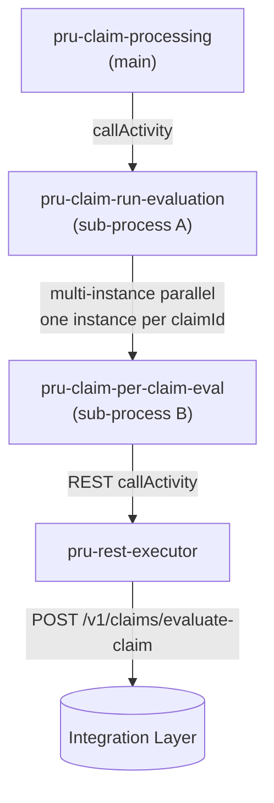

# Per-Claim Evaluation Fan-Out — Solution Design

> Adds a **parallel, one-claim-at-a-time** evaluation layer to the main claims process. Before evaluation, a REST call fetches the **array of claim ids** for the case; each id is then evaluated **in parallel** in its own sub-process, and the per-claim results are aggregated back into a single `Case_STP_Eligible` decision.
>
> **New / changed files**
> - `src/main/resources/org/jbpm/pru-claim-submission.bpmn` — **backup** of the pre-change main process (distinct id `…pru-claim-submission`)
> - `src/main/resources/org/jbpm/pru-claim-processing.bpmn` — **modified** (Get Claim IDs → Run Per Claim Evaluation → Aggregate spliced in)
> - `src/main/resources/org/jbpm/pru-claim-run-evaluation.bpmn` — **new** sub-process A (parallel multi-instance)
> - `src/main/resources/org/jbpm/pru-claim-per-claim-eval.bpmn` — **new** sub-process B (evaluates one claim via REST)
> - `mock_server/server.js` + `swagger.json` — 2 new endpoints
>
> Companions: [claims_solution.md](claims_solution.md), [mock_testing_blueprint.md](mock_testing_blueprint.md), [pru_claim_verification_solution.md](pru_claim_verification_solution.md).

---

## 1. The call graph



- **Main → A**: synchronous call activity (`waitForCompletion=true`). Main passes the full case payload + the claim-id array and gets back the list of per-claim results.
- **A → B**: a **multi-instance callActivity**, `isSequential="false"` (parallel). One instance of B per element of `claimIds`. jBPM collects each B's `claimResult` into a result collection.
- **B → REST**: B calls `POST /v1/claims/evaluate-claim` for its single claim (via the shared `pru-rest-executor`), parses the response, and returns it to A. A returns the collection to Main.

This is exactly the pattern requested: *"parallel flow for each claim to another sub-process to process one claim at a time; that process calls a REST API, gets a response and sends it to the parent parallel flow, and the parallel flow sends the response back to the claim-processing flow."*

---

## 2. What changed in `pru-claim-processing.bpmn`

Spliced in **after the Contestable merge** and **before the Is-TI gateway** (existing downstream — tax/payment/examiner/NIGO — is unchanged and still reachable):

```
… → Contestable? → [MRX Pull → MRX check] → (merge)
      → Get Claim IDs (REST)               ← NEW
      → Run Per Claim Evaluation (→ A)     ← NEW (parallel fan-out)
      → Aggregate Case_STP_Eligible        ← NEW (script)
      → Is TI Claim? → … (existing flow) …
```

| New node | Type | Detail |
|----------|------|--------|
| **Get Claim IDs** | REST callActivity → `pru-rest-executor` | `POST #{baseUrl}/v1/claims/get-claim-ids` with `{piid, caseId, applicablePolicies}`; onExit parses `claimIds[]` into the `claimIds` List var. **Each id = one claim.** |
| **Run Per Claim Evaluation** | callActivity → `pru-claim-run-evaluation` (A) | Passes the 9 payload vars + `claimIds`; receives `claimResults` (List). |
| **Aggregate Case_STP_Eligible** | scriptTask | `caseStpEligible = AND(claimResults[*].claimStpEligible)` — the whole case is STP only if **every** claim is STP-eligible (matches the image label *"Case_STP_Eligible = All Claim_STP_Eligible"*). |

New process variables added to the main process: `claimIds` (List), `claimResults` (List), `caseStpEligible` (Boolean).

---

## 3. Sub-process A — `pru-claim-run-evaluation` (parallel multi-instance)

**Purpose:** fan out the claim-id array to per-claim evaluation, in parallel, and collect the results.

- **Inputs:** `claimIds` (List) + all mock_testing_blueprint payload data — `caseId`, `claimType`, `policyNumber`, `applicablePolicies`, `dateOfDeath`, `uploadedDocuments`, `policyData`, `bankAccountDetails`.
- **Body:** one **multi-instance callActivity** (`Evaluate Claim (per claim)`) → sub-process B.
  - `multiInstanceLoopCharacteristics isSequential="false"` (parallel).
  - `loopDataInputRef` = the collection dataInput fed from `claimIds`.
  - `inputDataItem` = `claimId` — the single element handed to each B instance.
  - Shared vars (`caseId`, `claimType`, …) are mapped to every instance.
  - `loopDataOutputRef` = collection dataOutput → `claimResults`; `outputDataItem` = `claimResult` ← B's output.
- **Output:** `claimResults` (List of per-claim result objects) returned to Main.

```
Start → [ MI callActivity → B ]  (parallel over claimIds) → End
```

---

## 4. Sub-process B — `pru-claim-per-claim-eval` (one claim → REST)

**Purpose:** evaluate exactly one claim and return its result.

- **Inputs:** `claimId` (the loop item) + `caseId`, `claimType`, `policyNumber`, `dateOfDeath`, `uploadedDocuments`, `policyData`, `bankAccountDetails`.
- **Flow:** `Start → Script_Bootstrap (baseUrl) → Evaluate Claim (REST) → End`.
  - **Evaluate Claim** = callActivity → `pru-rest-executor`, `POST #{baseUrl}/v1/claims/evaluate-claim` with `{piid, caseId, claimId, claimType, policyNumber, dateOfDeath}`.
  - onExit stores the whole response in `claimResult` (Object) and `claimStpEligible` (Boolean).
- **Output:** `claimResult` — collected by A's multi-instance output.

Response shape (per claim): `{ claimId, claimStpEligible, requiresExaminer, pendingRequirements, claimFlags:{ contestable, minorBene, sanctionsHit, policyNotInForce } }`.

---

## 5. Data lineage (mock_testing_blueprint payload → per claim)

The full start payload from [mock_testing_blueprint.md](mock_testing_blueprint.md) is threaded all the way to each per-claim call:

```
Main start payload                 Main → A            A (MI) → B (per claim)
──────────────────                 ─────────           ──────────────────────
caseId, claimType, policyNumber,   same 8 vars   +     same 8 vars +
applicablePolicies, dateOfDeath,   claimIds[]          claimId (this element)
uploadedDocuments, policyData,
bankAccountDetails
                                                        ↓ POST /v1/claims/evaluate-claim
                                                        claimResult  ──► collected into
                                   claimResults ◄────── claimResults (List)
Aggregate: caseStpEligible = AND(claimResults[*].claimStpEligible)
```

---

## 6. New mock / integration endpoints

Base path served by the mock is `/api/v1/…`; the BPMN calls `#{baseUrl}/v1/…`.

### E1 — Get Claim IDs
```bash
curl -X POST "$BASE/v1/claims/get-claim-ids" -H 'Content-Type: application/json' \
  -d '{"caseId":"CASE-DEATH-HAPPY-001","applicablePolicies":["POL-1","POL-2"]}'
# → {"success":true,"caseId":"CASE-DEATH-HAPPY-001","claimIds":["CLM-2026-1000-POL1","CLM-2026-1001-POL2"]}
```
Returns **one claim id per applicable policy** (a `caseId` containing `MULTI` forces a 3-claim fan-out for testing).

### E2 — Evaluate Claim (per claim)
```bash
# happy → STP eligible
curl -X POST "$BASE/v1/claims/evaluate-claim" -H 'Content-Type: application/json' \
  -d '{"caseId":"CASE-DEATH-HAPPY-001","claimId":"CLM-2026-1000-POL1"}'
# → {"success":true,"claimId":"...","claimStpEligible":true,"requiresExaminer":false,"pendingRequirements":false,"claimFlags":{...}}

# CONTEST → not STP, needs examiner
curl -X POST "$BASE/v1/claims/evaluate-claim" -H 'Content-Type: application/json' \
  -d '{"caseId":"CASE-DEATH-CONTEST-005","claimId":"CLM-...-X"}'
# → {"success":true,"claimStpEligible":false,"requiresExaminer":true,"claimFlags":{"contestable":true,...}}
```
STP eligibility is driven by scenario keywords in `caseId`/`claimId` (`CONTEST`, `BANKFAIL`, `MINOR`, `SANCTION`, `LAPSE`, `POLICYFAIL`, `FASTTRACKFAIL`, `NIGO`), consistent with the existing mock conventions.

---

## 7. Testing the fan-out end-to-end

```bash
# 3-claim parallel fan-out: start the main process with a MULTI caseId
curl -X POST "$KIE/server/containers/prudential-claims-bpm_1.0.0-SNAPSHOT/processes/prudential-claims-submission.pru-claim-processing/instances" \
  -H 'Content-Type: application/json' \
  -d '{ "caseId":"CASE-DEATH-MULTI-201", "policyNumber":"POL-12345", "claimType":"DEATH",
        "applicablePolicies":["POL-1","POL-2","POL-3"], "dateOfDeath":"2025-04-01",
        "uploadedDocuments":["s3://.../form.pdf","s3://.../death_cert.pdf"] }'
```
Expected: **Get Claim IDs** returns 3 ids → **Run Per Claim Evaluation** spawns 3 parallel B instances (watch `[EvaluateClaim] claim=… -> stpEligible=…` in the mock log) → **Aggregate** logs `caseStpEligible=… (n/3 claims STP-eligible)`.

---

## 8. Notes & scope

- **Backup.** `pru-claim-submission.bpmn` is a byte-for-byte copy of the pre-change main process with a **distinct process id** (`…pru-claim-submission`) and name, so it deploys alongside the modified process without a duplicate-id conflict. All 9 processes in the kjar have unique ids and every `calledElement` resolves (verified).
- **Additive splice.** The new evaluation layer is inserted into the existing flow; the current downstream (Is-TI, fast-track, tax, payment, NIGO) is preserved and still reachable via the Is-TI gateway. The image's **Outcome** gateway (STP / Pending Requirement / Refer-to-Examiner) and the 30-day pending-requirement loop map onto that existing downstream + NIGO; if you want the downstream fully re-drawn to match the image 1:1 (single Outcome gateway replacing Is-TI/fast-track), that's a follow-up — say the word.
- **DI.** The three new shapes/edges are laid out on a detour row below the merge; Business Central will render them and can auto-arrange. jBPM runtime ignores DI.
- `caseStpEligible` is computed but the routing still uses the existing gateways; wire `caseStpEligible` into the Outcome decision when the downstream is consolidated.
