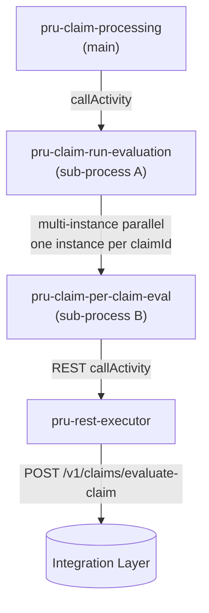

# Per-Claim Evaluation Fan-Out — Solution Design

> Adds a **parallel, one-claim-at-a-time** evaluation layer to the main claims process. Before evaluation, a REST call fetches the **array of claim ids** for the case; each id is then evaluated **in parallel** in its own sub-process, and the per-claim results are aggregated back into a single `Case_STP_Eligible` decision.
>
> **New / changed files**
> - `src/main/resources/org/jbpm/pru-claim-submission.bpmn` — **backup** of the original full pipeline (distinct id `…pru-claim-submission`); the pre-rewrite `pru-claim-processing` logic lives here
> - `src/main/resources/org/jbpm/pru-claim-processing.bpmn` — **rewritten** to the new outcome-based flow (§2)
> - `src/main/resources/org/jbpm/pru-claim-run-evaluation.bpmn` — sub-process A (**self-contained**: Get Claim IDs → parallel multi-instance)
> - `src/main/resources/org/jbpm/pru-claim-per-claim-eval.bpmn` — sub-process B (evaluates one claim via REST)
> - `mock_server/server.js` + `swagger.json` — evaluation + main-flow endpoints
>
> Companions: [claims_solution.md](claims_solution.md), [mock_testing_blueprint.md](mock_testing_blueprint.md), [pru_claim_verification_solution.md](pru_claim_verification_solution.md).

---

## 1. The call graph



- **Main → A**: synchronous call activity (`waitForCompletion=true`). A is a **single generic subprocess keyed by `caseId` (+ `claimType`)** — **both** the death *Run Per Claim Evaluation* and the TI *Run TI Per Claim Evaluation* nodes call the same `pru-claim-run-evaluation`, passing only `caseId` + `claimType`. A fetches the claim ids by caseId and returns the per-claim results. The death vs TI **examination flag batteries run behind the scenes in the evaluate API** (per-claim), not as BPMN nodes.
- **A → B**: a **multi-instance callActivity**, `isSequential="false"` (parallel). One instance of B per element of `claimIds`. jBPM collects each B's `claimResult` into a result collection.
- **B → REST**: B calls `POST /v1/claims/evaluate-claim` for its single claim (via the shared `pru-rest-executor`), parses the response, and returns it to A. A returns the collection to Main.

This is exactly the pattern requested: *"parallel flow for each claim to another sub-process to process one claim at a time; that process calls a REST API, gets a response and sends it to the parent parallel flow, and the parallel flow sends the response back to the claim-processing flow."*

---

## 2. The rewritten `pru-claim-processing.bpmn` flow

The main process was **fully replaced** with the outcome-based flow below (the original full submission→payment pipeline is preserved in `pru-claim-submission.bpmn`):

```
Start → Script_Bootstrap → «Claim Type?»
   ├─ TI  → Run TI Per Claim Evaluation (→ A, claimType=TI) → Consolidate TI Flags → Assign TI Case to Reviewer [human task · Reviewer group] → End (Claim Reviewer)
   └─ Death →
        Set Pol Status to Pend Death (PUT /v1/policy/status)   [note: stops billing, reversible]
        → Check contestability (POST /v1/claims/check-contestability — ANY policy = contestable)
        → «Contestable?»
             ├─ yes → MRX Pull (POST /mrx-check) → MRX check, Set MRx_Discrepancy (POST /mrx-check) ─┐
             └─ no ───────────────────────────────────────────────────────────────────────────────┤ (merge)
        → Run Per Claim Evaluation  (callActivity → pru-claim-run-evaluation)   [note: case level, once, auto hold]
        → Aggregate Case_STP_Eligible = All Claim_STP_Eligible (script)
        → «Outcome?»
             ├─ STP                → Calculate Benefit Amount (POST /calculate) → End (Payment Process)
             ├─ Pending Requirement → Send Requirement eMail (POST /nigo/send)
             │                       → Update Case+claim status Pending Req (POST /status)
             │                       → Update followup to 30 days (user task, wait)
             │                            ├─[Documents uploaded]→ (parallel) Run AI classification (POST /claims/nigo/rerun-idp, payload: piid + signalName)
             │                            │                                  ‖ Signal catch "AIClassificationComplete"  → join
             │                            │                       → Update Case data (POST /claims/nigo/update-status)
             │                            │                       → (loop back to Run Per Claim Evaluation)
             │                            └─[Day 30, boundary timer P30D]→ Assign case to examiner [human task · ClaimsExaminer group] → End (Claim Examiner)
             └─ Refer to Examiner  → Assign case to examiner [human task · ClaimsExaminer group] → End (Claim Examiner)
```

Key points:
- **Claim Type gate.** **Death** runs the STP adjudication lane; **TI** runs its own non-STP lane (Run TI Per Claim Evaluation → Consolidate TI Flags → Assign TI Case to Reviewer) and always lands on the **Reviewer** for mandatory medical review (AD-32) — no STP/Outcome gateway.
- **Case-level contestability.** A single `Check contestability` call decides contestable if **any** policy is contestable; contestable cases go through MRX pull + non-disclosure (`MRx_Discrepancy`) before evaluation.
- **Run Per Claim Evaluation** is the self-contained sub-process A (it fetches the claim ids and fans out — see §3). The main process passes only case data and gets back `claimResults`.
- **Aggregate** computes `caseStpEligible = AND(claimResults[*].claimStpEligible)` and sets `outcome` ∈ `STP` / `PENDING` / `EXAMINER`, which the **Outcome** gateway routes on.
- **Pending-requirement loop.** After sending the requirement email and setting Pending, the case **waits** on `Update followup to 30 days` (user task). On document upload it re-classifies, updates case data, and **loops back to Run Per Claim Evaluation**; an **interrupting boundary timer (P30D)** escalates a still-pending case to an examiner. (This mirrors the existing `pru-nigo-followup` wait/timer pattern.)
- **AI classification is async with a signal callback.** A **parallel gateway** splits into (a) the `Run AI classification, extraction and validation` REST call — its payload carries `piid` **and** `signalName` (`AIClassificationComplete`) so the async AI service can signal this instance back — and (b) a **signal intermediate catch event** on that signal. A **parallel join** waits for both before `Update Case data`. The signal must be sent to the process instance (e.g. by the AI service or a test harness) via the KIE signal API using the `piid` + `signalName` the payload provided.
- The loop-back re-enters via the **contestable merge** gateway (which therefore has three incoming: not-contestable, MRX-check, and the loop), keeping `Run Per Claim Evaluation` single-incoming.

Main process variables: `caseId, claimType, policyNumber, applicablePolicies, dateOfDeath, uploadedDocuments, policyData, bankAccountDetails, flagContestable, flagMrxDiscrepancy, claimResults, caseStpEligible, outcome, payoutAmount, pasLockStatus, baseUrl, reqPayload, resPayload, maxRetryCount`.

New main-flow endpoint: `POST /v1/claims/check-contestability` (others reuse existing endpoints). **Assign case to examiner** and **Assign TI Case to Reviewer** are **human tasks** (user tasks on the `ClaimsExaminer` / `Reviewer` group) — no assignment REST call.

---

## 3. Sub-process A — `pru-claim-run-evaluation` (self-contained parallel multi-instance)

**Purpose:** discover the case's claims, fan them out to per-claim evaluation in parallel, and collect the results. **Self-contained** — it fetches the claim ids itself (the main process has no separate "Get Claim IDs" node, matching the diagram).

- **Inputs (generic):** `caseId` + `claimType` only. Keyed by caseId — the evaluate API looks up per-claim data by `claimId` behind the scenes. `claimType` selects the death vs TI examination battery.
- **Body:**
  1. `Script_Bootstrap` — resolve `baseUrl`.
  2. **Get Claim IDs** (REST → `POST /v1/claims/get-claim-ids`) — onExit parses `claimIds[]` (**each id = one claim**).
  3. **Evaluate Claim (per claim)** — one **multi-instance callActivity** (`isSequential="false"`, parallel) → sub-process B:
     - `loopDataInputRef` = collection dataInput fed from `claimIds`; `inputDataItem` = `claimId` (one element per instance).
     - shared vars mapped to every instance; `loopDataOutputRef` → `claimResults`, `outputDataItem` = `claimResult` ← B's output.
- **Output:** `claimResults` (List of per-claim result objects) returned to Main.

```
Start → Script_Bootstrap → Get Claim IDs → [ MI callActivity → B ] (parallel over claimIds) → End
```

---

## 4. Sub-process B — `pru-claim-per-claim-eval` (one claim → REST)

**Purpose:** evaluate exactly one claim and return its result.

- **Inputs:** `claimId` (the loop item) + `caseId`, `claimType`, `policyNumber`, `dateOfDeath`, `uploadedDocuments`, `policyData`, `bankAccountDetails`.
- **Flow:** `Start → Script_Bootstrap (baseUrl) → Evaluate Claim (REST) → End`.
  - **Evaluate Claim** = callActivity → `pru-rest-executor`, `POST #{baseUrl}/claims/evaluate-claim` with `{piid, caseId, claimId, claimType}` (every REST payload carries `piid`).
  - onExit stores the whole response in `claimResult` (Object) and `claimStpEligible` (Boolean).
- **Output:** `claimResult` — collected by A's multi-instance output.

Response shape (per claim): `{ claimId, claimStpEligible, requiresExaminer, pendingRequirements, claimFlags:{ contestable, minorBene, sanctionsHit, policyNotInForce } }`.

---

## 5. Data lineage (generic — keyed by caseId)

The evaluation subprocess is generic: the main process passes only `caseId` + `claimType`; everything else is resolved by the evaluate API per claim (behind the scenes).

```
Main (Death or TI RunEval)      Main → A            A: getClaimIds(caseId)      A (MI) → B (per claim)
──────────────────────────      ─────────           ──────────────────────      ──────────────────────
caseId, claimType          ──►  caseId, claimType ──► claimIds[]  (by caseId) ──► caseId, claimType, claimId
                                                                                   ↓ POST /v1/claims/evaluate-claim
                                                                                   (DEATH battery US 10.06–10.29
                                                                                    OR TI battery US 11.02–11.06,
                                                                                    selected by claimType)
                                claimResults ◄──────────────────────────────────── claimResult (collected)
Aggregate: caseStpEligible = AND(claimResults[*].claimStpEligible)   [Death only; TI is always non-STP → Reviewer]
```

---

## 6. New mock / integration endpoints

The BPMN nodes call `#{baseUrl}/…` — **no `/v1` in the node URLs** (the version lives in `baseUrl`). The mock serves `/api/v1/…`, so for local testing set `INTEGRATION_LAYER_URL=http://localhost:3010/api/v1`. Every REST payload includes `piid`.

### E1 — Get Claim IDs
```bash
curl -X POST "$BASE/v1/claims/get-claim-ids" -H 'Content-Type: application/json' \
  -d '{"caseId":"CASE-DEATH-HAPPY-001","applicablePolicies":["POL-1","POL-2"]}'
# → {"success":true,"caseId":"CASE-DEATH-HAPPY-001","claimIds":["CLM-2026-1000-POL1","CLM-2026-1001-POL2"]}
```
Returns **one claim id per applicable policy** (a `caseId` containing `MULTI` forces a 3-claim fan-out for testing).

### E2 — Evaluate Claim (per claim)
```bash
# happy → STP eligible
curl -X POST "$BASE/v1/claims/evaluate-claim" -H 'Content-Type: application/json' \
  -d '{"caseId":"CASE-DEATH-HAPPY-001","claimId":"CLM-2026-1000-POL1"}'
# → {"success":true,"claimId":"...","claimStpEligible":true,"requiresExaminer":false,"pendingRequirements":false,"claimFlags":{...}}

# CONTEST → not STP, needs examiner
curl -X POST "$BASE/v1/claims/evaluate-claim" -H 'Content-Type: application/json' \
  -d '{"caseId":"CASE-DEATH-CONTEST-005","claimId":"CLM-...-X"}'
# → {"success":true,"claimStpEligible":false,"requiresExaminer":true,"claimFlags":{"contestable":true,...}}
```
STP eligibility is driven by scenario keywords in `caseId`/`claimId` (`CONTEST`, `BANKFAIL`, `MINOR`, `SANCTION`, `LAPSE`, `POLICYFAIL`, `FASTTRACKFAIL`, `NIGO`), consistent with the existing mock conventions.

---

## 7. Testing the fan-out end-to-end

```bash
# 3-claim parallel fan-out: start the main process with a MULTI caseId
curl -X POST "$KIE/server/containers/prudential-claims-bpm_1.0.0-SNAPSHOT/processes/prudential-claims-submission.pru-claim-processing/instances" \
  -H 'Content-Type: application/json' \
  -d '{ "caseId":"CASE-DEATH-MULTI-201", "policyNumber":"POL-12345", "claimType":"DEATH",
        "applicablePolicies":["POL-1","POL-2","POL-3"], "dateOfDeath":"2025-04-01",
        "uploadedDocuments":["s3://.../form.pdf","s3://.../death_cert.pdf"] }'
```
Expected: **Get Claim IDs** returns 3 ids → **Run Per Claim Evaluation** spawns 3 parallel B instances (watch `[EvaluateClaim] claim=… -> stpEligible=…` in the mock log) → **Aggregate** logs `caseStpEligible=… (n/3 claims STP-eligible)`.

---

## 8. Notes & scope

- **Backup.** `pru-claim-submission.bpmn` is a byte-for-byte copy of the pre-change main process with a **distinct process id** (`…pru-claim-submission`) and name, so it deploys alongside the modified process without a duplicate-id conflict. All 9 processes in the kjar have unique ids and every `calledElement` resolves (verified).
- **Additive splice.** The new evaluation layer is inserted into the existing flow; the current downstream (Is-TI, fast-track, tax, payment, NIGO) is preserved and still reachable via the Is-TI gateway. The image's **Outcome** gateway (STP / Pending Requirement / Refer-to-Examiner) and the 30-day pending-requirement loop map onto that existing downstream + NIGO; if you want the downstream fully re-drawn to match the image 1:1 (single Outcome gateway replacing Is-TI/fast-track), that's a follow-up — say the word.
- **DI.** The three new shapes/edges are laid out on a detour row below the merge; Business Central will render them and can auto-arrange. jBPM runtime ignores DI.
- `caseStpEligible` is computed but the routing still uses the existing gateways; wire `caseStpEligible` into the Outcome decision when the downstream is consolidated.
