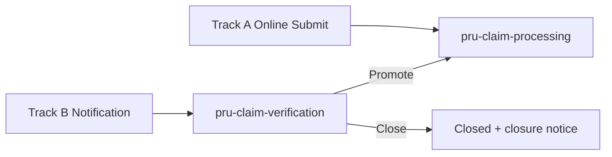
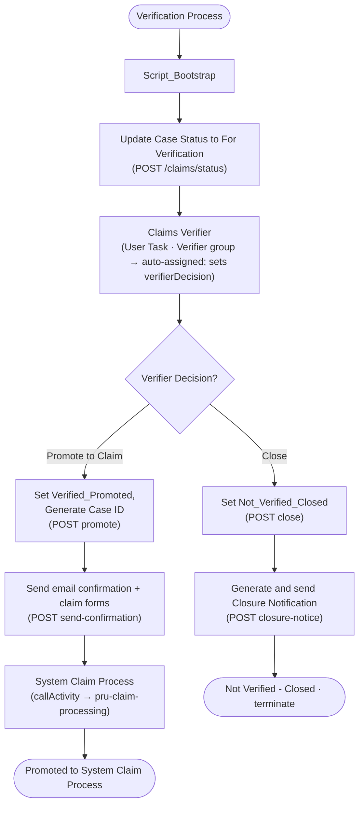

# Process 3: `pru-claim-verification` — Solution Design

> The **Claim Verification** process (Track B). A verifier reviews an inbound **notification** in the workbench and decides **Promote** or **Close**. On Promote it generates the **Case ID** (claim ids are generated per-case downstream — a case has multiple claims) and hands off to the main claims pipeline (`pru-claim-processing`) as a **sub-process**.
>
> - **BPMN:** [src/main/resources/org/jbpm/pru-claim-verification.bpmn](../src/main/resources/org/jbpm/pru-claim-verification.bpmn)
> - **Process id:** `prudential-claims-submission.pru-claim-verification`
> - **Companion docs:** [claims_solution.md](claims_solution.md) (Process 1 & 2), [claims_flags.md](claims_flags.md), [claims_status.md](claims_status.md), [mock_testing_blueprint.md](mock_testing_blueprint.md)

---

## 1. Where this process fits

The WS2 solution has two claim-entry tracks (Workbench BRD, terms key *Track A / Track B*):

- **Track A** — the claimant submits online; a formal claim exists from submission. This drives `pru-claim-processing` directly.
- **Track B** — a death/TI event is reported as a **notification** first (e.g. via an external notifier, FNOL channel, or bulk feed). It is **not yet a claim** — there is no Case ID or Claim ID. A **Verifier** must review it and either **Promote** it to a formal claim or **Close** it.

> Workbench BRD: *"the Verifier receives Track B notifications for external verification and Promote / Hold / Decline"* and *"The Verifier Promote action is the equivalent of the claimant Submit action for Track A — formal claim submission begins here."*

`pru-claim-verification` is the Track B front door. On Promote it becomes the caller of `pru-claim-processing`.



---

## 2. Why there is a `notificationId` — and where it comes from

This is the key modelling decision, so it is called out explicitly.

**The problem.** At notification time the claim does not exist yet, so **`caseId`, `claimId`, and `cid` are not available** — they are only minted on Promote (Workbench BRD: formal claim submission begins at Promote). But the process still needs a **stable key** to:
1. correlate the status writes across the flow (For Verification → assigned → promoted/held/closed),
2. be the idempotency/lookup handle for the notification record,
3. be echoed back by every verification API call.

**The derivation.** `notificationId` is that key. It is grounded in three source signals:

| Source signal | What it tells us |
|---------------|------------------|
| Workbench BRD **WB-5** case-status set lists **`Notification`** as the *first* status, before `For Verification` / `Claim Submitted` | The entity worked before a claim exists is a *Notification* |
| Workbench BRD verifier role: *"receives Track B **notifications** for external verification"* | The verifier's unit of work is a notification |
| The diagram's grey data object on **Review notification in workbench**: *"notification, policy, event, insured, beneficiary, documents, system flags"* | The verifier reviews a **notification** aggregate; "notification" is its own object alongside policy/event/etc. |

So the object exists in the domain; it needed an identifier. Following the repo's ID conventions (`CASE_ID = CASE-YYYYMMDD-NNNNN`, `CLM-YYYY-NNNNN`), the suggested format is **`NOTIF-YYYY-NNNNN`**.

**How it is supplied.** `notificationId` is a **process input variable** — it is provided when the verification process instance is *started* (by the notification-intake integration / FNOL channel), exactly the way `caseId` is the input key when `pru-claim-processing` is started in the [mock_testing_blueprint.md](mock_testing_blueprint.md). It is **not** generated inside this process.

**Lifecycle of the identifiers:**

| Identifier | Exists at notification (start)? | Created where | Type |
|------------|-------------------------------|---------------|------|
| `notificationId` | **Yes — process input** | Upstream intake (the trigger) | String `NOTIF-YYYY-NNNNN` |
| `caseId` | No | **Generated at Promote** (V3 endpoint) — one per case | String `CASE-YYYYMMDD-NNNNN` |
| claim id(s) | No | **Not generated here.** A case has **multiple** claims — the claim ids are generated **per-case downstream** by the main process's **Get Claim IDs** step (an array), then evaluated per claim | String array `CLM-…` |

> **Why no claim id at Promote.** Promotion mints only the **Case ID**. Because a case can carry several claims (one per applicable policy), a single claim id at the notification level would be wrong — so neither Promote nor Send-confirmation carries a claim id, and the verification → System Claim Process hand-off passes only `caseId` (+ context). The main process then calls **Get Claim IDs** to obtain the array and fans out per claim.

---

## 3. Process variables

All process variables, with **provenance** (where the value comes from). Types match `pru-claim-processing` where the variable is forwarded to it (so the sub-process call is type-safe).

| Variable | Type | Provenance / how obtained | Notes |
|----------|------|---------------------------|-------|
| `notificationId` | String | **Process input** (start payload) — from the notification-intake trigger | See §2. Correlation key for the whole flow |
| `claimType` | String | Process input | `DEATH` or `TI` |
| `policyNumber` | String | Process input (from the notification's policy data) | Primary policy |
| `applicablePolicies` | List | Process input | All eligible policies |
| `dateOfDeath` | String | Process input (the notification's event date) | Death event; blank for TI |
| `uploadedDocuments` | List | Process input (notification's documents) | S3 refs of evidence captured at notification |
| `policyData` | Object | Process input | Optional; may be null at notification time |
| `bankAccountDetails` | Object | Process input | Usually **null** at verification (collected later via the claim form); mapped through for completeness |
| `baseUrl` | String | **Set by `Script_Bootstrap`** from `INTEGRATION_LAYER_URL` (else `http://localhost:3000`) | Same bootstrap pattern as `pru-claim-processing` |
| `verifierDecision` | String | **Output of the `Claims Verifier` user task** | `PROMOTE` \| `CLOSE`; drives the gateway |
| `verifierRemarks` | String | Output of the `Claims Verifier` user task | Free-text rationale; forwarded to promote/close APIs |
| `notificationStatus` | String | **Set from API responses** (status / promote / close) | `FOR_VERIFICATION` → `VERIFIED_PROMOTED` / `NOT_VERIFIED_CLOSED` |
| `caseId` | String | **Generated by the Promote API** (V3), parsed in its onExit | Null until Promote; one per case (no claim id here) |
| `reqPayload` | String | Transient — built in each REST node's onEntry | Current API request JSON |
| `resPayload` | String | Transient — REST executor output (`Result`) | Current API response JSON |
| `maxRetryCount` | Integer | Set by `Script_Bootstrap` (default 3) | Retry budget for the shared error handler |

---

## 4. Flow diagram



The grey data object in the source diagram (*notification, policy, event, insured, beneficiary, documents, system flags*) is modelled as a **text annotation** attached to the **Claims Verifier** task — it names the read-only context the verifier reviews before recording the decision. (There is no separate "Review notification" step; the verifier reviews and decides in the single Claims Verifier task.) The verifier decides **Promote** or **Close** — there is no Hold decision.

---

## 5. Node specifications

REST nodes follow the repo convention exactly: a `callActivity → prudential-claims-submission.pru-rest-executor` with an **onEntry** script that builds `reqPayload` (always including `piid`) and an **onExit** script that parses `resPayload`. URLs use `#{baseUrl}/...` (no `/v1` in the node — the version lives in `baseUrl`). User tasks assign the role via the `GroupId` data input (like N13b/N16 in the main process).

| # | Node | Type | Endpoint (`#{baseUrl}` + …) | Reads | Writes |
|---|------|------|------------------------------|-------|--------|
| 0 | `Script_Bootstrap` | Script | — | env | `baseUrl`, `maxRetryCount` |
| 1 | Update Case Status to For Verification | REST (POST) | `/v1/claims/status` (status=`FOR_VERIFICATION`) — **shared status API** | `notificationId`, `caseId` | `notificationStatus` |
| 2 | Claims Verifier | **User Task** (Verifier group — **auto-assigned**) | — | notification context (annotation) | `verifierDecision`, `verifierRemarks` |
| 3 | Verifier Decision? | Exclusive gateway | — | `verifierDecision` | — |
| 4 | Set Verified_Promoted + Generate Case ID | REST (POST) | `/v1/claims/verification/promote` | `notificationId`, `claimType`, `policyNumber`, `applicablePolicies`, `verifierRemarks` | `notificationStatus`, `caseId` (no claim id) |
| 5 | Send confirmation + claim forms | REST (POST) | `/v1/claims/verification/send-confirmation` | `caseId`, `applicablePolicies` | — |
| 6 | **System Claim Process** | **callActivity → `pru-claim-processing`** | — | 8 vars (see §6) | `caseId` (round-trip) |
| 7 | Set Not_Verified_Closed | REST (POST) | `/v1/claims/verification/close` | `notificationId`, `caseId`, `verifierRemarks` | `notificationStatus` |
| 8 | Generate and send Closure Notification | REST (POST) | `/v1/claims/verification/closure-notice` | `notificationId`, `caseId` | — |

> **No "Assign Case to Verifier" step.** The `Claims Verifier` task is assigned to the `Verifier` group (`GroupId`), so it auto-lands on the verifier worklist (Alpha pull/auto-push, WB-4) — no explicit assignment service call is needed. It has a single incoming flow (from *Update Case Status*), so no merge gateway is required.

**Gateway logic** (the `Claims Verifier` task sets `verifierDecision` — **Promote or Close only, no Hold**):

| Branch | Condition | Path |
|--------|-----------|------|
| Promote to Claim | `"PROMOTE".equals(verifierDecision)` | promote → send-confirmation → System Claim Process → end |
| Close | `"CLOSE".equals(verifierDecision)` | close → closure-notice → **terminate** end event |

---

## 6. The sub-process hand-off (Promote → `pru-claim-processing`)

The **System Claim Process** node is `<bpmn2:callActivity … calledElement="prudential-claims-submission.pru-claim-processing" drools:independent="true" drools:waitForCompletion="true">` (same call style as the NIGO sub-process in the main flow).

Its data-input mapping **mirrors the `pru-claim-processing` start payload** documented in [mock_testing_blueprint.md](mock_testing_blueprint.md) §"Start Process Instance", so Track B enters the main pipeline identically to Track A:

| Verification variable | → main process variable | Type | Origin |
|-----------------------|-------------------------|------|--------|
| `caseId` | `caseId` | String | generated at Promote (one per case) |
| `claimType` | `claimType` | String | notification |
| `policyNumber` | `policyNumber` | String | notification |
| `applicablePolicies` | `applicablePolicies` | List | notification |
| `dateOfDeath` | `dateOfDeath` | String | notification (event) |
| `uploadedDocuments` | `uploadedDocuments` | List | notification (docs) |
| `policyData` | `policyData` | Object | notification (optional) |
| `bankAccountDetails` | `bankAccountDetails` | Object | usually null here |

> **No claim id in the hand-off.** Because a case has multiple claims, verification passes only the **`caseId`** (+ context). The main process then calls **Get Claim IDs** to obtain the array of claim ids and evaluates each one (see [pru_claim_evaluation_solution.md](pru_claim_evaluation_solution.md)). The main process's per-claim `cid` is derived there, not supplied by verification.
>
> **Output assignment.** The call activity maps one data **output** — the child's `caseId` back to the parent `caseId` (a harmless round-trip, mirroring the NIGO reusable subprocess). This is required so the reusable subprocess carries **both** input and output assignments; a reusable subprocess with neither is flagged by Business Central ("*Reusable Subprocess with no Assignments Data Input/Data Output*").

---

## 7. Mock / integration APIs

Implemented in [mock_server/server.js](../mock_server/server.js) and [swagger.json](../mock_server/swagger.json). The BPMN calls `#{baseUrl}/...` (**no `/v1` in the node** — version in `baseUrl`); the mock serves `/api/v1/...`, so for local testing set `INTEGRATION_LAYER_URL=http://localhost:3010/api/v1`.

**Case-status updates reuse the shared status API** (same one NIGO uses), not a bespoke endpoint:

| Node | Method | Path | Body → Response |
|------|--------|------|-----------------|
| Update Case Status to For Verification | POST | `/api/v1/claims/status` (**shared**) | `{status}` → `{success, status}` (echoes `FOR_VERIFICATION`; defaults to `PENDING_REQUIREMENTS`) |

Verification-specific endpoints:

| ID | Method | Path | Response (key fields) |
|----|--------|------|------------------------|
| V3 | POST | `/api/v1/claims/verification/promote` | `notificationStatus: "VERIFIED_PROMOTED"`, `caseId` (no claim id) |
| V4 | POST | `/api/v1/claims/verification/send-confirmation` | `claimFormsSent` |
| V6 | POST | `/api/v1/claims/verification/close` | `notificationStatus: "NOT_VERIFIED_CLOSED"` |
| V7 | POST | `/api/v1/claims/verification/closure-notice` | `noticeSentAt` |

### curl — request → response

```bash
BASE=http://localhost:3010/api/v1   # mock; BPMN uses #{baseUrl}=$INTEGRATION_LAYER_URL (version in baseUrl)

# Update Case Status (shared status API)
curl -X POST "$BASE/v1/claims/status" -H 'Content-Type: application/json' \
  -d '{"notificationId":"NOTIF-2026-0001","caseId":null,"status":"FOR_VERIFICATION"}'
# → {"success":true,"status":"FOR_VERIFICATION"}

# V3 Promote (generates the Case ID only — no claim id)
curl -X POST "$BASE/v1/claims/verification/promote" -H 'Content-Type: application/json' \
  -d '{"notificationId":"NOTIF-2026-0001","claimType":"DEATH","policyNumber":"POL-12345","applicablePolicies":["POL-12345"]}'
# → {"success":true,"notificationStatus":"VERIFIED_PROMOTED","caseId":"CASE-20260716-20305","claimType":"DEATH","caseStatus":"CLAIM_SUBMITTED"}

# V6 Close
curl -X POST "$BASE/v1/claims/verification/close" -H 'Content-Type: application/json' \
  -d '{"notificationId":"NOTIF-2026-0001","verifierRemarks":"insufficient evidence"}'
# → {"success":true,"notificationStatus":"NOT_VERIFIED_CLOSED","closedAt":"..."}
```
(V4 / V7 follow the same shape — see [swagger.json](../mock_server/swagger.json).)

---

## 8. How to run it (KIE Server)

**1. Start the verification process** (the notification-intake trigger — `notificationId` supplied here):
```bash
curl -X POST "$KIE/server/containers/prudential-claims-bpm_1.0.0-SNAPSHOT/processes/prudential-claims-submission.pru-claim-verification/instances" \
  -H 'Content-Type: application/json' \
  -d '{
    "notificationId": "NOTIF-2026-0001",
    "claimType": "DEATH",
    "policyNumber": "POL-12345",
    "applicablePolicies": ["POL-12345"],
    "dateOfDeath": "2025-04-01",
    "uploadedDocuments": ["s3://prudential-claims/death_evidence.pdf"],
    "policyData": { "eligibility_passed": true },
    "bankAccountDetails": null
  }'
```

**2. Verifier works the `Claims Verifier` human task** (reviews the notification context, then records the decision). Complete it with the branch selector:
```bash
curl -X PUT "$KIE/server/containers/{container}/tasks/{taskId}/states/completed" \
  -H 'Content-Type: application/json' \
  -d '{ "verifierDecision": "PROMOTE", "verifierRemarks": "Death evidence confirmed" }'
```

**3. On PROMOTE** the process auto-calls `pru-claim-processing` with the mapped payload (§6) — no separate start needed.

---

## 9. Roles & statuses

- **Role:** the single `Claims Verifier` user task is assigned to the **`Verifier`** group via the `GroupId` data input (mirrors how the main process assigns `ClaimsExaminer`). Because it's group-assigned it **auto-lands on the verifier worklist** (Alpha pull / auto-push, WB-4) — there is no separate "Assign Case to Verifier" service step. The verifier reviews the notification context (annotation) and records the decision in that one task.
- **Notification status axis** (distinct from `CASE.CASE_STATUS`): `FOR_VERIFICATION` → `VERIFIED_PROMOTED` / `NOT_VERIFIED_CLOSED`. Full detail and the mapping into `CASE_STATUS` (`Claim Submitted` on promote; `Closed` on close) is in [claims_status.md](claims_status.md) §1.1.

---

## 10. Design notes / open points

- **Decision set.** WB-3 lists the verifier decision as *Promote / Hold / Decline*. This process implements **Promote** and **Close** only — there is no **Hold** decision (removed: no action was attached to it), and **Close** is used in place of *Decline* per the drawn diagram. If the canonical term is *Decline*, only the label/enum value needs changing.
- **"Generate and send Closure Notification"** is modelled as a **service (REST) task** (consistent with the Promote-branch email node), even though the diagram drew it with a person icon. Flip to a user task if a manual send is intended.
- **`bankAccountDetails` at verification** is typically null (collected later via the claim form); it is mapped through so the sub-process contract is complete when the notification does carry it.
- **Process id vs blueprint label.** The blueprint's start URL uses `pru-claim-internal-processing`, but the deployed process id is `prudential-claims-submission.pru-claim-processing` — which is what this process's `calledElement` targets. Worth reconciling the blueprint naming separately.
- **No `kmodule.xml` change** is required (processes are auto-discovered); **no SVG** is required (Business Central regenerates it on import).
